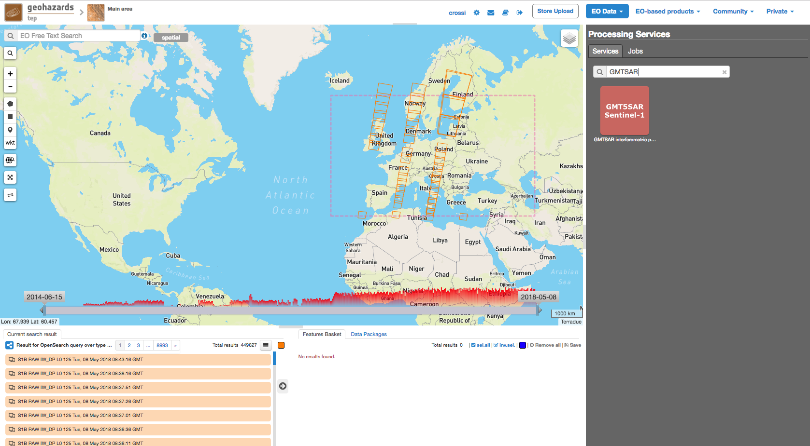
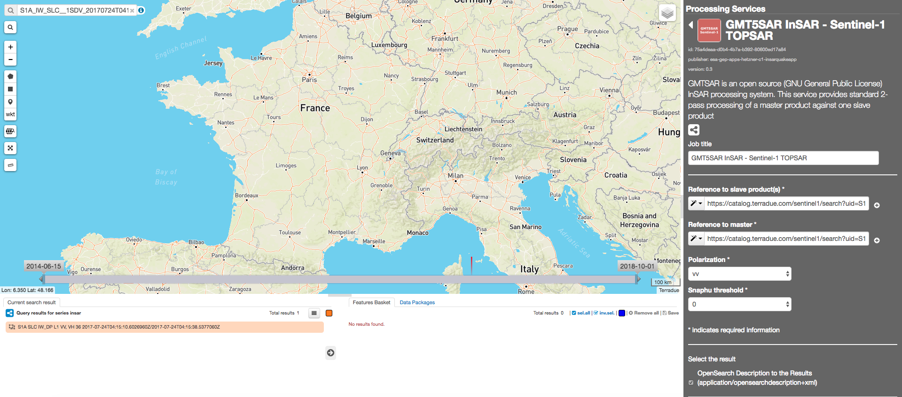
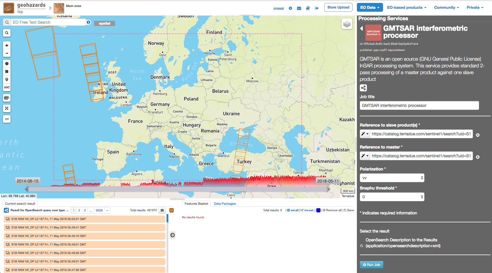
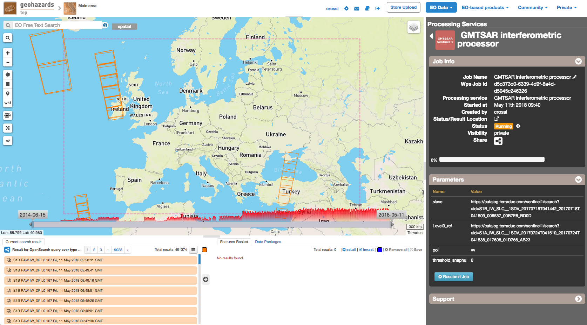
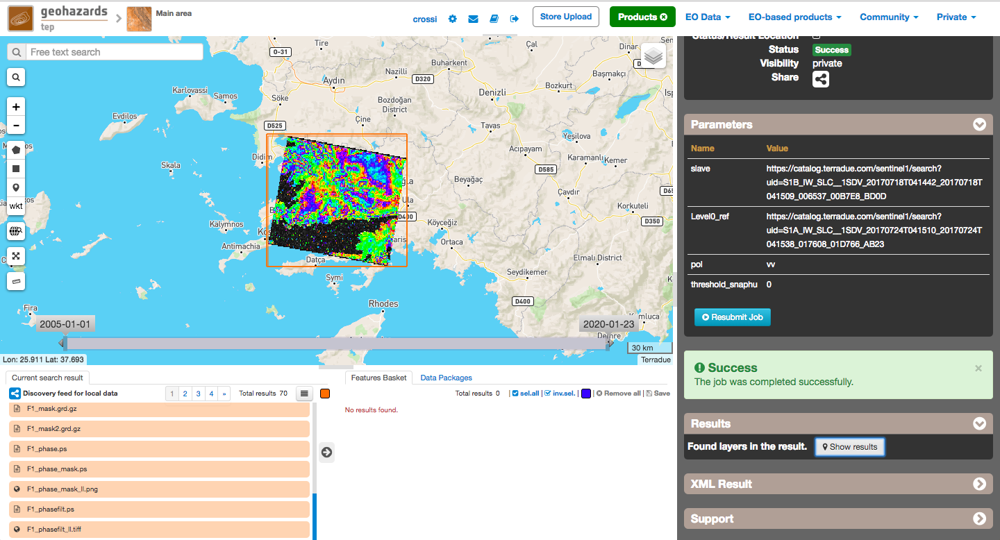

GMT5SAR for Sentinel-1
~~~~~~~~~~~~~~~~~~~~~~

**GMT5SAR interferometric processor**

GMT5SAR is an open source (GNU General Public License) InSAR processing system. This service provides standard 2-pass processing of a master product against one or more slave products.

**EO sources supported**:

    - Sentinel-1

**Output specifications**

    - xxxxxxxx
    - xxxxxxxx
    - xxxxxxxx

-----

This tutorial covers the typical InSAR processing to form an interferogram using two SAR images and a digital elevation model.

The GMT5SAR processing service can also process several pairs master/slave (same master).

Select the processing
=====================

* Login to the platform (see :doc:`user <../community-guide/user>` section)

* Select the processing service GMT5SAR Interferometric Processor”:

The "GMT5SAR Interferometric Processor" panel is displayed with parameters values to be filled-in.

.. NOTE:: Parameters comes with default pre-filled values which are the same as the ones used in this tutorial, so you may skip the following section and directly use the pre-filled parameters.

Fill the parameters
===================

.. NOTE:: slave and master can be picked up by using the following data package (alternatively to the search steps described): **BajaCaliforniaEQ**

Slave product reference
-----------------------

* Select **EO Data / Envisat** as data collection.

* Type **ASA_IM__0P** in the Search Terms field (1):

* Click on Show Other Parametersand apply the date value **2010-05-02** in both:
- time:start field
- time:end field
then click on the button **Search**:

* Drag and Drop the first result in the *Slave product reference* field:

Master product reference
------------------------

* Perform the same procedure described previously (`Slave product reference`_), using the value **2010-03-28** in both the **time:start** field and the **time:end** field:

* Drag and drop the first result in the *Master product reference* field:

Polarization
------------------------

* Select the Polarization

		
Snaphu threshold
------------------------

* Select the Snaphu threshold

Run the job
===========

* Click on the button Run Job and see the Running Job

* After about 25 minutes, see the Successful Job:

* Click on the button *Show results on map*, then on the *phase_mask_ll.tiff* result on the *Results Table* in the bottom left side

* See the result on map:

More info
=========

http://topex.ucsd.edu/gmtsar/
