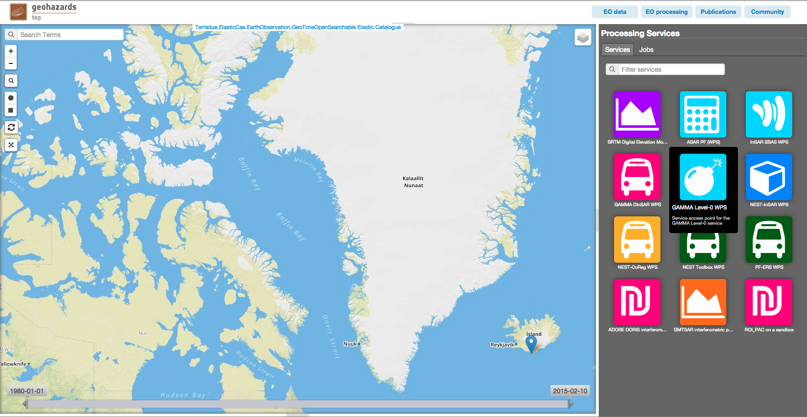
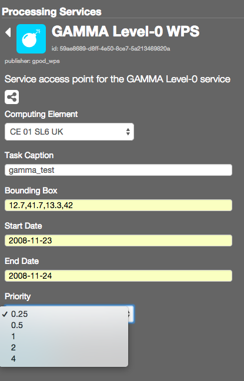
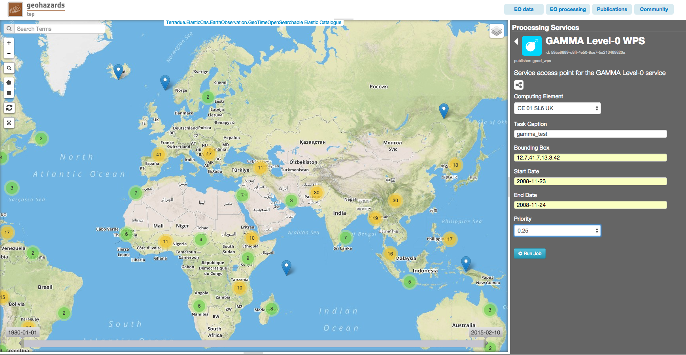

G-POD GAMMA Level0 Service
~~~~~~~~~~~~~~~~~~~~~~~~~~

Select the processing
=====================

* Login to the platform (see :doc:`user <../community-guide/user>` section)

* Access the Geobrowser :  https://geohazards-tep.eo.esa.int/geobrowser/#

Fill the parameters
===================

* Start your data search, select central Italy as your Area of Interest and select the input product : 
ENVISAT ASAR ASA_IM__0P, 2009-02-01T09:24:28.014Z, V/V, Track 79

* Drag and drop the input product on the Files box:

.. figure:: assets/tuto_gamma_2.png
	:figclass: align-center
        :width: 750px
        :align: center
        

Task Caption and Job Title
--------------------------

* Fill the Job Title and Task Caption parameters setting a caption value, for example:
Job title :  GAMMA-L0
Task Caption :  GAMMA-L0 

Run the job
===========

* Click on the button Run Job:

* Wait for the job completion and download the results:

