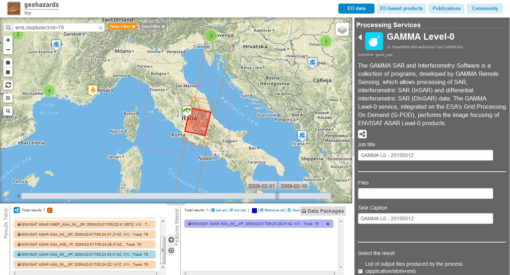
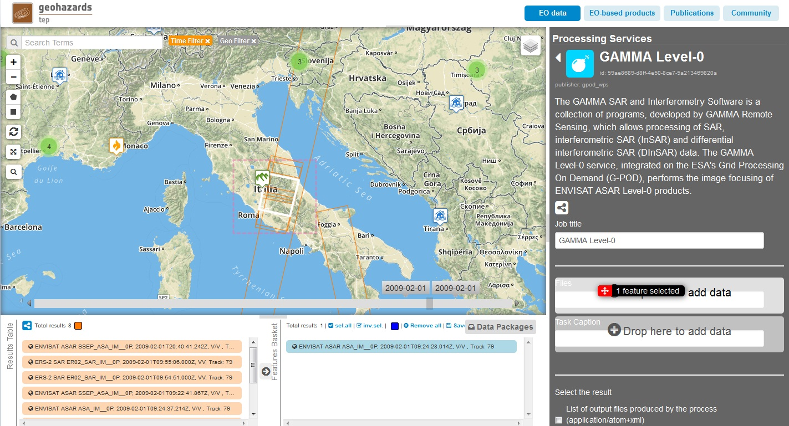
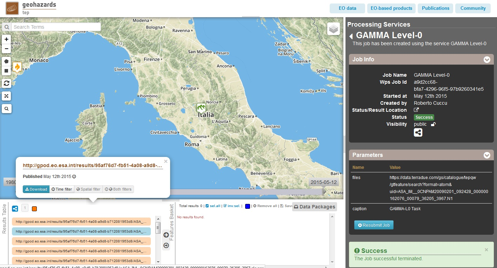

G-POD GAMMA Level0 Service
~~~~~~~~~~~~~~~~~~~~~~~~~~

        
**GAMMA Level-0**

The GAMMA SAR and Interferometry Software is a collection of programs, developed by GAMMA Remote Sensing, which allows processing of SAR, interferometric SAR (InSAR) and differential interferometric SAR (DInSAR) data. The GAMMA Level-0 service, integrated on the ESA's Grid Processing On Demand (G-POD), performs the image focusing of ENVISAT ASAR Level-0 products.

**EO sources supported**:

    - Envisat ASAR L0

**Output specifications**

To be defined

Select the processing
=====================

* Sign-in on the Portal https://geohazards-tep.eo.esa.int/ (see guidance :doc:`user <../community-guide/user>` section)

* Access the Geobrowser: https://geohazards-tep.eo.esa.int/geobrowser/

* Open the tab "Processing services" from the right of the map, and then select the processing service “GAMMA Level-0”:

Select the files to process
===========================

* Navigate on the map to the central Italy and define both the geo and time filters for data search.
* Use the spatial filter tooltip "Draw a rectangle" in order to define the search Area of Interest (AOI) over the central Italy.
* Use the temporal filter tooltips (the ones with dates labels) in order to define the search time span, both around 2009-02-01. NOTE: you can also edit precise search dates from the "Search Form" tooltip.
* From this filtered search, make drag and drops from the "Results Table" to your "Features Basket", in order to select the following input file:

.. code-block:: gamma-parameter

  ENVISAT ASAR ASA_IM__0P, 2009-02-01T09:24:28.014Z, V/V, Track 79

Fill the parameter values
=========================

Task Caption and Job Title
--------------------------

* As *Job title*, type:

.. code-block:: gamma-parameter

  GAMMA-L0

* As input *Files*, drag and drop the selected product:

.. code-block:: gamma-parameter

  ENVISAT ASAR ASA_IM__0P, 2009-02-01T09:24:28.014Z, V/V, Track 79

* As *Task Caption*, type:

.. code-block:: gamma-parameter

  GAMMA-L0 

Run the job
===========

* Click on the button "Run Job" at the bottom of the GAMMA Level-0 processor tab, and monitor the progress of the running Job:

.. figure:: assets/tuto_gamma_3.jpg
	:figclass: align-center
        :width: 750px
        :align: center

* Wait for the Job completion, then check the status is set as "Successful Job”.

* Download the GAMMA Level-0 processing results once the Job is completed:

