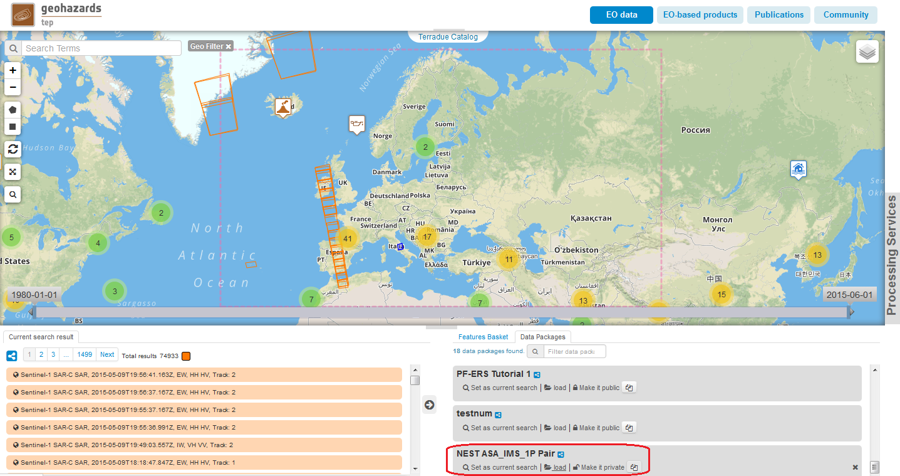

G-POD NEST CoReg Service
~~~~~~~~~~~~~~~~~~~~~~

Select the processing
=================

* Sign-in on the Portal https://geohazards-tep.eo.esa.int/ (see guidance :doc:`user <../community-guide/user>` section)

* Access the Geobrowser: https://geohazards-tep.eo.esa.int/geobrowser/

* Open the tab "Processing services" from the right of the map, and then select the processing service “NEST CoReg”.

The "NEST CoReg" panel is displayed with the parameter values to be filled-in.

Select the files to process
===================

* From the bottom right panel, load the data package called “NEST ASA_IMS_1P Pair”. The following pre and post event products over L'Aquila will appear listed in the "Features Basket" panel:

.. code-block:: nest-coreg-parameter

  ENVISAT ASAR ASA_IMS_1P, 2007-04-11T20:47:49.989Z, , Track: 129
  ENVISAT ASAR ASA_IMS_1P, 2009-03-11T20:47:46.215Z, , Track: 129

* Alternatively, navigate on the map to the L'Aquila region (Italy) and define both the geo and time filters for data search.
* Use the spatial filter tooltip "Draw a rectangle" in order to define the search Area of Interest (AOI) over the L'Aquila region.
* Use the temporal filter tooltips (the ones with dates labels) in order to define the search time span, first around 2007-04-11 and then around 2009-03-11. NOTE: you can also edit precise search dates from the "Search Form" tooltip.

Fill the parameter values
===================

* As the *Job title*:

 You can edit the *Job title* to describe your processing job, e.g.:

.. code-block:: nest-coreg-parameter

  NEST CoReg L'Aquila

* As input *Files*:

Select the 2 files in the "Features Basket", using either the "shift" key or the "sel.all" link above the list. Drag and drop the selected products onto the "Files" parameter field.

.. code-block:: nest-coreg-parameter

  ENVISAT ASAR ASA_IMS_1P, 2007-04-11T20:47:49.989Z, , Track: 129
  ENVISAT ASAR ASA_IMS_1P, 2009-03-11T20:47:46.215Z, , Track: 129

Drag and drop operation:

.. figure:: assets/tuto_nest_coreg_2_files.png
	:figclass: align-center
        :width: 750px
        :align: center

* As *Master File*:

Unselect all the previously selected products in the "Features basket" and then click on the following single product. Drag and drop that product to the mandatory parameter field "Master File”:

.. code-block:: nest-coreg-parameter

  ENVISAT ASAR ASA_IMS_1P, 2007-04-11T20:47:49.989Z, , Track: 129

Drag and drop operation:

.. figure:: assets/tuto_nest_coreg_3_master.png
	:figclass: align-center
        :width: 750px
        :align: center

.. note::

  You can leave all the other parameter fields as is (blank or pre-defined values).

Run the job
=========

* Click on the button "Run Job" at the bottom of the NEST CoReg processor tab, and monitor the progress of the running Job:

.. figure:: assets/tuto_nest_coreg_4_run.png
	:figclass: align-center
        :width: 750px
        :align: center

* After about 30 minutes of processing time, check the status is set as "Successful Job":

.. figure:: assets/tuto_nest_coreg_5_result.png
	:figclass: align-center
        :width: 750px
        :align: center

* Download the NEST CoReg processing results once the Job is completed:

.. figure:: assets/tuto_nest_coreg_6_download.png
	:figclass: align-center
        :width: 750px
        :align: center
