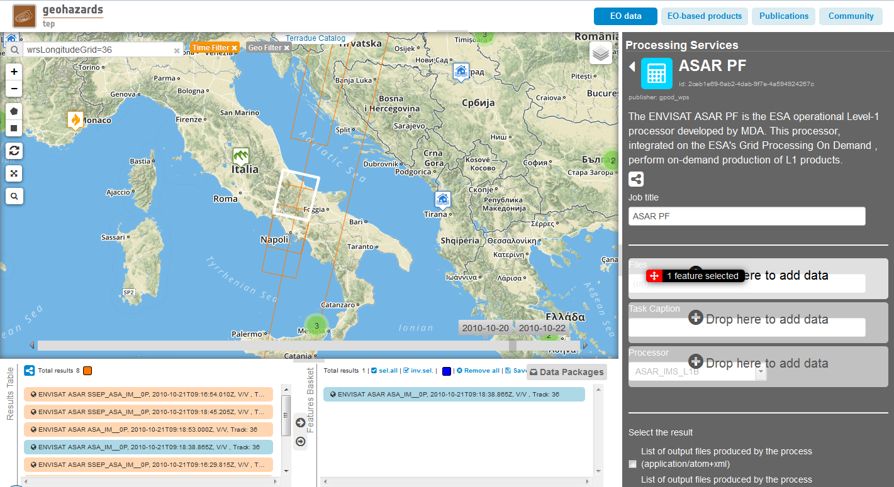
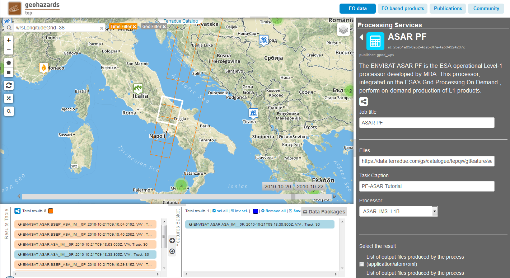
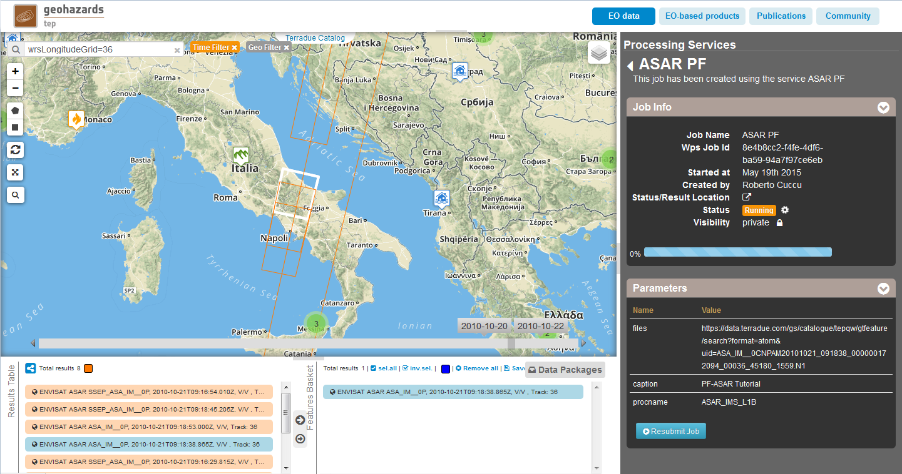
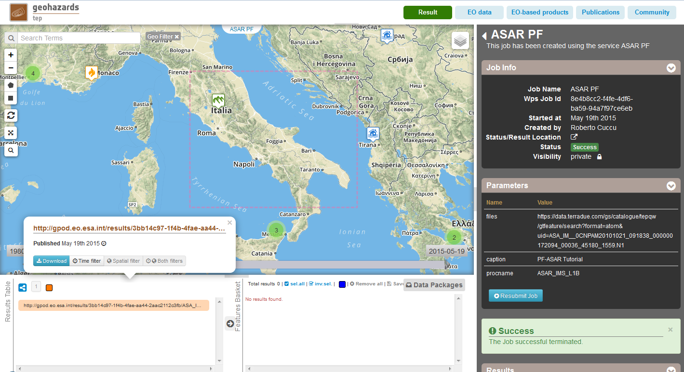

G-POD PF-ASAR Service
~~~~~~~~~~~~~~~~~~~~~~

Select the processing
=====================

* Sign-in on the Portal https://geohazards-tep.eo.esa.int/ (see guidance :doc:`user <../community-guide/user>` section)

* Access the Geobrowser: https://geohazards-tep.eo.esa.int/geobrowser/

* Open the tab "Processing services" from the right of the map, then select the processing service “G-POD PF-ASAR”.

Select the files to process
===========================

* Click on the *Data Packages* button in the bottom right of the screen, within the Features Basket panel. 
Then select from the list the "PF-ASAR Tutorial" data package and click on *load*. 
The selected data package contains the reference to the following input file:

.. code-block:: parameter

  ASA_IM__0CNPAM20101021_091838_000000172094_00036_45180_1559.N1

.. figure:: assets/tuto_pfasar_1.png
	:figclass: align-center
        :width: 750px
        :align: center

Fill the parameter values
=========================
Define values for the "Job title", the "Task caption" and the "Processor type".

* As *Job title*, type:

.. code-block:: parameter

  ASAR PF

* As input *Files*, drag and drop the selected input file:

* As *Task Caption*, type:

.. code-block:: parameter

  PF-ASAR Tutorial
  
* As *Processor*, select from the drop-down menu the value:

.. code-block:: parameter

   ASAR_IMS_L1B
   

Run the job
===========

* Click on the button "Run Job" at the bottom of the G-POD PF-ASAR processor tab, and monitor the progress of the running Job:

* Wait for the Job completion, then check the status is set as "Successful Job”.

* Download the G-POD PF-ASAR processing results once the Job is completed (VPN connexion required):

.. figure:: assets/tuto_pfasar_6.png
	:figclass: align-center
        :width: 750px
        :align: center
