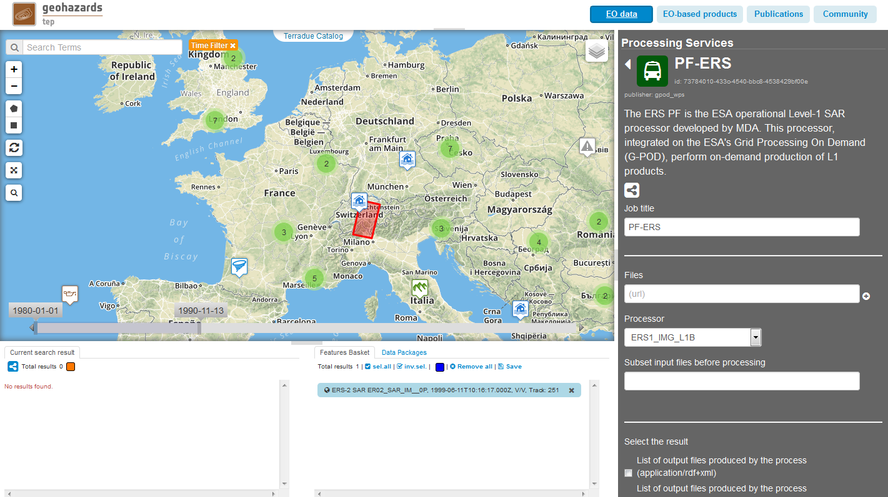
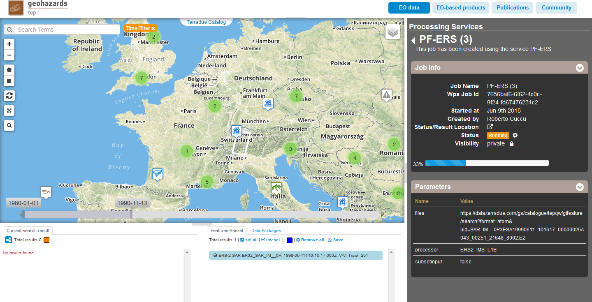
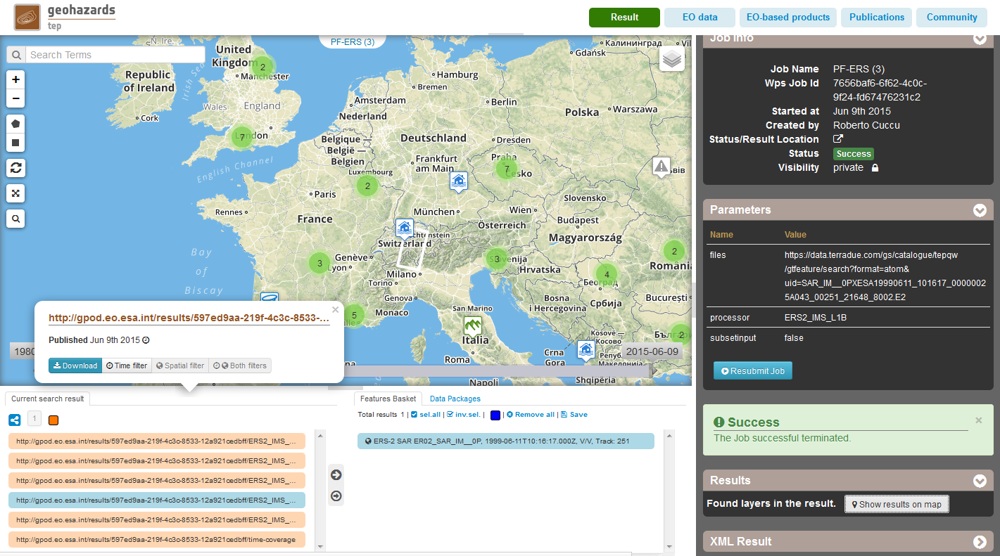

G-POD PF-ERS Service
~~~~~~~~~~~~~~~~~~~~

Select the processing
=====================

* Sign-in on the Portal https://geohazards-tep.eo.esa.int/ (see guidance :doc:`user <../community-guide/user>` section)

* Access the Geobrowser: https://geohazards-tep.eo.esa.int/geobrowser/

* Open the tab "Processing services" from the right of the map, and then select the processing service “PF-ERS”:

Select the files to process
===========================

* Access the Data Packages and load the public data package “PF-ERS Tutorial” which contains the following input ERS-2 SAR Level-0 product:

.. code-block:: gamma-parameter
   SAR_IM__0PXESA19990611_101617_00000025A043_00251_21648_8002.E2

        
Fill the parameter values
=========================

Mandatory paramters
--------------------

* As *Job title*, type:

.. code-block:: gamma-parameter

 PF-ERS

* As input *Files*, drag and drop the selected product:

.. code-block:: gamma-parameter

   SAR_IM__0PXESA19990611_101617_00000025A043_00251_21648_8002.E2

.. figure:: assets/tuto_pf_ers_2.png
	:figclass: align-center
        :width: 750px
        :align: center   
   
* As *Processor*, type:

.. code-block:: gamma-parameter

   ERS2_IMS_L1B
   
* As *Subset Input files before processing*, type:

.. code-block:: gamma-parameter

	false
	
.. figure:: assets/tuto_pf_ers_3.png
	:figclass: align-center
        :width: 750px
        :align: center  	
	
Run the job
===========

* Click on the button "Run Job" at the bottom of the PF-ERS processor tab, and monitor the progress of the running Job:

        
* Wait for the Job completion, then check the status is set as "Successful Job” and and download the PF-ERS processing results once the Job is completed:

