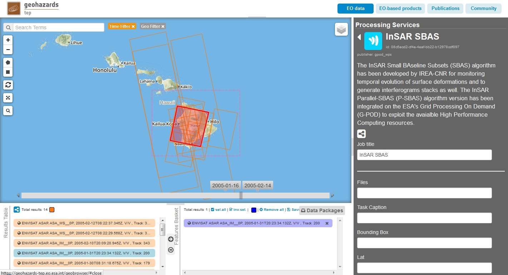
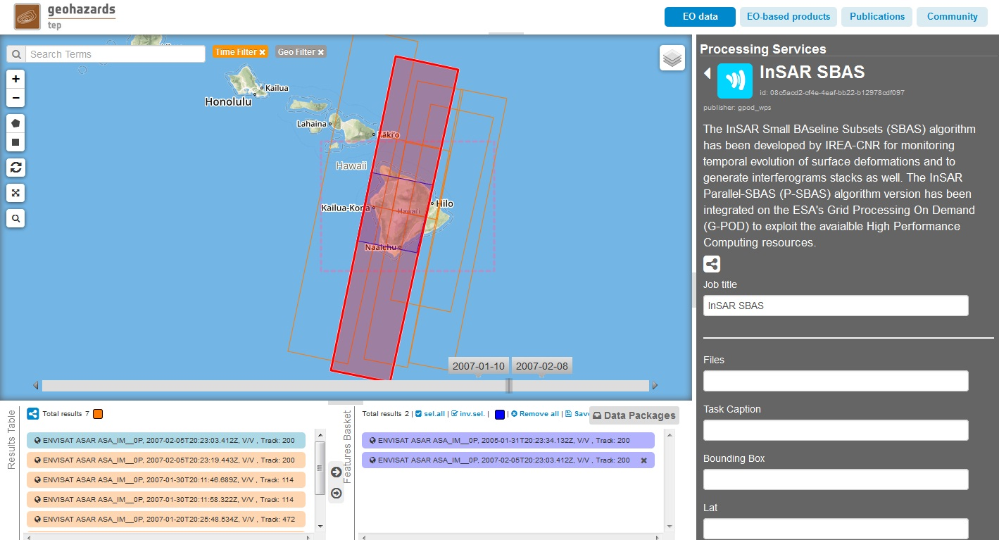
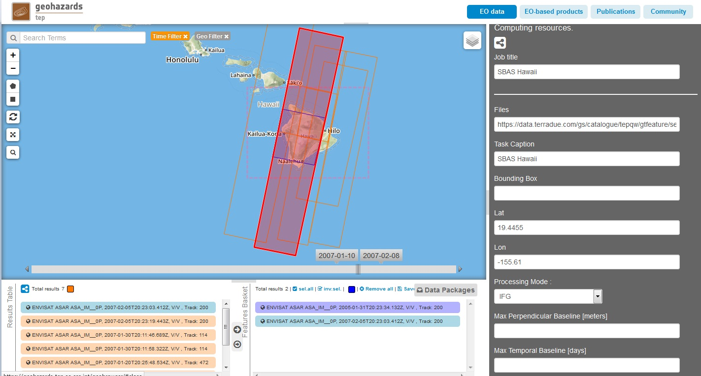
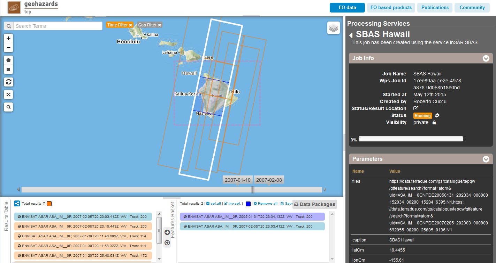
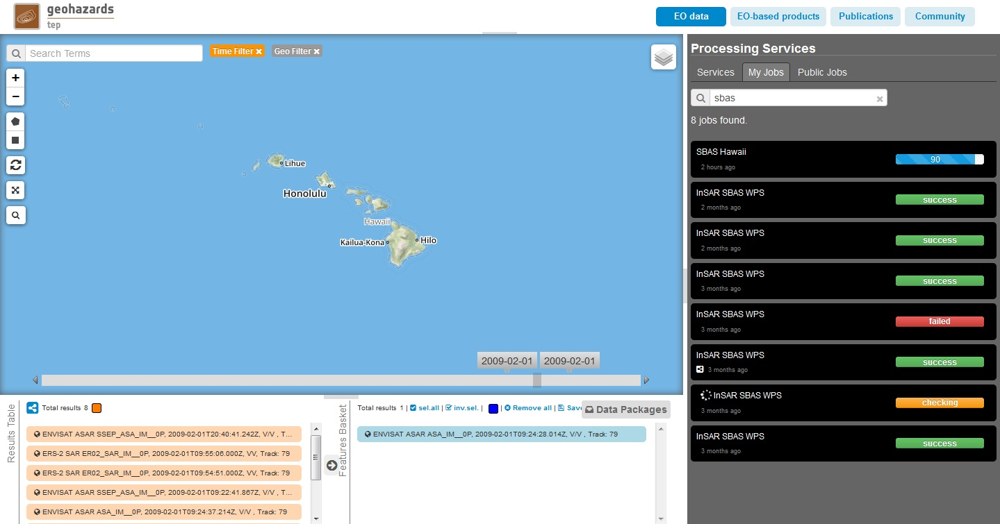
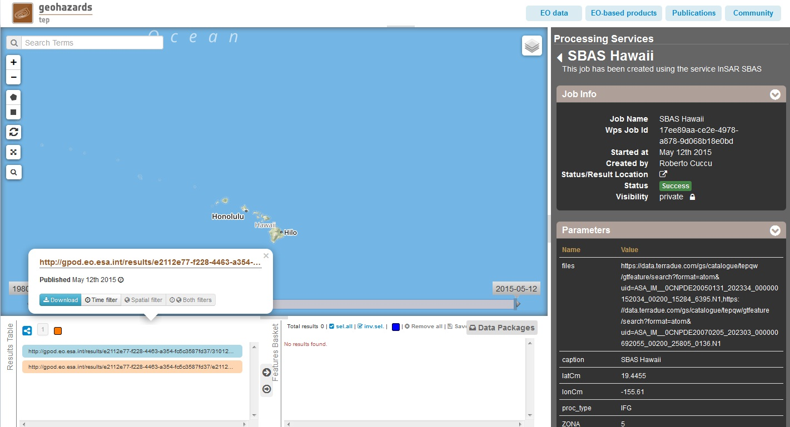

G-POD SBAS InSAR Service
~~~~~~~~~~~~~~~~~~~~~~~~

Select the processing
=====================

* Login to the platform (see :doc:`user <../community-guide/user>` section)

* Access the Geobrowser : https://geohazards-tep.eo.esa.int/geobrowser/

* Select the processing service “InSAR SBAS”.

The "InSAR SBAS" panel is displayed with parameters values to be filled-in.

Fill the parameters
===================

* Select the Hawaii islands as Area of Interest (AOI) and select properly the time filters in order to get the following products:

.. code-block:: sbas-parameter

  ENVISAT ASAR ASA_IM__0P, 2005-01-31T20:23:34.132Z, V/V, Track: 200
  ENVISAT ASAR ASA_IM__0P, 2007-02-05T20:23:03.412Z, V/V, Track: 200

* Drag and Drop the above products in the field *Files*.

* As *Job title*, type:

.. code-block:: sbas-parameter

  SBAS Hawaii

* As *Task Caption*, type:

.. code-block:: sbas-parameter
 
  SBAS Hawaii

* As *Lat*, type:

.. code-block:: sbas-parameter
  
  19.4455

* As *Lon*, type:

.. code-block:: sbas-parameter
  
  -155.61

* As *Processing Mode*, select:

.. code-block:: sbas-parameter
  
  IFG

* As *Zone_UTM*, type:

.. code-block:: sbas-parameter
  
  5

* As *CM_UTM*, type:

.. code-block:: sbas-parameter
  
  -153

* As *Y0*, type:

.. code-block:: sbas-parameter
  
  0

.. note::

  You can left all the other field as blank.

Run the job
===========

* Click on the button Run Job and see the Running Job:

* After about 2 hours, see the Successful Job:

* Download the processing results once the Job is completed:

