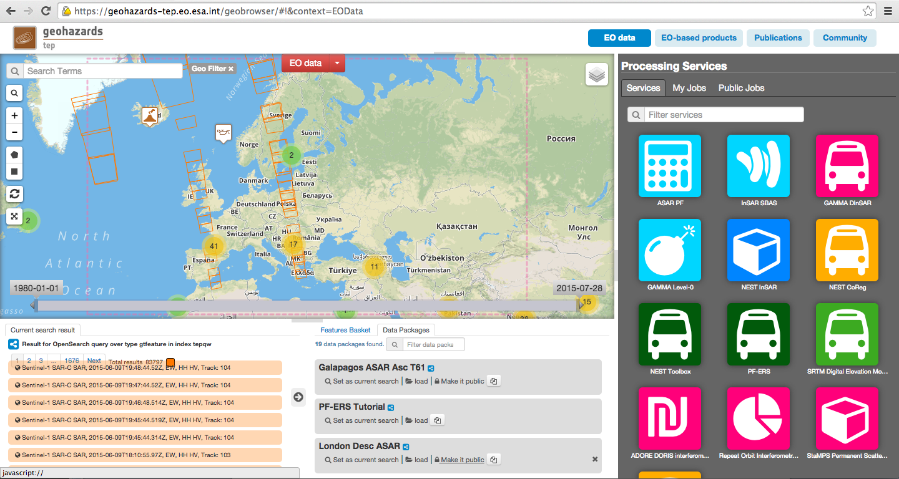
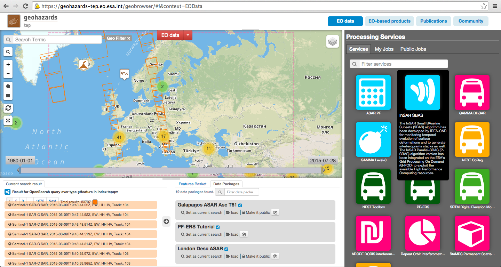
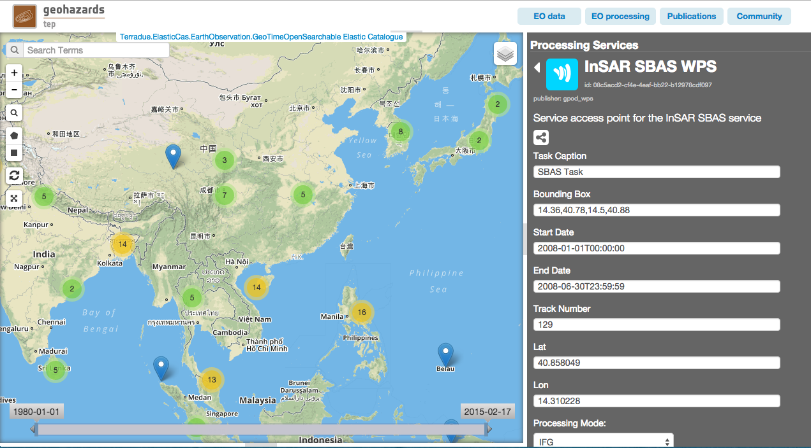
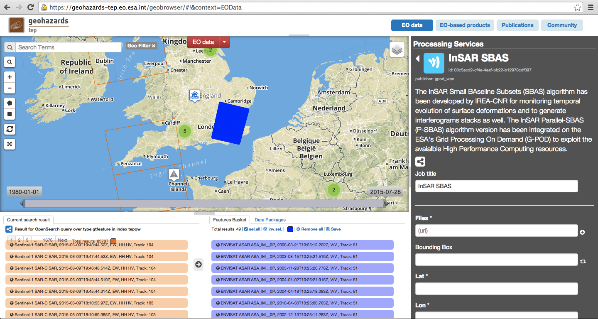
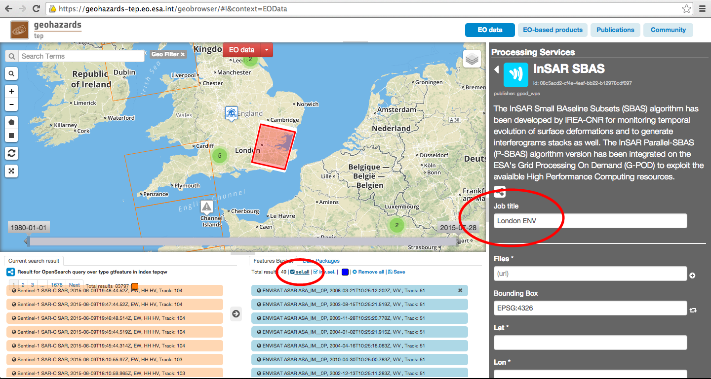
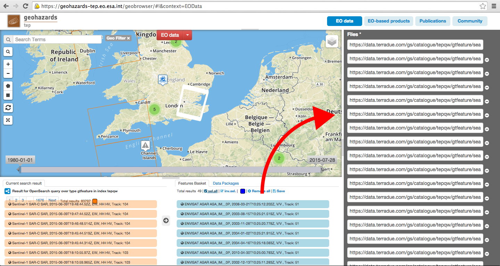
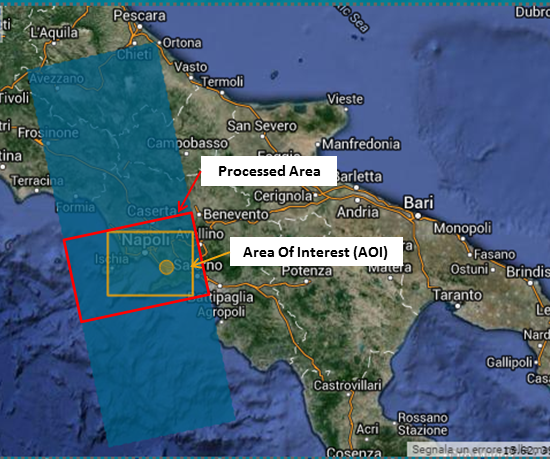
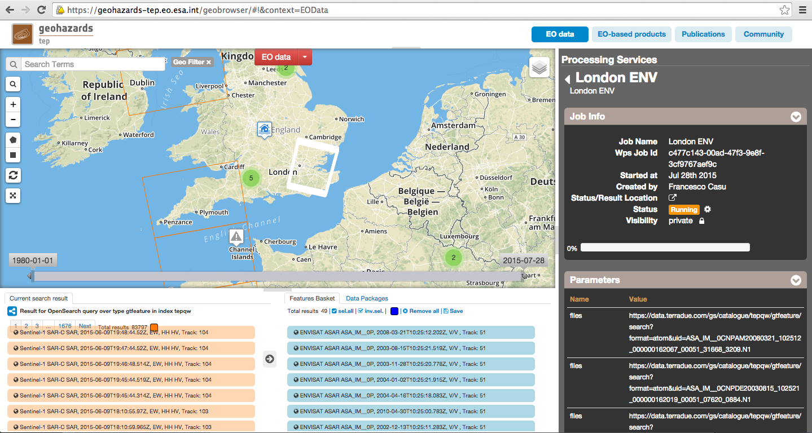
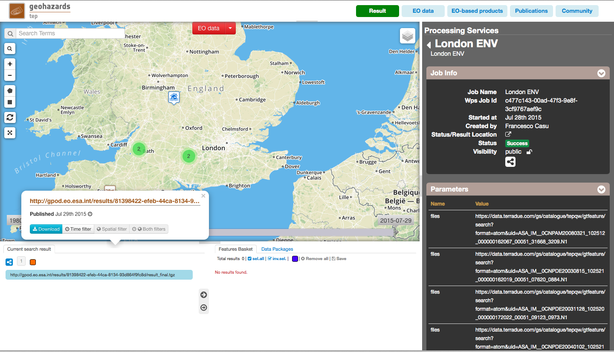
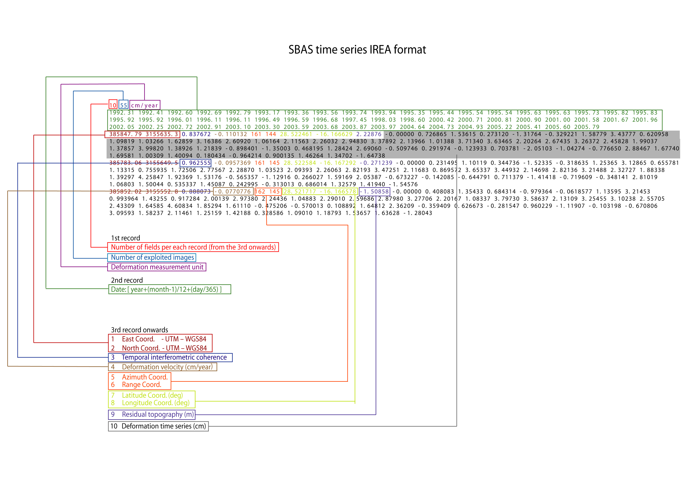

G-POD SBAS InSAR Service
~~~~~~~~~~~~~~~~~~~~~~~~

This tutorial describes how to submit a job for the SBAS-InSAR service to obtain a ground displacement time series from ERS and/or ENVISAT ASAR data. The tutorial is addressed to users already familiar with InSAR processing, analysis and products, and gives some hints and recommendation for the best service usage experience.

The provided service performs the full SBAS-InSAR chain from RAW data (Level 0) focusing to displacement time series generation.

The main user actions are the following:
*	select the Input SAR Raw data to be processed;
*	optionally define the area of SAR data to be processed;
*	set input parameters/threshold (e.g. baseline, temporal coherence, …) for SBAS-InSAR processing;
*	obtain SBAS-InSAR geocoded (Lat/Lon and/or UTM WGS84) results, such as mean deformation velocity map and deformation time series.

As additional feature, the possibility to generate single or stack of interferograms co-registered to a single master geometry is also available.

Users are encouraged to use the SBAS-InSAR service here described for scientific purposes. Please, note that commercial use (including service provisioning) of any part of this service is not allowed without express permission from the CNR-IREA Institute and ESA. 
Being this service available for free for scientific use, please recognize the effort made by the authors by citing:

**F. Casu, S. Elefante, P. Imperatore, I. Zinno, M. Manunta, C. De Luca and R. Lanari, "SBAS-DInSAR Parallel Processing for Deformation Time-Series Computation," IEEE JSTARS, vol. 7, no. 8, pp. 3285-3296, 2014, doi: 10.1109/JSTARS.2014.2322671**

in relevant talks and publications prepared by using SBAS-InSAR results generated by this service.
CNR-IREA and ESA do not respond in any case for the use, interpretation, and quality of the obtained measurements.

Select the processing
=====================

* Sign-in on the Portal https://geohazards-tep.eo.esa.int/ (see guidance :doc:`user <../community-guide/user>` section)

* Access the Geobrowser: https://geohazards-tep.eo.esa.int/geobrowser/

* Open the tab "Processing services" from the right of the map, and then select the processing service “InSAR SBAS”.

Select the files to process
===================

Input SAR data selection must be carried out with particular care, since a wrong data selection can result to an unfeasible processing.

* The algorithm accepts as inputs **ASAR** and **ERS RAW (level 0) data**. SLCs cannot be processed. The corresponding catalogue entry names are (in the brackets are the actual file names):
	+ ENVISAT data: **ENVISAT ASAR L0** (ASA_IM__);
	+ ERS data in CEOS format: **ERS-x SAR IM L0** (ER0x_SAR_IM__0P), where “x” can be equal to 1 or 2;
	+ ERS data in ASAR format: **ERS-x SAR Ex_SAR_IM__0P** (SAR_IM__0P), where “x” can be equal to 1 or 2.
* It is very important that the user selects **images related to the same track only**. In case of use of ASAR data, also same sub-swaths have to be considered.
* **For ERS data only**, it is mandatory to **avoid** possible **epoch replications**. Indeed, it is possible that the same area is (partially) covered by two or more frames acquired at the same epoch. For a correct run this data duplication has to be avoided. ASAR data can be selected without caring of this particular constrain since the system automatically discards duplicated images and correctly joins SAR data belonging to different “portions” (frames) of the same strip.
* **Note that to obtain reliable displacement measurements and to avoid processing failures, it is strongly suggested to select a number of epochs greater then 20 in the case of time series generation mode**.

For this tutorial, a pre-defined data set has been prepared to speed up data selection step.

* Browse the Data Packages looking for *London Desc ASAR* package and click on the load button to upload it.

* Surf the map to the London (UK) Area of Interest: the browser page should appear as depicted in the next figure.

        
* Set the *Job Title* with a meaningful name (e.g. London ASAR) and push the *sel. all* button in the Feature Basket. 
      

                
* Drag all the selected data and drop them within the Files field on the right panel.                
                

                
                
Fill the parameter values
===================

Leave the *Bounding Box* unchanged. By the way, this field is needed when the subsequent *Cut data over selected AoI* flag is set to “true”.

* As *Lat*, type:

.. code-block:: sbas-parameter
  
  51.5

* As *Lon*, type:

.. code-block:: sbas-parameter
  
 -0.13
 
*Lat* and Lon are the Latitude and Longitude coordinates (in decimal degrees) of the **reference point** for the SBAS-InSAR measurement. It should be located in a stable area or its deformation behaviour shall be known. In any case, the user shall verify that input Lat and Lon coordinates are on **land** and included **within the selected area**. As a suggestion, urbanized areas are usually well suitable to locate the reference point.
 
* As *Cut data over selected AoI* type:

.. code-block:: sbas-parameter

  false

When “true”, the system automatically process the AOI identified by the *Bounding Box* selection. The area along the SAR strip is selected according to the following Figure. 

Acquisitions that do not cover the selected area are automatically discarded. In any case, within this processing mode, the size of the processed area along the azimuth direction ranges between 15000 and 40000 full resolution lines. This feature is **available only for ASAR data** and **ERS data in ASAR format** and it is particularly useful for processing the long strips.

* As *Processing Mode*, select:

.. code-block:: sbas-parameter
  
  Time Series Generation

.. figure:: assets/tuto_sbas_6.png
	:figclass: align-center
        :width: 750px
        :align: center
        
.. note::

You can leave all the other fields unchanged. **Note that the default values work fine for almost all the ERS and ENVISAT cases.**

For sake of completeness, in the following a brief description of each parameter is provided:

* **Max Perpendicular Baseline** is the maximum allowed perpendicular baseline between Master and Slave of each exploited InSAR pair;
* **Max Temporal Baseline** is the maximum allowed temporal separation between Master and Slave of each exploited InSAR pair;
* **Ground Pixel Dimension** represents the dimension of the resulting multilooked pixel of the SBAS-InSAR processing. This practically translates into number of looks along azimuth and range. As an example: 80m correspond to 20x4 looks in the ENVISAT case, while 40m to 10x2.
* **Max Allowed Delta-Doppler** is the maximum allowed Doppler Centroid difference between Master and Slave of each exploited InSAR pair;
* **Max Allowed Doppler Centroid** represents the maximum allowed Doppler Centroid of each SAR acquisition.
* **Prefer Short Time Interferograms.** If checked, the data pair selection tool prefers short time interferograms. Check it when the temporal decorrelation is high and the critical baseline is large. Note that to keep short time interferograms the perpendicular baseline threshold must be increased.
* **Common Band Filtering** allows performing, if selected, a common band filtering in the interferogram generation.
* **Goldstein Weight** is the exponential value of the Goldstein’s phase filter (0.5 as default value).
* **Coh Threshold** represents the Coherence Threshold on the pixels before unwrapping and can assume values between 0.6 and 1.
* **APS Smoothing Time Window** is the temporal window width (in days) for the APS filter on the resulting time series. 

Run the job
===========

* Click on the button "Run Job" at the bottom of the SBAS InSAR processor tab, and monitor the progress of the running Job:

* After about 21 hours of processing time, check the status is set as "Successful Job"

* Download the SBAS InSAR processing results once the Job is completed:

        
**InSAR results available in the Web Portal after processing**

The result that the user will find on web portal are strongly depending on the selected **Processing Mode.**

    **Conventions and assumptions**
	
    Results are provided in the satellite Line Of Sight. Positive values indicate that the target moves toward the satellite.
    Note that all the published binary files (.dat) are in 32-bit floating point raster format (if not differently specified) without any 		header information. The origin of each binary matrix is located in the Lower Left corner. 
    Results provided in SAR coordinates have the Azimuth direction along the columns (X) and Range direction along the rows (Y).
    Results provided in GEO coordinates (Lat-Lon WGS84) have the Longitude direction along the columns (X) and the Latitude direction along the rows (Y).
    In the naming convention, the <ddmmyyyy> represents the day, month and year of a specific date while <SSS> is a three character code referring to the used sensor (e.g, ERS, ENV, ...).
	
	**Published Results**

	For the **Interferogram Generation** Mode a .tgz folder related to each interferogram pair (in the format <ddmmyyyySSS>_<ddmmyyyySSS>.tgz) is published; each folder contains:
	
		+ fr.dat: Interferogram as binary file in SAR coordinates;
		+ coh.dat: Coherence map as binary file in SAR coordinates;
		+ fr.dat_GOLD: Interferogram filtered with Goldstein kernel as binary file in SAR coordinates;
		+ fr.dat_GOLD_GEO_<dimLon>x<dimLat>: Geocoded Goldstein filtered interferogram as binary file;
		+ coh.dat_GEO_<dimLon>x<dimLat>: Geocoded Coherence map as binary file;
		+ fr.dat_<ddmmyyyySSS>_<ddmmyyyySSS>_GOLD_GEO.tif.kmz: Quick-look of the geocoded Interferogram importable in Google Earth;
		+ the file Interferograms_Dimension.txt which contains the Azimuth and Range dimensions for the binary files provided in SAR coordinates.
		
	For **Time Series Generation Mode** a .tgz folder named “result_final” is published, which contains:
	
		+ 	One ASCII file containing all the outputs of the SBAS-InSAR chain processing. 

			The first record contains, respectively: the number of field of each record; the number of acquisitions used in the time 	series and the measure unit for the mean displacement velocity. 

			The second record contains the list of the epochs of acquisitions used in the time series, given as fraction of year.  In particular, the following relation explains the correspondence between the actual date and its representation as fraction of the year:

.. yyyy.ffff = yyyy + (mm-1)/12 + dd/365::

			where, yyyy.ffff is the acquisition epoch represented as fraction of the year (where ffff is the decimal part), while yyyy, mm and dd are the year, month and day, respectively, assuming that a date is represented as: ddmmyyyy. For instance, the date 17052013 corresponds to: 2013 + (5-1)/12 + 17/365 = 2013.3799
			
			All the others records contain, per each pixel:
			+ East and North UTM WGS84 coordinates (in meters);
			+ Temporal coherence value;
			+ Mean displacement velocity, calculated as linear fit of the relevant time series (in centimetres per year);
			+ SAR coordinates (in pixels);
			+ geographic WGS84 coordinates (latitude and longitude, in degrees);
			+ residual topography w.r.t. the used DEM (in meters);
			+ deformation time series (in centimetres).
			
			The basic scheme of the output ASCII file is reported in Figure 1.

			The file name is: SBAS_output4GIS_<ddmmyyyySSS>_<ddmmyyyySSS>.txt, where the two date indicate the starting and ending acquisitions used for generating the displacement time series.
			
		+ One .kmz file containing the Quick-look of the retrieved mean deformation velocity importable in Google Earth.
		+ Two txt files named *currDates.txt* and *currPairs.txt* which contain the lists of acquisitions and interferometric pairs, respectively.
		

        
        **Figure 1**: Format of the ASCII file, which encloses the outputs of the SBAS-InSAR processing chain.
        
**Feedbacks**

Users are also kindly invited to report any issue and problem encountered during the use of this service to <GEP REFERENCE/TICKETING SYSTEM> **sbas-help@irea.cnr.it** and **eo-gpod@esa.int**. Moreover, suggestions and comments are warmly appreciated in order to keep the service as much as possible appealing, effective and efficient.

