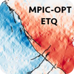
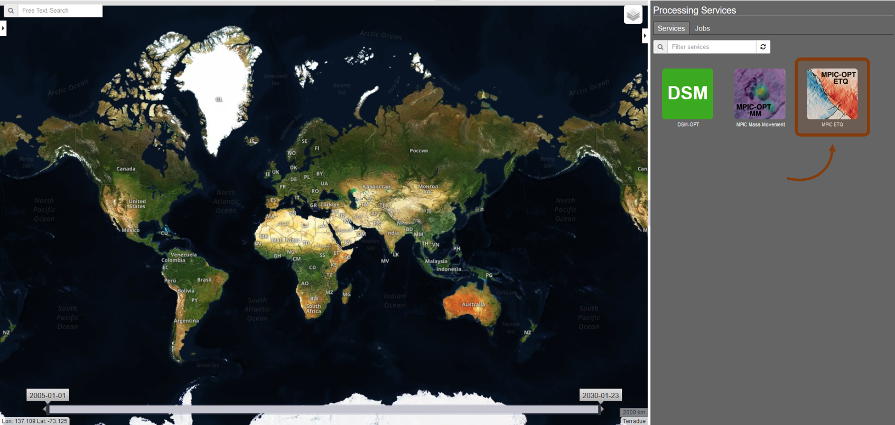
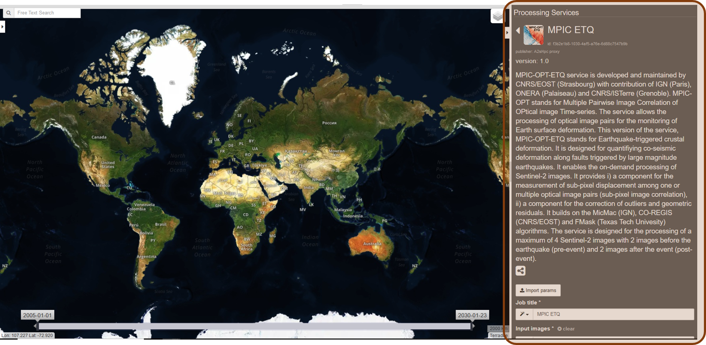
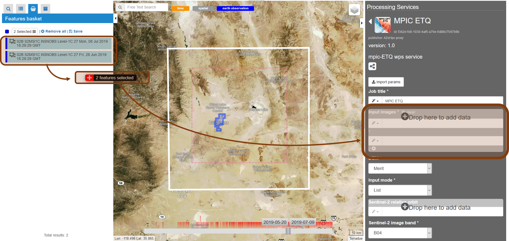
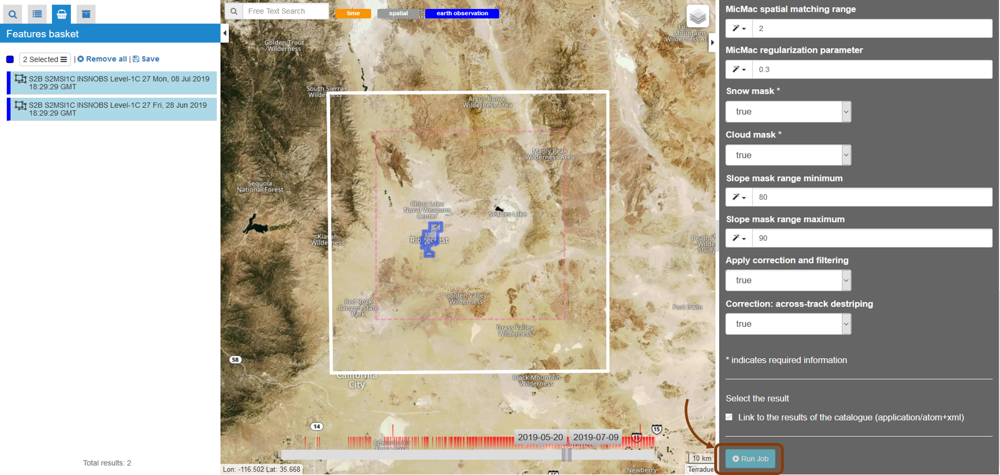

MPIC-OPT-ETQ: Multiple Pairwise Image Correlation of OPTical images for EarThQuake analysis
~~~~~~~~~~~~~~~~~~~~~~~~~~~~~~~~~~~~~~~~~~~~~~~~~~~~~~~~~~~~~~~~~~~~~~~~~~~~~~~~~~~~~~~~~

**MPIC-OPT-ETQ**

**MPIC-OPT-EarThQuake** is a service based on the **CO-REGIS/MPIC** library developed by CNRS/EOST (Strasbourg, France) [1]_, [2]_ and the MicMac image matching library developed by IGN (Marne-la-Vallée, France) [3]_.
CO-REGIS (CO-REGIStration of Sentinel-2 and Landsat-8 images) and MPIC (Mutiple Pairwise Image Correlation of image time series) enable the processing of optical image time series for the quantification of Earth surface motion.

**MPIC-OPT-ETQ** is an on-demand service tailored for quantifying co-seismic deformation from a limited number of images and a few number of parameters which makes it easy to use by non-experts.
It comprises two components with (a) an analysis module for measuring sub-pixel displacement from optical image pairs and (b) a correction module for the geometric correction and filtering of residuals. 

**EO sources**:

    - Sentinel-2 MSI L1C

**Outputs**

Four **service outputs** are provided for visualization on GEP:

* **Mean displacement magnitude:** It consists of a GeoTIFF image representing the mean displacement magnitude over all time steps. The unit is in  *m*. The naming convention is *MM_Mean_displ_magnitude_tile_date1_to_dateN.tif*
* **Mean displacement:** TIt consists of two GeoTIFF images representing the mean displacement in the E−W and N−S direction. The unit is in *m*. The naming convention is *MM_Mean_displacement_EW_tile_date1_to_dateN.tif* and *MM_Mean_displacement_NS_tile_date1_to_dateN.tif*.
* **Quality:** It consists of a GeoTIFF image representing the percentage, per pixel, of the pairs with a correlation score *NCC > minimum correlation threshold*.

Four **service output folders** are provided for download by the user:

* **Analysis:** Folder containing the four products described above in float GeoTIFF file formats.
* **Displacements:** Folder containing the correlation grids and the corrected and filtered displacement field grids.
	- **Corrected displacement fields for each time step:** Float GeoTIFF files representing the measured displacement among the two respective input images in pixels in E-W direction (East is positive) and N-S direction (South is positive) after application of the corrections selected by the user. The naming conventions are *MM_EW_displ_tile_date1_vs_date2_corrected.tif* and *MM_NS_displ_tile_date1_vs_date2_corrected.tif* respectively.
	- **Filtered displacement fields for each time step:** Float GeoTIFF files representing the measured displacements among the two respective input images in pixels in E-W direction (East is positive) and N-S direction (South is positive) after filtering. The naming conventions are *MM_EW_displ_tile_date1_vs_date2_FILTER_Displmax.tif* and *MM_NS_displ_tile_date1_vs_date2_FILTER_Displmax.tif* respectively.
	- **Correlation scores:**  Folder containing 8-bit GeoTIFF images representing the correlation score for each time step with the correlation coefficient [0,1] quantized in the range [128,255]. The naming convention is *MM_Corr_tile_date1_date2.tif*.
* **Masks:** Folder containing the masks used in the processing.
	- **Decorrelation mask:**  8-bit GeoTIFF image representing the decorrelation mask for each time step. The naming convention is *tile_date1_date2_decorrel_mask.tif*.
	- **Cloud mask:** 8-bit GeoTIFF images representing the cloud mask for each time step. Six flags are indicated: 0 = clear sky pixel; 1 = null; 2 = cloud pixel; 3 = cloud shadow pixel; 4 = snow pixel; 5 = water pixel. The naming convention is: *Tile_date_spectral_mask.tif*.
	- **Slope mask:** 8-bit GeoTIFF images representing the slope mask. The naming convention is: *Tile_slope_mask_mask.tif*
* **Preview:** Folder containing the four browse products of the analysis folder.

.. **Convention:** The displacement and the mean velocity products are displayed with the following convention: in the **Forward** mode, **Positive values** are towards the **South** and the **East**; in the **Forward+Backward** mode, the products of the **Backward** time direction have opposite signs as compared to the ones in the **Forward** time direction.

-----

The tutorial introduces the use of the **MPIC-OPT-ETQ** service for the quantification of co-seismic motion. To this end we will process Sentinel-2 images acquired before and after the Ridgecrest earthquake sequence (California, USA, 2019).

Select the processing service
=============================

* Login to the platform (see :doc:`user <../community-guide/user>` section)

* Go to the Geobrowser, expand the panel “Processing services” on the right hand side and select the processing service “MPIC-OPT-ETQ”:

This will display the service panel including several tunable parameters.

Use case: Analysis of the July 2019 Ridgecrest Earthquake sequence
==================================================================

Select input data
-----------------

The Geobrowser offers multiple ways to search a large variety of EO-based dataset and the user should refer to the :doc:`Geobrowser <../community-guide/platform/geobrowser>` section for a general introduction.
For this tutorial we will use a data package which is accessible through the "Data Packages" tab on the upper left of the screen. If you type "Ridgecrest" into the search box you should be able to find a data package named "Ridgecrest_2019_S2_2im". Alternatively you can access the `Ridgecrest data package`_ directly by clicking on the link:
.. _`Ridgecrest datapackage`: https://geohazards-tep.eu/t2api/share?url=https%3A%2F%2Fgeohazards-tep.eu%2Ft2api%2Fdata%2Fpackage%2Fsearch%3Fid%3DRidgecrest_2019_S2_2im

.. figure:: assets/tuto_mpicetq_3.png
	:figclass: align-center
        :width: 750px
        :align: center

Click on the data package, hold Shift and Drag and Drop all four products in the *Sentinel-2 products* field in the service panel on the right:

.. Warning:: Sentinel-2 datasets distributed before 27 September 2016 contain multiple tiles. For such datasets the *Geobrowser* currently returns several results including both the original multi-tile dataset and a preview of the footprints of the tiles. For processing, you must select **only** the original multi-tile datasets. For datasets after 27 September 2016, there is no such ambiguity.

Set the processing parameters
-----------------------------

There are 16 processing parameters that can be adjusted. A short explanation of the parameter is provided when hovering over the parameter fields.

* **DEM:** Defines the Digital Elevation Model used for filtering the displacement fields. The *Merit* [4]_ and the *COP-DEM_GLO-30* [5]_ are available to GEP users. The default DEM is the Merit DEM.
* **Sentinel-2 band:** Defines the Sentinel-2 band for matching. The option *B04* is recommended since the red band is also used for band to band co-registration by the ESA Sentinel-2 production center.
* **Split date:** Is an optional parameter of the form "yyyy-MM-dd" which will split the time series into two subsets. Pairs will only be formed among members of different subsets. This is particularly interesting in the case of quantifying co-seismic displacement. The default value is left empty.
* **Minimum matching range:** Defines the minimum matching range for creating the image pairs. The matching range is expressed in *acquisitions* so if a minimum range is set to 1, all the images (N) will be paired with at least the next image in time (N+1). The default value is set to 1.
* **Maximum matching range:** Defines the maximum matching range for creating the image pairs. The matching range is expressed in *acquisitions* so if a maximum range is set to 2, all the images (N) will be paired with at most the next second image in time (N+2). The default value is set to 5.
* **Matching direction:** Define the time direction for the matching. If *Forward* is selected, the pairs are only created in the time direction. If *Forward+Backward* is selected, the pairs will be created in both directions (i.e. time and reverse time direction). The default value is set to *Forward*.
.. Warning:: Choosing the *Forward+Backward* option has to be carefully considered by the user as it increases the number of pairs created and hence, the computing time and resources.
* **Window size:** Controls the size of the template used for matching. It controls the neighborhood around the central pixel. The minimum value is 1 (3x3 pixels) and the maximum value is 7 (15x15 pixels). The default value is *3* (7x7 pixels). A smaller window size allow better reconstructing small scale variations but can lead to more noise. Vice versa, larger window sizes lead to greater robustness against noise but smooth small scale details. For large scale motion such as co-seismic slip, we recommend to use large window sizes.
* **Decorrelation threshold:** Discards the matches with a correlation coefficient below a value expressed in the range [0,1]. The default value is *0.2*.
* **Spatial matching range:** Defines the search range in pixel for finding matches based on the template. The actual search range is computed from this parameter as round(Spatial matching range/0.8)+2. The parameter has to be adjusted according to the maximum expected displacement taking into account possible coregistration biases of the input images.
* **Regularization parameter:** Similar to the window size, controls the smoothness of the expected motion field. Increasing the regularization parameter puts greater emphasis on a smooth motion field where neighboring pixels will have similar displacement values. For large scale features such as co-seismic displacement, large value lead to smoother and less noisy results. The default value is *0.3*.
* **Use a direction for regularization:** By default the regularization is isotropic but the user can choose a direction for the regularization meaning the displacement field will constrain a smooth gradient in this direction.
* **Direction of the fault plane / Teta0:** Direction for the regularization, in the case of strike-slip earthquake and if the a priori known, it is recommended to chose the direction of the fault (with East Teta0=0). 
* **Snow mask:** If set to *True*, the areas of the images covered by snow are masked. The default value is set to *True*.
* **Cloud mask:** If set to *True*, the areas of the images covered by clouds are masked. The default value is set to *True*.
* **Slope mask range minimum:** The pixels located on terrain slopes with a slope angle larger than the value set with the parameter are filtered out in the products. By default, the parameter is set to *80*, so pixels located on slopes with angle larger than 80 degrees are filtered.
* **Slope mask range maximum:** The pixels located on terrain slopes with a slope angle smaller than the value set with the parameter are filtered out in the products. By default, the parameter is set to *90* degrees, so pixels located on slopes with angle between *Slope mask range minimum* and 90 degrees are filtered.
* **Apply correction and filtering:** If set to *True*, the geometric corrections (as described in [2]_ )and the filtering (as described in [1]_) are applied. They are highly recommended for any use case and are applied by default.
* **Apply correction and filtering:** If set to *True*, the jitter undulation observed in Sentinel-2 images are filtered out [6]_. This correction is recommended for displacement fields with large spatial wavelength like co-seismic displacemnet fields. By default, the paratemeter is *True* and the correction is applied.

Run the job
-----------

* You are good to go. Click on the button *Run Job* at the bottom of the right panel.

* Once the job has finished, click on the *Show results* button to obtain a list of products for visualization.
.. note:: The products in the *Geobrowser* are previews. The user needs to download the results for further analysis and interpretation.

.. figure:: assets/tuto_mpicetq_6.png
	:figclass: align-center
        :width: 750px
        :align: center

References
==========

.. [1] Stumpf, A., Malet, J.-P. and Delacourt, C. (2017). Correlation of satellite image time-series for the detection and monitoring of slow-moving landslides. Remote Sensing of Environment, 189: 40-55. DOI:10.1016/j.rse.2016.11.007
.. [2] Stumpf, A., Michéa, D. Malet, J.-P. (2018). Improved co-registration of Sentinel-2 and Landsat-8 imagery for Earth surface motion measurements. Remote Sensing, 10, 160. DOI:10.3390/rs10020160
.. [3] Rosu, A.-M., Pierrot-Deseilligny, M., Delorme, A., Binet, R. and Klinger, Y. (2015). Measurement of ground displacement from optical satellite image correlation using the free open-source software MicMac. ISPRS Journal of Photogrammetry and Remote Sensing, 100: 48–59. DOI:10.1016/j.isprsjprs.2014.03.002
.. [4] Yamazaki D., Ikeshima, D., Tawatari, R., Yamaguchi, T., O'Loughlin, F., Neal, J.-C., Sampson, C.C., Kanae, S., and Bates, P.D. (2017). A high accuracy map of global terrain elevations. Geophysical Research Letters, 44: 5844-5853, DOI:10.1002/2017GL072874
.. [5] Copernicus Services Coordinated Interface / CSCI (2020). Copernicus DEM - Global and European Digital Elevation Model (COP-DEM). https://spacedata.copernicus.eu/web/cscda/dataset-details?articleId=394198
.. [6] Provost, F., Michéa, D., Malet J.-P., Stumpf, A., Doin M.-P., Lacroix, P., Boissier, E., Pointal, E., Pacini F., Bally, P. (submitted). Terrain deformation measurements from optical satellite imagery: the MPIC-OPT processing services for geohazards monitoring. Remote Sensing of Environment (subm. in Oct. 2020).
