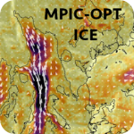
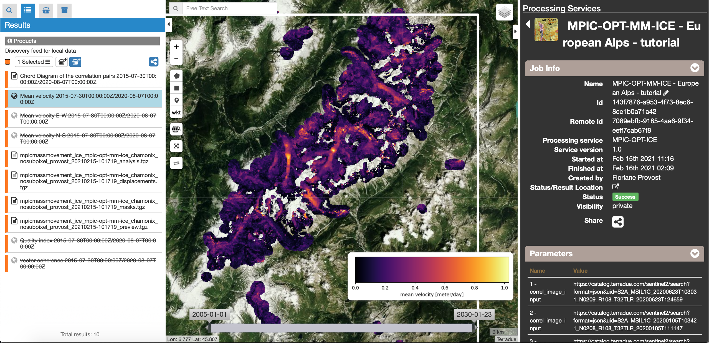

MPIC-OPT-ICE: Multiple Pairwise Image Correlation of OPTical images for ICE/glacier analysis
~~~~~~~~~~~~~~~~~~~~~~~~~~~~~~~~~~~~~~~~~~~~~~~~~~~~~~~~~~~~~~~~~~~~~~~~~~~~~~~~~~~~~~~~~~~~~~~~~~~~~~

**MPIC-OPT** stands for Multiple Pairwise Image Correlation of OPtical image Time-series. The service is developed and maintained by CNRS/ITES (Strasbourg) with contribution of IGN/Matis (Marne-la-Vallée), ONERA (Palaiseau) and CNRS/ISTerre (Grenoble). The service allows the processing of optical image pairs for the monitoring of Earth surface deformation. 

The service version **MPIC-OPT-ICE** is designed for monitoring glacier and ice sheet persistent motion. It enables the on-demand processing of Sentinel-2 image time series. It provides 1) a module for image matching of multiple image pairs susing pixel and sub-pixel image correlation or optical flow, 2) a module for image pairs geometrical correction and filtering, and 3) a module for the spatio-temporal analysis of surface motion. It builds on the MicMac (IGN/Matis; Rosu et al., 2015 [1]_), GeFolki (ONERA; Brigot et al., 2016 [2]_), CO-REGIS (CNRS/EOST; Stumpf et al., 2017 [3]_), MPIC (Stumpf et al., 2018 [4]_), TIO (CNRS/ISTerre; Bontemps et al., 2018 [5]_) and FMask (Texas Tech University; Qiu et al., 2019 [6]_) algorithms. The service is designed for the processing of a maximum of 100 images. Specific tools for ice monitoring are avalaible such as the possibility to focus the analysis on the extent of the glaciers based on the GLIMS database [7]_.

**EO sources**:

    - Sentinel-2 MSI L1C

**Outputs**
============

Five **service outputs** are provided for visualization on GEP:

* **Mean velocity magnitude:** It consists of a GeoTIFF image representing the mean velocity magnitude over all time steps. The unit is in  *m/day*. The naming convention is *MM_Mean_velocity_magnitude_tile_date1_to_dateN.tif*
* **Mean velocity:** It consists of two GeoTIFF images representing the mean velocity in the E−W and N−S direction. The unit is in *m/day*. The naming convention is *MM_Mean_velocity_EW_tile_date1_to_dateN.tif* and *MM_Mean_velocity_NS_tile_date1_to_dateN.tif*.
* **Quality Index:** It consists of a GeoTIFF image representing the percentage, per pixel, of the pairs with a correlation score *NCC > minimum correlation threshold*.
* **Vector Coherence:** It consists of a GeoTIFF image representing the persistence of the displacement in both magnitude and direction. It has no unit and ranges from 0 (i.e. no motion or random motion) to 1 (i.e. strong motion in the a consistent direction).
* **Chord Diagram:** The Chord diagram representing the link between the images as tunned by the user with the Matching parameters.

Four **service output folders** are provided for download by the user:

* **Analysis:** Folder containing the four products described above in float GeoTIFF file formats.

* **Displacements:** Folder containing the correlation grids and the corrected and filtered displacement field grids.
	* **Corrected displacement fields for each time step:** Float GeoTIFF files representing the measured displacement among the two respective input images in pixels in E-W direction (East is positive) and N-S direction (South is positive) after application of the corrections selected by the user. The naming conventions are *MM_EW_displ_tile_date1_vs_date2_corrected.tif* and *MM_NS_displ_tile_date1_vs_date2_corrected.tif* respectively.
	* **Filtered displacement fields for each time step:** Float GeoTIFF files representing the measured displacements among the two respective input images in pixels in E-W direction (East is positive) and N-S direction (South is positive) after filtering. The naming conventions are *MM_EW_displ_tile_date1_vs_date2_FILTER_Displmax.tif* and *MM_NS_displ_tile_date1_vs_date2_FILTER_Displmax.tif* respectively.
	* **Correlation scores:**  Folder containing 8-bit GeoTIFF images representing the correlation score for each time step with the correlation coefficient [0,1] quantized in the range [128,255]. The naming convention is *MM_Corr_tile_date1_date2.tif*.

.. Note:: The displacement and the mean velocity products are displayed with the following convention: in the **Forward** mode, **Positive values** are towards the **South** and the **East**; in the **Forward+Backward** mode, the products of the **Backward** time direction have opposite signs as compared to the ones in the **Forward** time direction.

* **Masks:** Folder containing the masks used in the processing.
	* **Decorrelation mask:**  8-bit GeoTIFF image representing the decorrelation mask for each time step. The naming convention is *tile_date1_date2_decorrel_mask.tif*.
	* **Cloud mask:** 8-bit GeoTIFF images representing the cloud mask for each time step. Six flags are indicated: 0 = clear sky pixel; 1 = null; 2 = cloud pixel; 3 = cloud shadow pixel; 4 = snow pixel; 5 = water pixel. The naming convention is: *Tile_date_spectral_mask.tif*.
	* **Slope mask:** 8-bit GeoTIFF images representing the slope mask. The naming convention is: *Tile_slope_mask_mask.tif*

* **Preview:** Folder containing the four browse products of the analysis folder.

If the option to invert the time series is selected by the use, three additional outputs are displayed:

* **TIO Mean velocity magnitude:** It consists in a GeoTiff representing the mean velocity computed after inversion of the displacement time serie. The velocity is computed by a linear regression for each pixel. The unit is *m/day*.

.. Warning:: if the displacement is not linear over time, this estimation may be inacurrate.

* **TIO EW/NS Mean velocity:** It consists in a GeoTiff representing the mean velocity computed after inversion of the displacement time serie for each field East-West and North-South. The velocity is computed by a linear regression for each pixel. The unit is *m/day*.
* **Displacement time serie:** It consists in a .csv file containing the cumulative displacement for the EW, NS component and the norm of the displacement for each date of acquisition.
* **TIO folder:** An archive that contains for both displacement component the results of the TIO algorithm. It contains for example, the RMS error for each date of acquisition (*RMSpixel_date* files), the inverted cumulative displacement (*depl_cumul*), etc.

-----

Use case: Ice velocity of the European Alps glaciers (Mont-Blanc massif)
========================================================================

The tutorial introduces the use of the **MPIC-OPT-ICE** service for the quantification of ice surface motion. To this end we will process the couldless Sentinel-2 images available in  the 2015-2020 period over the glaciers of the European Alps.

Select input data
-----------------

The Geobrowser offers multiple ways to search a large variety of EO-based dataset and the user should refer to the :doc:`Geobrowser <../community-guide/platform/geobrowser>` section for a general introduction.
For this tutorial we will use a data package which is accessible through the "Data Packages" tab on the upper left of the screen. If you type "Ridgecrest" into the search box you should be able to find a data package named "European_Alps_S2_im". Alternatively you can access it directly by clicking on the link: https://geohazards-tep.eu/t2api/share?url=https%3A%2F%2Fgeohazards-tep.eu%2Ft2api%2Fdata%2Fpackage%2Fsearch%3Fid%3DEuropean_Alps_S2_im

Please refer to the tutorial of the MPIC-OPT-ETQ to learn more on how to manipulate the data on GEP.

.. Warning:: Sentinel-2 datasets distributed before 27 September 2016 contain multiple tiles. For such datasets the *Geobrowser* currently returns several results including both the original multi-tile dataset and a preview of the footprints of the tiles. For processing, you must select **only** the original multi-tile datasets. For datasets after 27 September 2016, there is no such ambiguity.

Set the processing parameters
-----------------------------

There are 37 processing parameters that can be adjusted. A short explanation of the parameter is provided when hovering over the parameter fields.

* **DEM:** Defines the Digital Elevation Model used for filtering the displacement fields. The *Merit* [8]_ and the *COP-DEM_GLO-30* [9]_ are available to GEP users. The default DEM is the Merit DEM.
* **Sentinel-2 band:** Defines the Sentinel-2 band for matching. The option *B04* is recommended since the red band is also used for band to band co-registration by the ESA Sentinel-2 production center.
* **Matching parameters:** These parameters control the network of pairs that will be created. This is of main importance to obtain a measure of the ground deformation. The user should keep in mind that the method is sensitive to 1/10 of pixel. In the case of Sentinel-2, the method is sensitive to displacement of ~1 meter, if there is less than 1 meter of displacement between two dates, the ground motion will not be measured.
	* **Matching mode:** Defines the unit of the next parameters, it can be "acquisition" or "days".
        * **Minimum matching range:** Defines the minimum matching range for creating the image pairs. The matching range is expressed in *acquisitions* so if a minimum range is set to 1, all the images (N) will be paired with at least the next image in time (N+1). The default value is set to 1.
        * **Maximum matching range:** Defines the maximum matching range for creating the image pairs. The matching range is expressed in *acquisitions* so if a maximum range is set to 2, all the images (N) will be paired with at most the next second image in time (N+2). The default value is set to 5.
        * **Split date:** Is an optional parameter of the form "yyyy-MM-dd" which will split the time series into two subsets. Pairs will only be formed among members of different subsets. This is particularly interesting in the case of quantifying co-seismic displacement. The default value is left empty.
        * **Matching direction:** Define the time direction for the matching. If *Forward* is selected, the pairs are only created in the time direction. If *Forward+Backward* is selected, the pairs will be created in both directions (i.e. time and reverse time direction). The default value is set to *Forward*.

.. Warning:: Choosing the *Forward+Backward* option has to be carefully considered by the user as it increases the number of pairs created and hence, the computing time and resources.

* **Sentinel-2 relative orbit:** Defines the relative orbit to filter the acquisitions. Biases exist between acquisitions of different relative orbits, this option allow to ensure only one relative orbit is considered. 
* **Region Of Interest bounding box:** Defines the area the Sentinel-2 acquisitions are cropped to compute the correlation. 

.. Warning:: It is highly recommended to define small region of interrest for numerous input images in order to reduce the computational cost. For instance, the each Sentinel-2 contain 10980x10980 pixels (100 kmx 100 km). If the pairing network is set to compute 1000 pairs, it means that the correlation and the inversion have to be computed over 100 billion points that will take several days to weeks to process. It is recommended to set ROI of around 5000 x 5000 pixel (50 x 50 km).

* **Image Matching parameters:** Two different algorithms are proposed for this step: **MicMac** developped by IGN/ENS and **GeFolki** *developped by ONERA. Micmac is based on the correlation of two images in the spatial domain while GeFolki is optical flow algorithm.
	* **MicMac Parameters:**
		* **Window size:** Controls the size of the template used for matching. It controls the neighborhood around the central pixel. The minimum value is 1 (3x3 pixels) and the maximum value is 7 (15x15 pixels). The default value is *3* (7x7 pixels). A smaller window size allow better reconstructing small scale variations but can lead to more noise. Vice versa, larger window sizes lead to greater robustness against noise but smooth small scale details. For large scale motion such as co-seismic slip, we recommend to use large window sizes.
		* **Decorrelation threshold:** Discards the matches with a correlation coefficient below a value expressed in the range [0,1]. The default value is *0.2*.
		* **Spatial matching range:** Defines the search range in pixel for finding matches based on the template. The actual search range is computed from this parameter as round(Spatial matching range/0.8)+2. The parameter has to be adjusted according to the maximum expected displacement taking into account possible coregistration biases of the input images.
		* **Regularization parameter:** Similar to the window size, controls the smoothness of the expected motion field. Increasing the regularization parameter puts greater emphasis on a smooth motion field where neighboring pixels will have similar displacement values. For large scale features such as co-seismic displacement, large value lead to smoother and less noisy results. The default value is *0.3*.
		* **Sub-pixel matching:** If true, the sub-pixel matching will be computed at different resolution. This multi-resolution approach consists in starting the computation at a coarse resolution and improving the resolution at each matching level. If false, the matching is computed only at the image resolution.	
	* **GeFolki parameters:**
		* **Radius:** Define the the size of the window *(2R + 1) x (2R + 1)* on which the matching between the two images is maximized. The choice of the radius value is a compromise between robustness and the expected level of detail. A large radius makes the algorithm more robust. If the flow is rapidly changing on the image, the radius must be chosen small eNOugh to estimate these variations. The algorithm can be used for several radius sizes in an iterative manner. The radius sequence is computed as power of 2.
		* **Levels:** Define the number of levels (L) in the scale pyramid. The parameter value is conditioned by the maximum size of the displacement *Wmax*. By default, L=1 so the displacement is assumed to be lower than 2 pixels.
		* **Iteration:** Defines the number of iterations to reach a minimum.
		* **Rank:** Define the spatial window of the rank filter. The parameter controls the smoothness of calculated displacement field by averaging the displacement values within the window size. Default value is *r=4* (9x9 pixel).

* **Masks:** 
	* **Buffer outside the glacier extent:** Defines a buffer area around the glacier mask of the GLIMS database _[7]. The unit is *meter*. By default, a distance of 1000m is taken around the glacier outline.
	* **Glacier mask:** If set to *True*, the correlation is computed only on the pixels located inside the glacier outlines. The glicier oultines are taken from the GLIMS database _[7]. 
	* **Snow mask:** If set to *True*, the areas of the images covered by snow are masked. The default value is set to *True*.
	* **Cloud mask:** If set to *True*, the areas of the images covered by clouds are masked. The default value is set to *True*.
	* **Slope mask range minimum:** The pixels located on terrain slopes with a slope angle larger than the value set with the parameter are filtered out in the products. By default, the parameter is set to *80*, so pixels located on slopes with angle larger than 80 degrees are filtered.
	* **Slope mask range maximum:** The pixels located on terrain slopes with a slope angle smaller than the value set with the parameter are filtered out in the products. By default, the parameter is set to *90* degrees, so pixels located on slopes with angle between *Slope mask range minimum* and 90 degrees are filtered.
	* **Topographic shadow:** If set to *True*, the sun illumination is simulated using the position of the sun and the selected DEM. The area in the shadow are then mask out of the acquisitions before computing the correlation.

* **Correction and filtering of the displacement fields**
	* **Apply correction and filtering:** If set to *True*, the geometric corrections (as described in [4]_ ) and the filtering (as described in [3]_) are applied. They are highly recommended for any use case and are applied by default. **The user can activate or deactivate each correction**.
	* **Correction: deramping** If set to *True*, the first geometric correction (as described in [4]_ ) is applied . It consists in estimating a planar function to correct the ramp commonly present in the displacement fields. It is highly recommended for any use case and is applied by default.
	* **Correction: along-track destriping** If set to *True*, the second geometric correction (as described in [4]_ ) is applied . It consists in estimating a linear shift within each Sentinel-2 sensor stripe to correct the shift present in each stripes of the displacement fields. It is highly recommended for any use case and is applied by default.
	* **Correction: along-track destriping value** The shift within each stripe can be estimated using the *mean* or the *median* of the displacement distribution. By default, the shift is estimated using the *mean* value.
	* **Correction: across-track destriping value** This corrects the jitter undulation by filtering out the short wavelength undulation by a wavelet filter [6]_. This filter is directional and can affect the results by filtering out part of the signal. In the case of small object like glaciers, it is not recommended use it. By default, it is set to *False*.
	* **Filtering displacement amplitude threshold:** Displacement with a magnitude larger than this value will be filtered out in each correlation pair. The unist in in *pixel*. By default, the threshold is 10 px (i.e. 100 m for Sentinel-2).
	* **Filtering: Displacement direction:** If set to *True*, the displacement field is filter by analysing the direction of the displacement with respect to the direction of the slope. By default, it is set to *False*.
	* **Maximum angle deviation for direction filtering:** Defines the maximum angle between the displacement direction and the slope direction. If the this angle is larger than this value, the displacement will be removed in the East-West and North-South displacement fields. The unit is in *degree* and is set to 45° by default.

* **Motion analysis:** If set to *True*, the MPIC-OPT-ICE service provides different outputs computed from the stack of correlation pairs.

* **Time series Inversion for Optical images parameters**
	* **Run TIO:** If set to *True* the TIO algorithm computes the displacement time series. By default, it is set to *True*.
	* **Inversion weight:** Defines the weight of each displacement pairs. The weight is based on the temporal baseline between the two acquisitions as defined in [5]_. The user can choose to give more wait to short baseline pairs (*Short-baseline*) or long baseline (*Long-baseline*) or to set no weight (*None*) in the inversion. By default, it is set to *None*.
	* **Discard pairs:** If set to *True*, pairs can be discarded based on the percentage of masked area in the AOI. This allow to remove the pairs with very few correlated pixels.
	* **Discarding threshold:** The ratio between masked and non-masked pixel is computed over the AOI. If this ratio is larger than the *discarding threshold*, the pairs is discarded from the inversion procedure. This parameter is ranging in [0,1] and set to 0.8 by default.
	* **Correlation weighting:** If set to *True*, the inversion will take into account the correlation grids to weight the contribution of each pixel for each pair in the inversion.

Results
--------

The results are also accessible on this link: https://geohazards-tep.eu/t2api/share?url=https%3A%2F%2Fgeohazards-tep.eu%2Ft2api%2Fjob%2Fwps%2Fsearch%3Fid%3D32259ea3-396c-4ba0-aa67-cc752ee8f9cb%26key%3De490dd3f-d5bf-4c5f-97e7-943f06b60c0f

* The first set of results provides the mean velocity (m/day) computed from the stack of displacement grids. Here, one can see the activity of the European Alpine glaciers with a mean velocity of up to 0.7 m/day.

* The second set of results provides the mean velocity (m/day) estimated from the linear regression of the TIO displacement times series. 

.. image:: assets/tuto_results_mpicice_TIO.png

.. Note:: One can see that the estimation of the velocity from both approaches may slighlty differ. The choice of various parameters such as the matching range, the correlation threshold, the activated masks or the inversion weights may change significantly the results.

Disclaimer
----------

The MPIC-OPT services are scientific softwares provided at the best CNRS/ForM@Ter (EOST/A2S) knowledge according to state-of-the-art image matching algorithms. No warranty is provided on the processors and results of the services. CNRS/ForM@Ter (EOST/A2S) is not responsible for any software inaccuracies, bugs, errors and misuse. Generated results have a defined accuracy according to the relevant scientific publications available in the literature. Result accuracy is estimated on a statistical basis. Provided results are not validated by CNRS/ForM@Ter  and, indeed, it is user responsibility to validate them. CNRS/ForM@Ter  is not responsible for the use, quality, accuracy and interpretation of results and products that are generated by using the processors and services provided within the platform. CNRS/ForM@Ter  is not responsible for the use, quality, accuracy and interpretation of third party results, products and services derived from the use of the  processors and services. CNRS/ForM@Ter  is not responsible of possible outages of the provided services. CNRS/ForM@Ter   is not responsible of any kind of third party loss derived from service outage, result inaccuracies, software errors of the provided services and products. The maintenance, update and user support are provided by EOST/A2S free of charge and at best effort. EOST/A2S is not responsible for any consequence derived from delays on replies to user requests or support inaccuracies.
 
* **CNRS**: Centre National de la Recherche Scientifique / French National Research Council
* **ForM@Ter**: Pôle Terre Solide / Solid Earth Centre
* **EOST**: Ecole et Observatoire des Sciences de la Terre / School and Observatory of Earth Sciences
* **A2S**: Application de Surveillance par Satellite / Application Satellite Survey

References
==========

.. [1] Rosu, A. M., Pierrot-Deseilligny, M., Delorme, A., Binet, R., & Klinger, Y. (2015). Measurement of ground displacement from optical satellite image correlation using the free open-source software MicMac. ISPRS Journal of Photogrammetry and Remote Sensing, 100, 48-59.
.. [2] Brigot, G., Colin-Koeniguer, E., Plyer, A., & Janez, F. (2016). Adaptation and evaluation of an optical flow method applied to coregistration of forest remote sensing images. IEEE Journal of Selected Topics in Applied Earth Observations and Remote Sensing, 9(7), 2923-2939.
.. [3] Stumpf, A., Malet, J.-P. and Delacourt, C. (2017). Correlation of satellite image time-series for the detection and monitoring of slow-moving landslides. Remote Sensing of Environment, 189: 40-55. DOI:10.1016/j.rse.2016.11.007
.. [4] Stumpf, A., Michéa, D. Malet, J.-P. (2018). Improved co-registration of Sentinel-2 and Landsat-8 imagery for Earth surface motion measurements. Remote Sensing, 10, 160. DOI:10.3390/rs10020160
.. [5] Bontemps, N., Lacroix, P., & Doin, M. P. (2018). Inversion of deformation fields time-series from optical images, and application to the long term kinematics of slow-moving landslides in Peru. Remote Sensing of Environment, 210, 144-158.
.. [6] Qiu, S., Zhu, Z., & He, B. (2019). Fmask 4.0: Improved cloud and cloud shadow detection in Landsats 4–8 and Sentinel-2 imagery. Remote sensing of environment, 231, 111205.
.. [7] GLIMS and NSIDC (2005, updated 2020): Global Land Ice Measurements from Space glacier database. Compiled and made available by the international GLIMS community and the National Snow and Ice Data Center, Boulder CO, USA. https://doi.org/10.7265/N5V98602.
.. [8] Yamazaki D., Ikeshima, D., Tawatari, R., Yamaguchi, T., O'Loughlin, F., Neal, J.-C., Sampson, C.C., Kanae, S., and Bates, P.D. (2017). A high accuracy map of global terrain elevations. Geophysical Research Letters, 44: 5844-5853, DOI:10.1002/2017GL072874
.. [9] Copernicus Services Coordinated Interface / CSCI (2020). Copernicus DEM - Global and European Digital Elevation Model (COP-DEM). https://spacedata.copernicus.eu/web/cscda/dataset-details?articleId=394198
.. [10] Provost, F., Michéa, D., Malet J.-P., Stumpf, A., Doin M.-P., Lacroix, P., Boissier, E., Pointal, E., Pacini F., Bally, P. (submitted). Terrain deformation measurements from optical satellite imagery: the MPIC-OPT processing services for geohazards monitoring. Remote Sensing of Environment (subm. in Oct. 2020).

