MPIC-OPT: Multiple pairwise optical image correlation
~~~~~~~~~~~~~~~~~~~~~~~~~~~~~~~~~~~~~~~~~~~~~~~~~~~~~

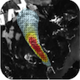
        
**MPIC-OPT**

"This service is developed by CNRS EOST. The MPIC-OPT (Mutiple Pairwise Image Correlation of OPtical image Time-series) service enables the processing of optical image time-series for the monitoring of persistent surface deformation (continuously moving landslides and glaciers). It enables the on-demand processing of time series of Sentinel-2 (Pleaides and Spot6/7 in its VHRO version) if time series (of at least 5 dates) are available over an area.
It comprises three components for i) the measurement of sub-pixel displacement among one or multiple optical image pairs (sub-pixel image correlation), ii) the correction outlier and geometric residuals and iii) a component for multi-temporal fusion"

**EO sources supported**:

    - Sentinel-2 MSI L1C

**Output specifications**

    - Cloud masks (8-bit GeoTiffs representing the mask for each time step)
    - Corrected displacement fields and correlation map for each time step (Floating point GeoTiffs representing the measured displacements among the two respective
input images in pixels)
    - MPIC landslide detection (A floating point GeoTiff representing the vector coherence of all time-steps accumulated
with a value range of [0,1])

-----

This service targets the detection and measurement of horizontal ground deformation (e.g. co-seismic slip, landsliding) based on sub-pixel image correlation. The service allows to jointly analyse a single pairs or time-series of Sentinel-2 images. It combines methods for sub-pixel image matching of multiple-pair combinations as presented in [1]_ and the correction of systematic co-registration residuals as presented in [2]_.

This tutorial will introduce you to the use of the service for the detection of landslide surface displacement for two use cases beeing the quantification of landslide surface displacement and co-seismic displacement. To this end we will process a series of Sentinel-2 images acquired over the Harmalière landslide (France 2016) in and Sentinel-2 images acquired before and after the Kaikoura earthquake (New Zealand 2016).

.. The service is one of three services implemented by CNRS-EOST on the Geohazards Exploitation platform which are mainly dedicated the detection and monitoring of landslides and measurements of surface deformation. This includes the generation of surface models and orthoimages from very-high resolution (VHR) Pléiades images (DSM-OPT), the detection and measurement of surface motion (e.g. landslides and co-seismic slip) from time-series of Sentinel-2 images (MPIC-OPT), and the rapid mapping of newly triggered landslides using Sentinel-2 or VHR orthoimages from before and after major triggering events such as earthquakes or heavy rainstorms.

Select the processing service
=============================

* Login to the platform (see :doc:`user <../community-guide/user>` section)

* Go to the Geobrowser, expand the panel “Processing services” on the right hand side and select the processing service “MPIC-OPT”:

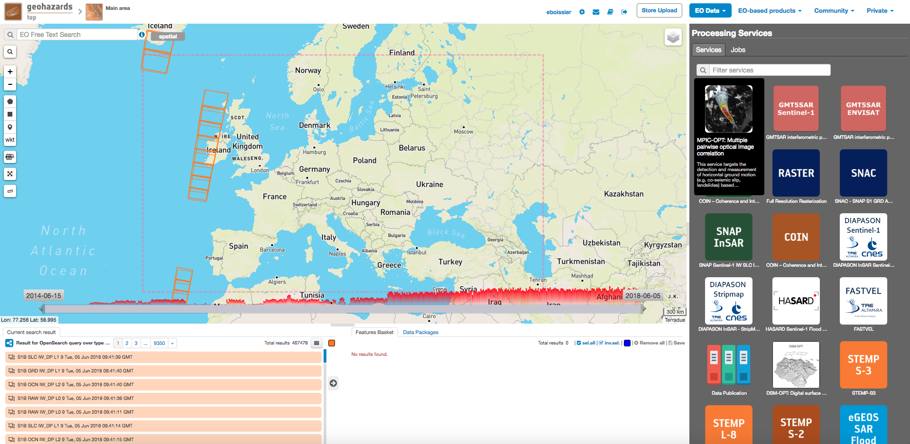

This will display the service panel including several pre-defined parameters which can be adapted .

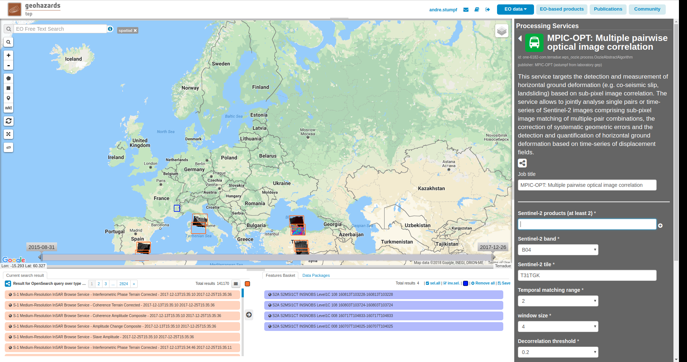

Use case 1: Landslide surface displacement
==========================================

Select input data
-----------------

The Geobrowser offers multiple ways to search and discover a large variety of EO-based dataset and the interested reader should refer to the :doc:`Geobrowser <../community-guide/platform/geobrowser>` section for a general introduction. 
For this tutorial we will rely on readily prepared data packages which are accessible through the "Data Packages" tab on the lower right of the screen. If you type "Harmaliere" into the search box you should be able to find a data package named "Harmaliere landslide". Alternatively you can access the `Harmaliere landslide data package`_ directly by clicking on the provided link.

.. _`Harmaliere landslide data package`: https://geohazards-tep-ref.terradue.com/t2api/share?url=https%3A%2F%2Fgeohazards-tep-ref.terradue.com%2Ft2api%2Fdata%2Fpackage%2Fsearch%3Fid%3DHarmalierelandslide&id=landslide-dm

Similarily you can search for "Kaikoura" to find the data package that we will use in the second part of this tutorial.

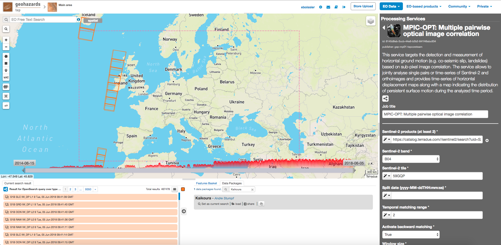

Click on the data package, hold shift and Drag and Drop all four results in the *Sentinel-2 products* field in the service panel on the right:

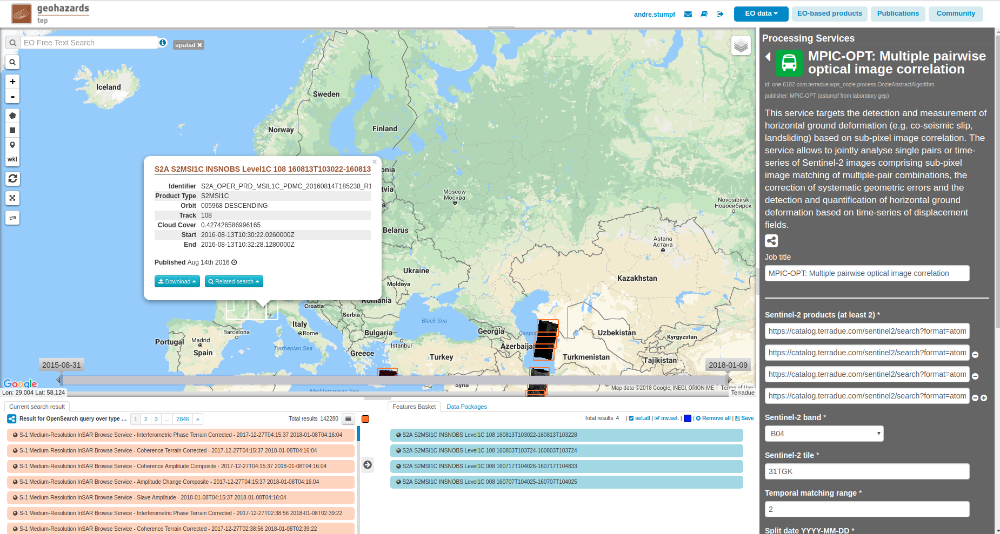

.. caution:: Sentinel-2 datasets distributed before 27 September 2016 contain multiple tiles. For such datasets the *Geobrowser* currently returns several results including both the original multi-tile dataset and a preview of the footprints of the contained tiles. For processing you must select **only** the original multi-tile datasets. For datasets after 27 September 2016 there is no such ambiguity.

Set the processing parameters 
-----------------------------

There is a total of 9 processing parameters that can be adjusted and when hovering over the parameter fields you will see a short explanation for each of the parameters.

* **Sentinel-2 band:** Specify the Sentinel-2 band used for matching. The option *B04* is recommended since the red band is also used for band to band co-registration by ESA
* **Sentinel-2 tile:** This parameter is mainly for backwards compatibility with older SAFE datasets(before 27 September 2016) where multiple tiles where distributed in one SAFE folder. For such datasets it is necessary to specify Sentinel-2 tile in the format T{UTM zone number}{MGRS code} (e.g. T31TGK). However, here we are dealing with single tile datasets so that the parameter can be set to *NONE*.
* **Temporal matching range:** Defines how many pairs will be created considering the temporal order of the selected images. The default is *2* so that each image is matched with at most the previous 2 images within the selection.
* **Split date:** An optional parameter of the form "yyyy-MM-ddTHH:mm:ss" which will split the time series into two subsets and pairs will only be formed among members of different subsets. We will see the utility of this parameter in the second example and will leave it at *NONE* for the moment.
* **Window size:** The parameter controls the size of the template used for matching among the input images. More specifically it controls the neighborhood around the central pixel so that the default value of *3* results in a 7x7 window size. The minimum value is 1 (3x3 pixel) and the recommended maximum is 7 (15x15 pixel). A smaller window will allow to better reconstruct small scale variations while at the same time can lead to more noise. Vice versa larger window sizes will lead to greater robustness against noise while smoothing small scale details. For small scale movements such as landslides we recommend a smaller window size (e.g. 2) while for large scale movements such as coseismic slip larger window sizes are often better.
* **Decorrelation threshold:** Matches with a correlation coefficient [0,1] will be discarded. The default value is *0.2*.
* **Spatial matching range:** Defines the search range in pixel for finding matches. The actual search range is computed from this parameter as round(Spatial matching range/0.8)+2. This parameter should be adjusted according to the maximum expected displacement taking into account also the possible coregistration bias of the input images. This the considered landslide underwent a period of strong acceleration we will increase this value to *7*.
* **Regularization parameter:** Similar to the window size the regularization parameter controls the smootheness of the expected motion field. Increasing the regularization parameter is putting greater emphasize on a smooth motion field where neighboring pixels will have similar displacment values. For small scale features with strong gradients in the motion fields (e.g. landlsides) we recommend values between 0.05 and 0.3. For large scale features such as coseismic displacement further increasing the value can lead to smoother and less noisy results. Here we will use the default value of *0.3*.
* **Activate backward matching:** If set to True backward matching will be performed for each pair. Here we will leave it at the default beeing *False*.

The figure below summarizes the parameter settings for this test.

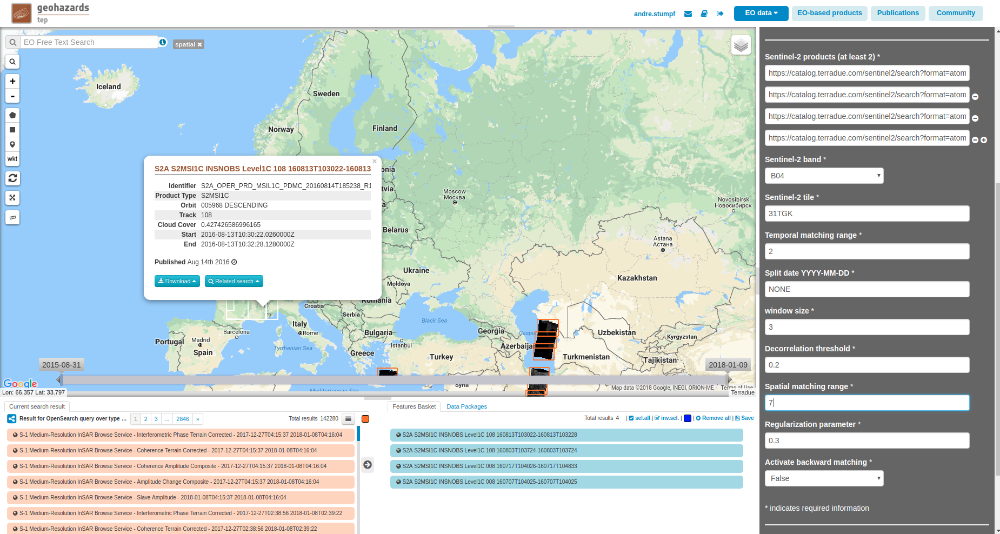

Run the job
-----------

* You are good to go. Click on the button *Run Job* at the bottom of the right panel. Depending on the allocated resources the execution will require at least few hours to terminate.

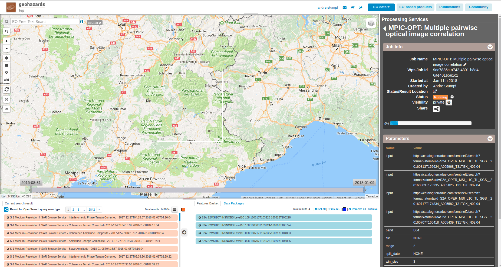

* Once the job has finished click on the *Show results* button to get a list and pre-visualization of all displacement maps and the respective multi-temporal indicators.

.. note:: The pre-visualization in the *Geobrowser* is just a preview and the user is encouraged to download the results for further processing and analysis.

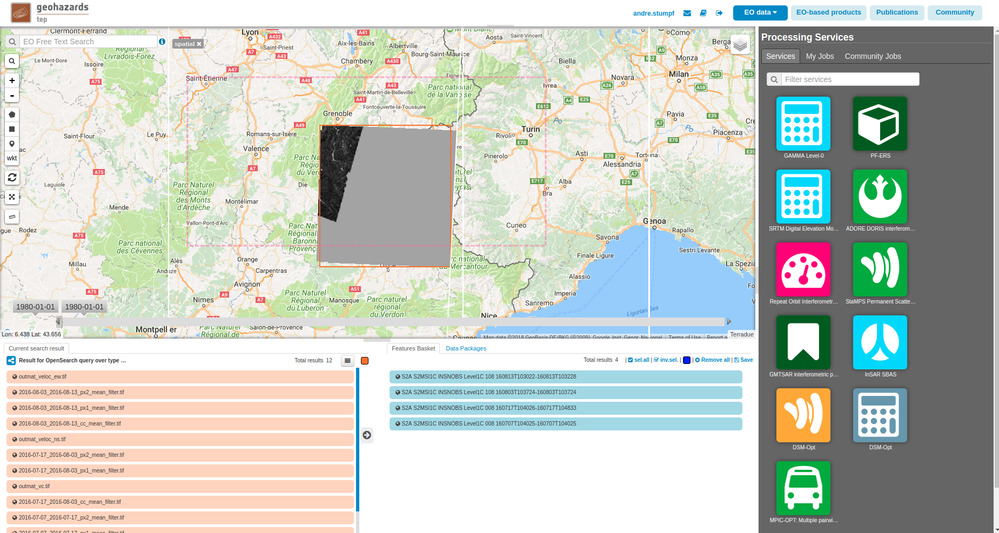

Use case 2: Coseismic slip
==========================

With this second use case we will illustrate the use of MPIC-OPT for measurements of co-seismic slip using the example of the `Kaikoura earthquake`_ which hit the southern island of New Zealand on 14 November 2016.

.. _`Kaikoura earthquake`: https://en.wikipedia.org/wiki/2016_Kaikoura_earthquake

Select input data
-----------------

As in the previous example there is already a data package available which we you can find by typing "Kaikoura" in the search box in the "Data Packages" tab on the lower right of the screen. Alternatively, you can access the `Kaikoura data package`_ directly by clicking on the link.

.. _`Kaikoura data package`: https://geohazards-tep-ref.terradue.com/t2api/share?url=https%3A%2F%2Fgeohazards-tep-ref.terradue.com%2Ft2api%2Fdata%2Fpackage%2Fsearch%3Fid%3DKaikoura&id=landslide-dm

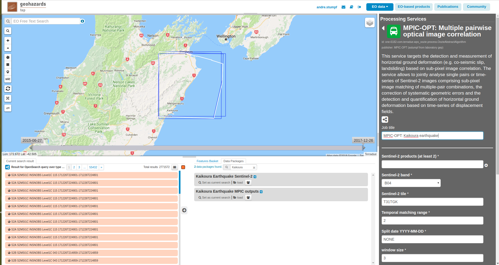

Click on the data package, hold shift and Drag and Drop all four results in the *Sentinel-2 products* field in the service panel on the right:

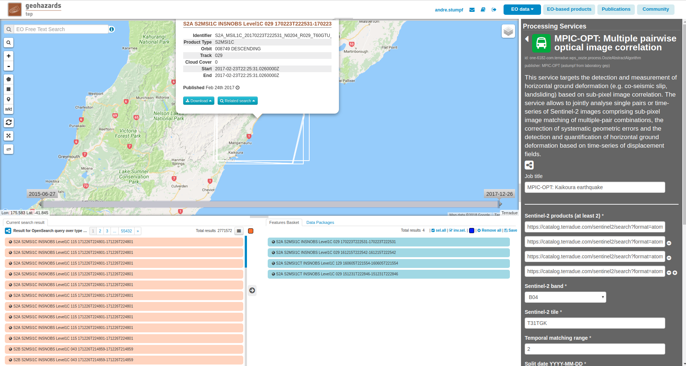

Set the processing parameters 
-----------------------------

.. note:: For this example we will set the **Split date** in which case the **Temporal matching range** is ignored.

* **Sentinel-2 band:** Specify the Sentinel-2 band used for matching. The option *B04* is recommended since the red band is also used for band to band co-registration by ESA.
* **Sentinel-2 tile:** The tile code for this scene is *59GQP*.
* **Temporal matching range:** For this use case we will use the **Split date** parameter in which case all possible pairs are formed and the **Temporal matching range** will be ignored.
* **Split date:** We will set the parameter to the date of the earthquake which is *2016-11-13T11:02:00* (yyyy-MM-ddTHH:mm:ss, UTC time). Consequently the service will match all scenes before this date with all scenes after this date.
* **Window size:** The parameter controls the size of the template used for matching among the input images. Leave it at the default value of *3* which results in a 7x7 window size.
* **Decorrelation threshold:** We will slightly increase this threshold to *0.33*.
* **Spatial matching range:** Defines the search range in pixel for finding matches. The horizontal offsets for this event reached 10 m and more and we should provide some additional tolerance for possible co-registration offsets. So set the value to *3*.
* **Regularization parameter:** Here again we will use the default value of *0.3*.
* **Activate backward matching:** Set this option to *True* to also inverse the pairs which provides an aditional measurement that can help to reduce the variance of the offsets measured at each time step.

The figure below summarizes the parameter settings for this test.

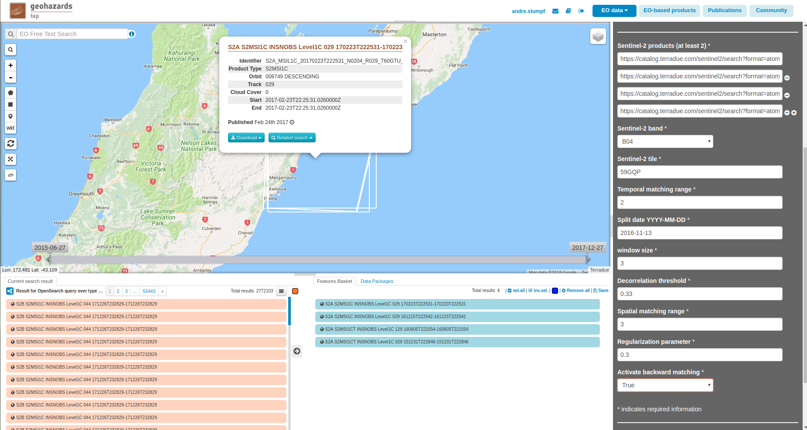

Run the job
-----------

* You are good to go. Click on the button *Run Job* at the bottom of the right panel. Depending on the allocated resources the execution will require at least few hours to terminate.

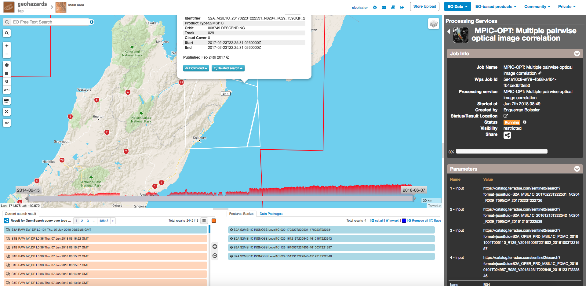

* Once the job has finished click on the *Show results* button to get a list and pre-visualization of all displacement maps and the respective multi-temporal indicators.

.. note:: The pre-visualization in the *Geobrowser* is just a preview and the user is encouraged to download the results for further processing and analysis.

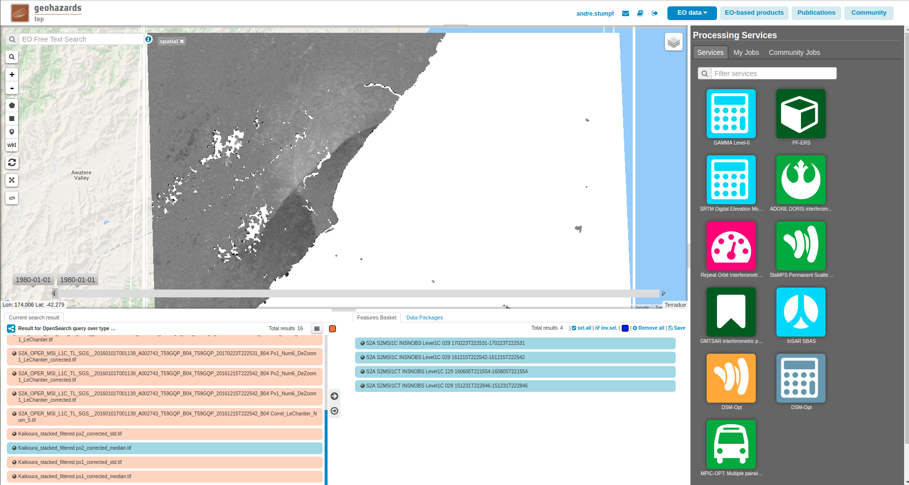

The service output generally includes the following files:

* **Cloud masks:** 8-bit GeoTiffs representing the mask for each time step. Areas with no data and covered by clouds in the two respective input images marked as 0. Valid pixels are marked with 255. The naming convention is: *cloud_masks_assembled_dateimage1_dateimage2.tif*
* **Corrected displacement fields and correlation maps for each time step:** Floating point GeoTiffs representing the measured displacements among the two respective input images in pixels in E-W direction (east is postive) and N-S direction (South is positive): The naming conventions are *Px1_dateimage1_dateimage2.tif* and *Px2_dateimage1_dateimage2.tif* respectively.
* **Correllation coefficient:**  8-bit GeoTiffs representing the correlation coefficient for each time step with the correlation coefficient [0,1] quantized to a range of 128 to 255. The naming convention is *Correl_dateimage1_dateimage2.tif*
* **Vector coherence:** A floating point GeoTiff representing the vector coherence of all time-steps accumulated with a value range of [0,1]. The naming convention is *vector_coherence_dateimage1_dateimage2.tif*
* **Mean displacement:** A floating point GeoTiff representing the average displacement over all time steps in meters. The naming convention is *mean_displacement_$dateimage1_dateimage2.tif*
* **Mean velocity:** Two floating point GeoTiffs representing the mean absolute velocities in E−W direction and N−S direction in meters/day respectively. The naming conventions are *mean_veloc_ew_dateimage1_dateimage2.tif* and *mean_veloc_ns_dateimage1_dateimage2.tif*.

References
==========

.. [1] Stumpf, A., Malet, J.P. and Delacourt, C., 2017. Correlation of satellite image time-series for the detection and monitoring of slow-moving landslides. Remote Sensing of Environment, 189, pp.40-55.

.. [2] Stumpf, A., Michéa, D. Malet, J.P., in Press. Improved co-registration of Sentinel-2 and Landsat-8 imagery for Earth surface motion measurements. Remote Sensing.
