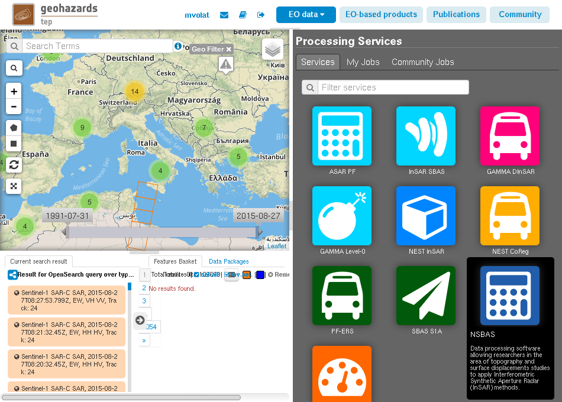
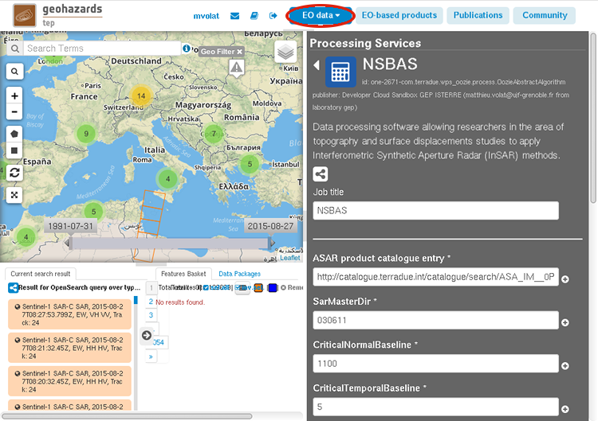
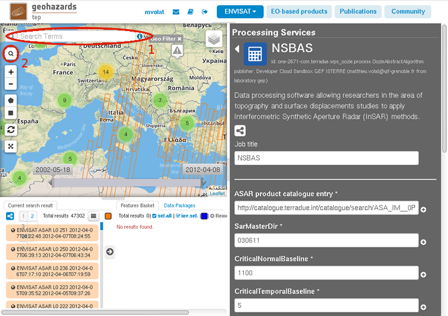
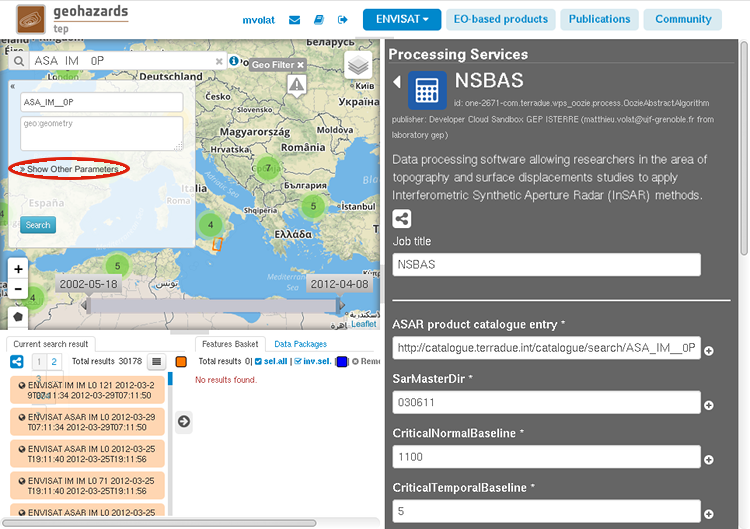
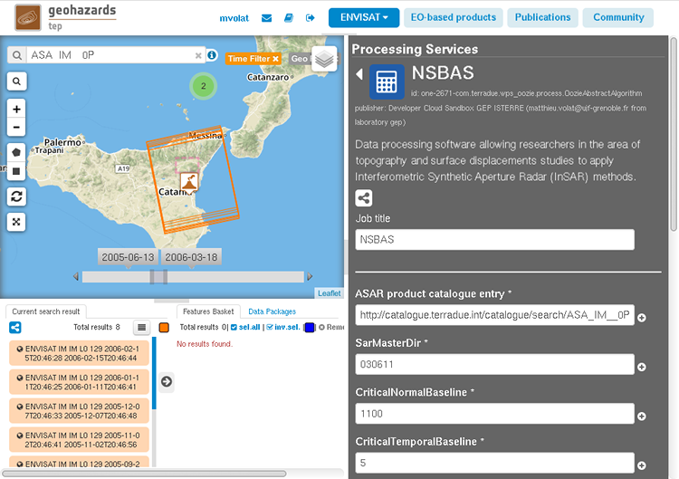
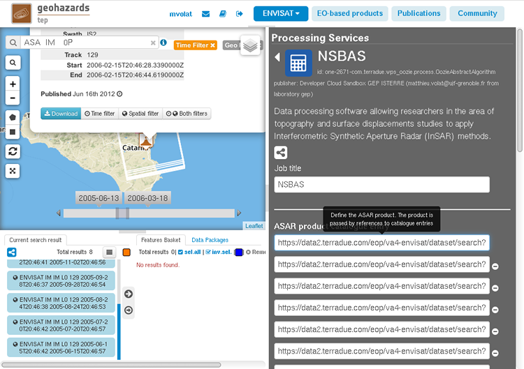
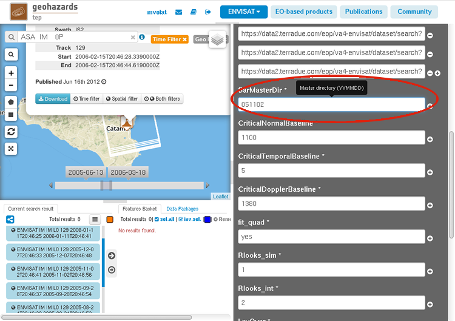
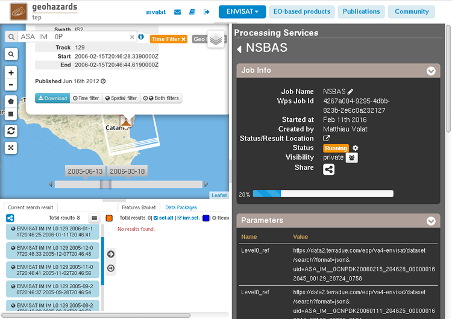
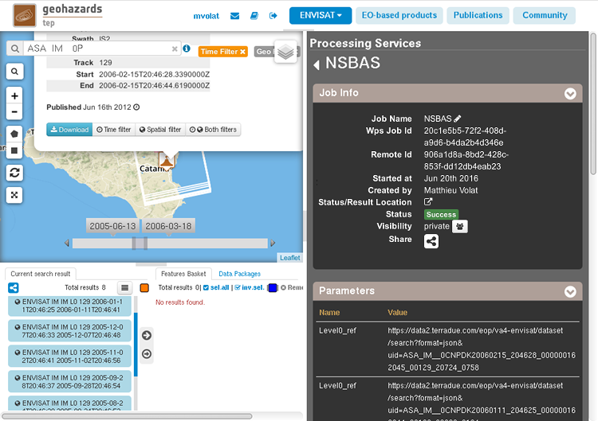

Interferogram generation with NSBAS
~~~~~~~~~~~~~~~~~~~~~~~~~~~~~~~~~~~

The NSBAS processing chain, mainly developped internaly at the ISTerre 
laboratory, is based on the ROI_PAC software (`http://www.roipac.org`)
from the Jet Propulsion Laboratory/Calltech to manage the processing of 
interferometric synthetic aperture radar (InSAR) data since raw data up to
time series analysis.

This tutorial will show how to produce a stack of aligned interferograms
using the NSBAS service on geoportal. We will use an input dataset 
constituted from multiple Envisat ASAR images over the Mount Etna area,
Sicily.

Select the processing
=====================

* Login to the platform (see :doc:`user <../community-guide/user>` section)

* Select the processing service *NSBAS*:

The panel is pre-filled with reasonnable default parameters values.

Fill the parameters
===================

SAR product dataset
-------------------

* Click on the *Product* button (1) and select the **ENVISAT** data set in the
  list:

* Type **ASA_IM__0P** in the Search Terms field (1) and then click on the
  magnifier icon (2):

* Click on Show Other Parameters:

* And fill the following field with the corresponding value:

 - *time:start* -> **2005-06-13**
 - *time:end* -> **2006-03-18**
 - *geo:box* -> **14.79,37.74,15.14,37.92**
 - *eop:orbitDirection* -> **ASCENDING**
 - *eop:track* -> **129**

* Then click on search and you should have an meaningful selection of images:

* Erase the *ASAR product catalogue entry* field

* Select all the search results, drag and drop them into the field:

Processing parameters
---------------------

Most of the parameters have reasonable values for Envisat SAR images. The
only paramater in this case that needs to be set is the master date.

* Scroll down to the *SarMasterDir* field in the NSBAS parameter list,
  set it to **051102** (the date we choose as toplevel master):

Other parameters' description can be obtained by hovering the mouse on
the parameters.

Run the job
-----------

* Click on the button Run Job and see the Running Job:

* After a while, see the Successful Job:

Results
-------

There is two types of results for a NSBAS processing: georeferenced previews
and a tar archive containing the interferogram stack and auxilliary products.

* Click on the button *Show results on map*, then on one of the files ending
  in ".phase.png" in the bottom left side

* See the result on map.

* Click on the *workdir.tar.bz2* file to retrieve the full dataset
