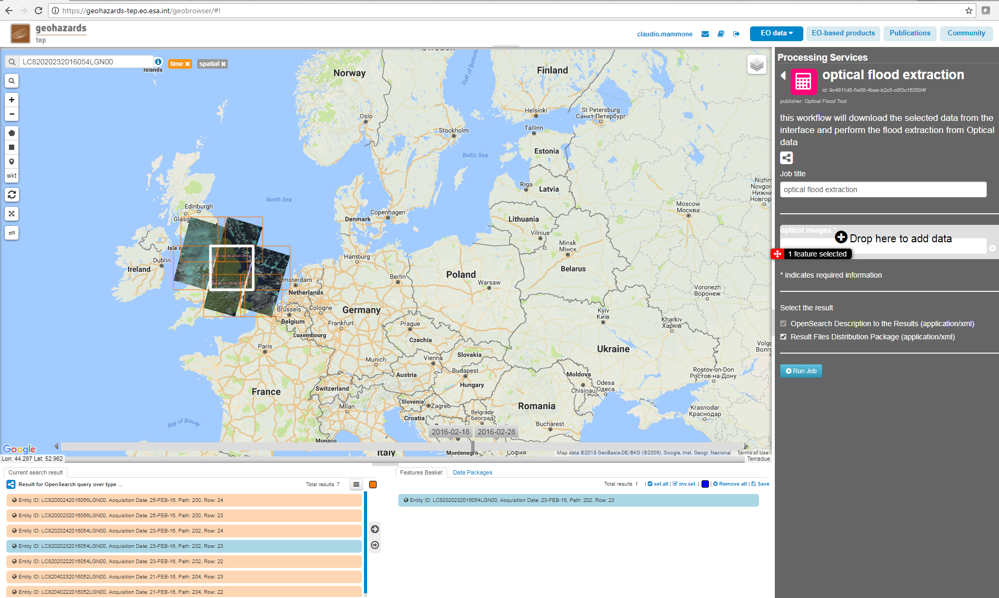
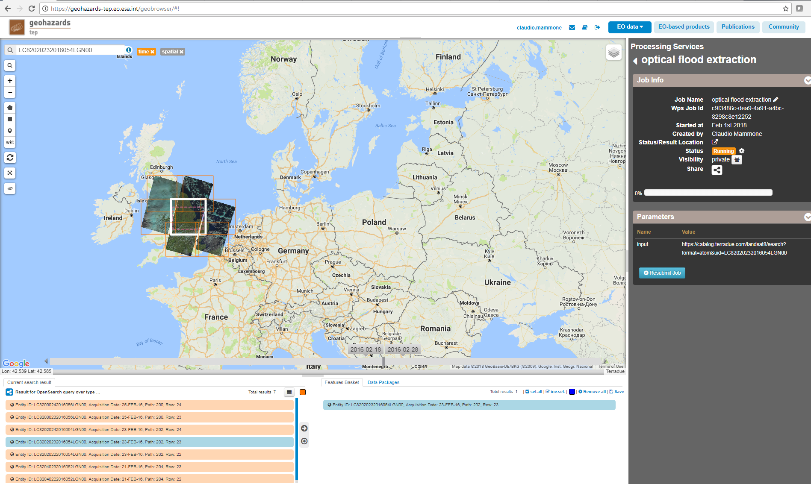
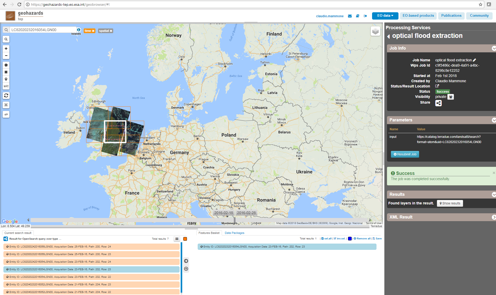
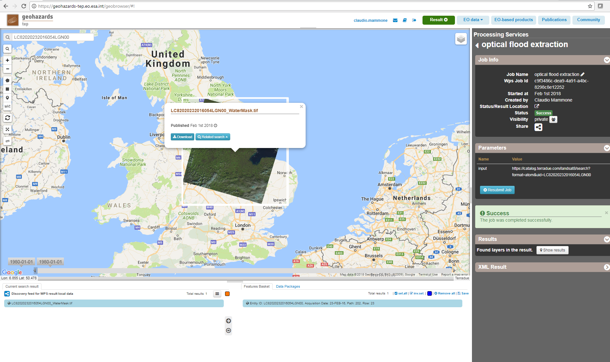

Optical Flood Tool Service
~~~~~~~~~~~~~~~~~~~~~~~~~~

.. image:: assets/optical_flood_icon.png
        
**Optical based Flood processing chain**

Service using Sentinel-2 and Landsat-8 data and an automated Water Extraction tool  developed and integrated in GEP by eGEOS to extract water bodies to support flood mapping.

**EO sources supported**:

    - Sentinel-2
    - Landsat-8

**Output specifications**

    - water mask GeoTiff file)

Select the processing
=====================

* Sign-in on the Portal https://geohazards-tep.eo.esa.int/ (see guidance :doc:`user <../community-guide/user>` section)

* Access the Geobrowser: https://geohazards-tep.eo.esa.int/geobrowser/

* Open the tab "Processing services" from the right of the map, then select the processing service “Optical flood extraction”.

Select the files to process
===========================

* Click on the *Data Packages* button in the bottom right of the screen, within the Features Basket panel. 
Then select from the list the "Optical-flood-trial-case" data package and click on *load*.
The service works with Landsat-8 images and with tiled Sentinel-2 data (e.g. the filename starts with "S2A_MSIL1C_"). 
The selected data package contains the reference to the following input file:

.. code-block:: parameter

    LC82020232016054LGN00

Fill the parameter values
=========================
Define values for the "Job title" and the "Optical images" fields.

* As *Job title*, type:

.. code-block:: parameter

  Optical flood extraction

* As input *optical images*, drag and drop the selected input file:

Run the job
===========

* Click on the button "Run Job" at the bottom of the Optical flood extraction processor tab, and monitor the progress of the running Job:

* Wait for the Job completion, then check the status is set as "Successful Job”.

* Download the optical flood extraction processing results once the Job is completed:

The output of the service (water mask) is a GeoTiff file, represented in int format, with "100" value where the water is present, "0" otherwise.

