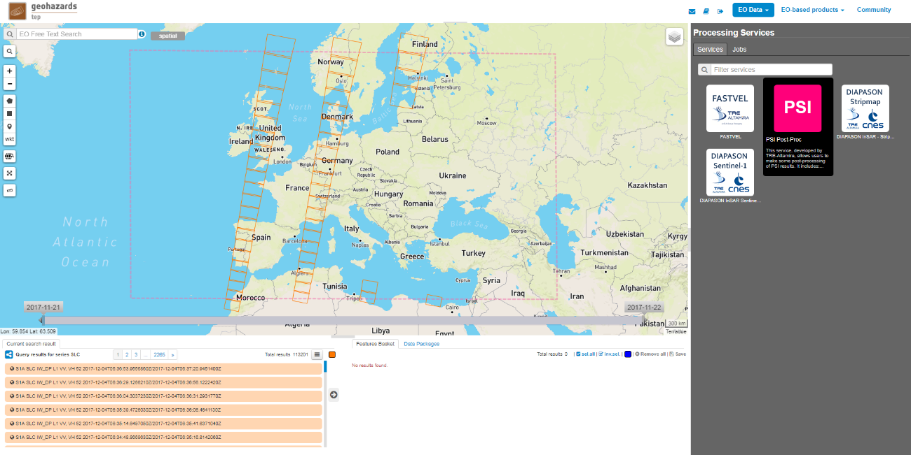
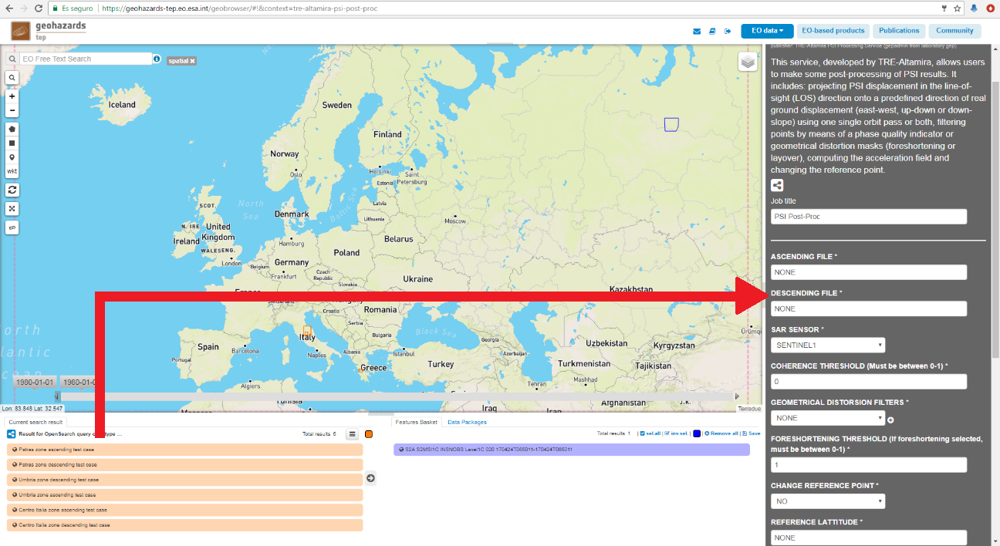
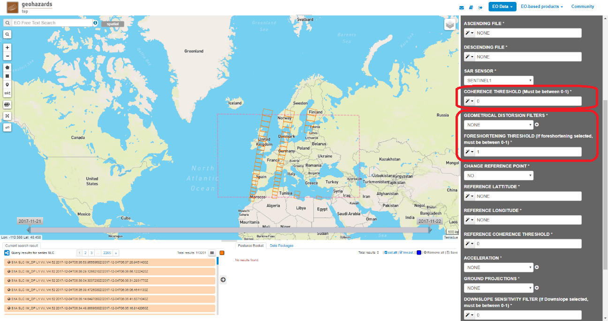
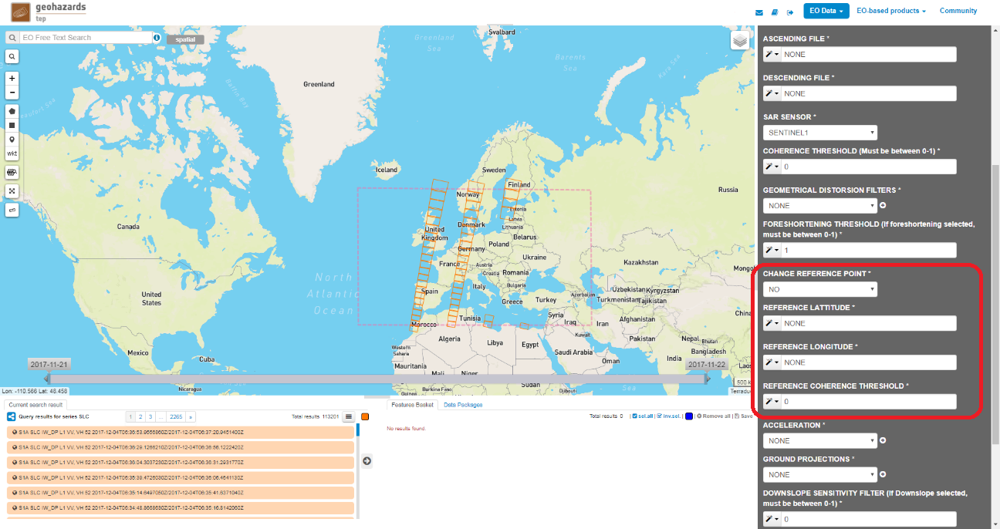
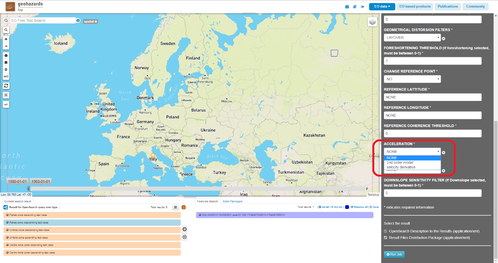
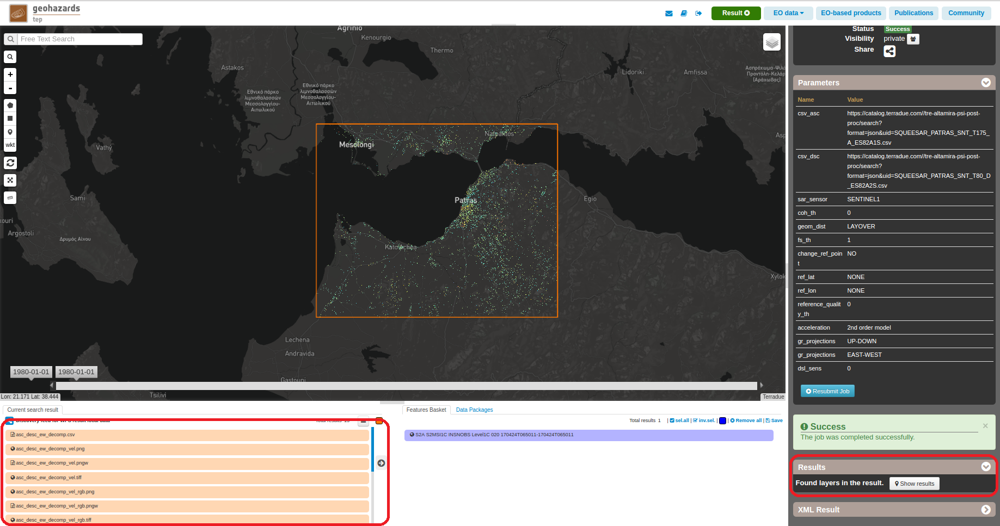

PSI Post Processing Tool
~~~~~~~~~~~~~~~~~~~~~~~~

The service is aimed at producing derived results starting from PSI results produced with SqueeSAR TM (off-line) and S-BAS PSI processing.

Application selection
=====================
* The user shall login on the GEP and in the "Processing Services" section , select the "PSI Post-Proc" service from the "services" tab.

Select the files to process
===========================

First of all select the SqueeSAR(TM) from the EO data.

.. figure:: assets/tuto_psipp_2.png
    :figclass: align-center
        :width: 750px
        :align: center 

Is possible to do the projection or the decomposition depending on the selection of the files to process. To select a file is necessary to drag the files to the ASCENDING FILE and DESCENDING FILE cell.

* Selecting one file, ascending or descending performs the projection.
* Selecting both files ascending and descending performs the decomposition.

Fill the parameters values
==========================

Select the point filters
------------------------

The application allows to filter points using the coherence and the geometrical distorsions.
* Coherence filter: apply a filter to remove points with a coherence value lower that the selected COHERENCE THRESHOLD.
* Geometrical distorsion filters: is possible to select a layover and a foreshortening filter. In case the foreshortening filter is selected, a FORESHORTENING THRESHOLD value should be selected.

Reference point selection
-------------------------

The application allows to change the reference point of the motion database. To change the reference point is necessary to select the coordinates of the new reference point and the application will get the closest point to the selected coordinates. To select a new reference point is necessary set to YES the CHANGE REFERENCE POINT cell and set the REFERENCE LATITUDE and the REFERENCE LONGITUDE.
Also is possible to set a coherence threshold for the selection of the new reference point using the REFERENCE COHERENCE THRESHOLD.

Acceleration calculation
------------------------

Is possible to calculate the acceleration of the results, there are 2 options to select:
* 2n order model
* Velocity derivative

Ground projections
------------------

Finally we should select the GROUND PROJECTION there are 3 available options:
* UP-DOWN projection/decomposition.
* EAST-WEST projection/decomposition.
* DOWNSLOPE projection/decomposition. In this case is possible to filter points with a low sensitivity setting the DOWNSLOPE SENSITIVITY FILTER.

.. figure:: assets/tuto_psipp_7.png
    :figclass: align-center
        :width: 750px
        :align: center

Run the job
===========

Once you have selected the configuration, click on the button Run Job. Is possible to see the percentage of the running job.

.. figure:: assets/tuto_psipp_8.png
    :figclass: align-center
        :width: 750px
        :align: center

When job finishes and the status is possible to see the results clicking on the Show results button.

Outputs
=======

The generated outputs are a csv, a float and a rgb GeoTiff of the velocity and finaly a png of the velocity that is shown in the map.
The output filenames should have this name: [asc/desc/asc_desc]_[ud/ew/dsl]_[proj/decomp]

Selecting an ascending file:
* asc_ud_proj
* asc_ew_proj
* asc_dsl_proj_dsl and asc_dsl_proj_los
Selecting a descending file:
* desc_ud_proj
* desc_ew_proj
* desc_dsl_proj_dsl and desc_dsl_proj_los
Selecting an ascending and a descending file:
* asc_desc_ud_decomp
* asc_desc_ew_decomp
* asc_desc_dsl_decomp_dsl,  asc_desc_dsl_decomp_los

