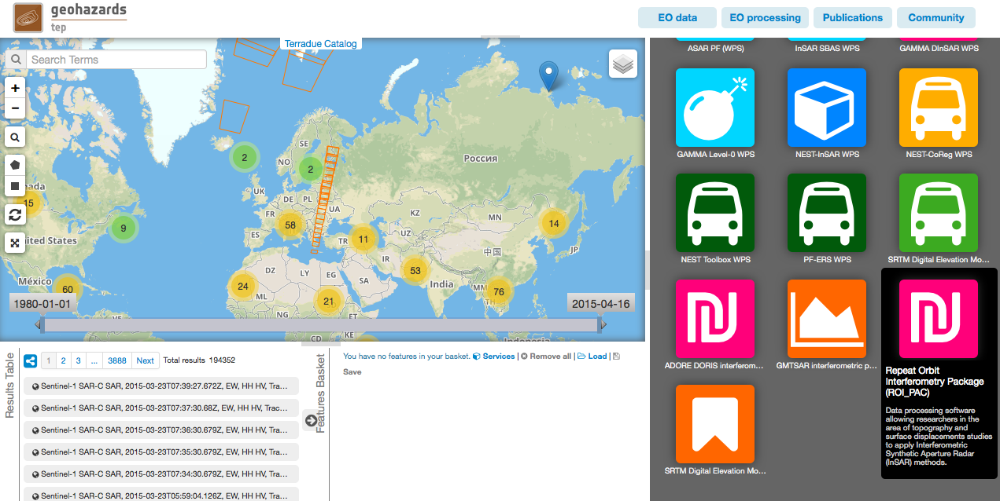
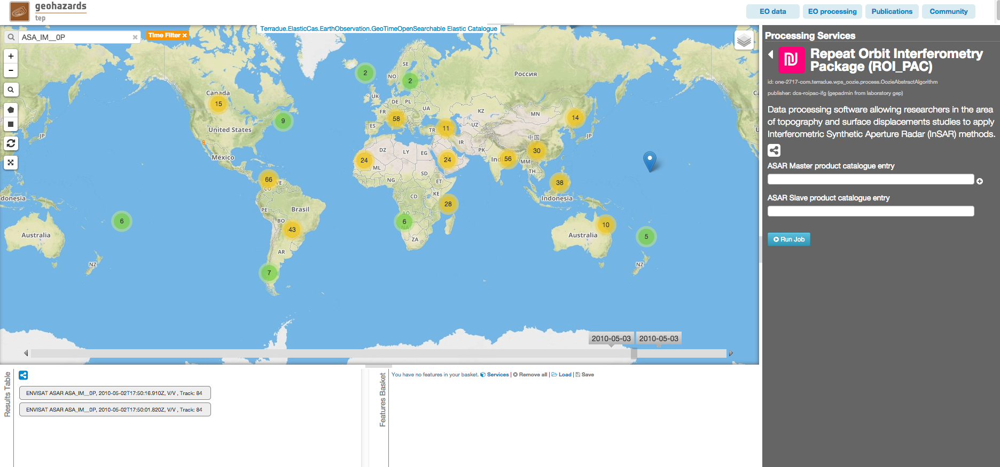
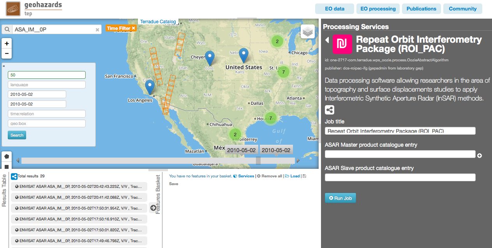
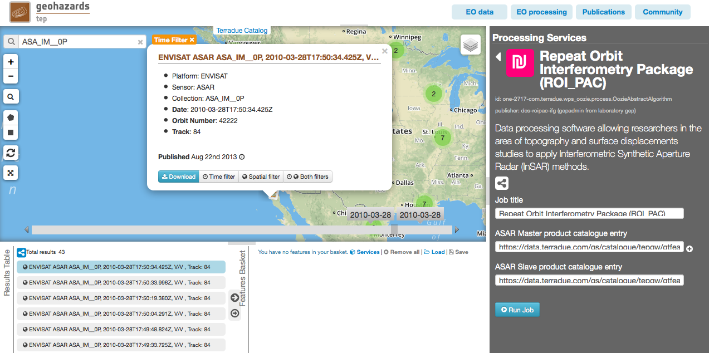
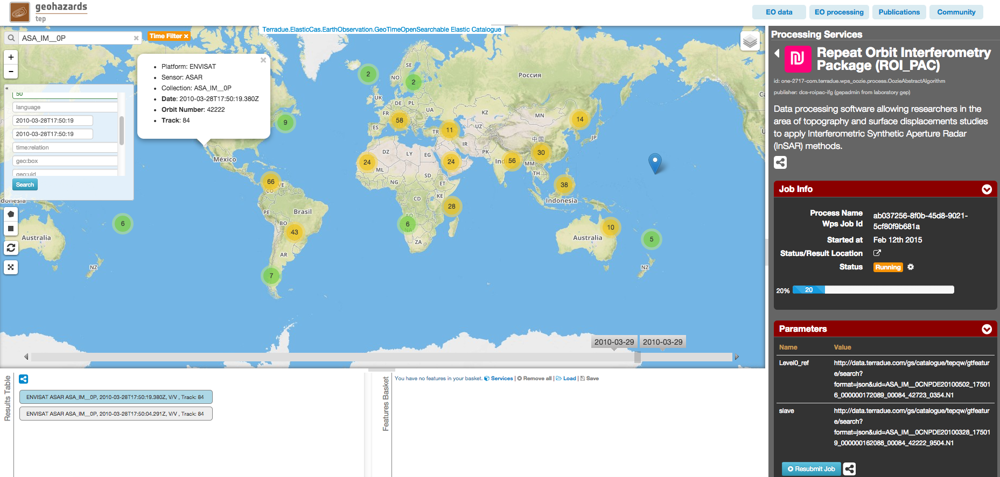
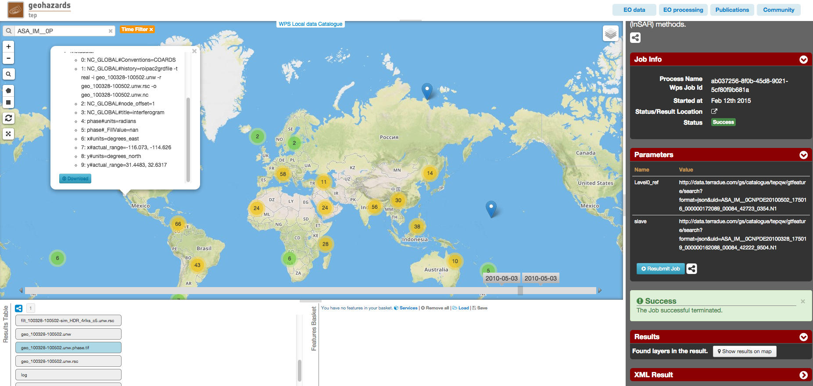

ROI_PAC on Hadoop Cloud Sandbox
~~~~~~~~~~~~~~~~~~~~~~~~~~~~~~~

Select the processing
=====================

* Login to the platform (see :doc:`user <../community-guide/user>` section)

* Select the processing service “Repeat Orbit Interferometry Package (ROI_PAC)”:

The "Repeat Orbit Interferometry Package (ROI_PAC)" panel is displayed with parameters values to be filled-in.

Fill the parameters
===================

Master product reference
-----------------------

* Type **ASA_IM__0P** in the Search Terms field (1) and then click on the lens icon (2):

* Click on Show Other Parameters, type in the **time:start** field the value **2010-05-02T17:50:16** and in the **time:end** field the value **2010-05-02T17:50:16**, then click on the button **Search**:

* Drag and Drop the first result in the *ASAR Master product catalogue entry* field:

.. figure:: assets/tuto_roi_pac_4.png
	:figclass: align-center
        :width: 750px
        :align: center

Slave product reference
------------------------

* Perform the same procedure described previously (`Master product reference`_), using the value **2010-03-28T17:50:16** in both the **time:start** field and the **time:end** field then drag and drop the first result in the *ASAR Slave product catalogue entry* field:

Run the job
===========

* Click on the button Run Job and see the Running Job

* After about 20 minutes, see the Successful Job:

.. figure:: assets/tuto_roi_pac_7.png
	:figclass: align-center
        :width: 750px
        :align: center

* Click on the button *Show results on map*, then on the *geo_100328-100502.unw.phase.tif* result on the *Results Table* in the bottom left side

* See the result on map: 

