COMBI - Band Combination
~~~~~~~~~~~~~~~~~~~~~~~~

        
**Band Combination**

This service provides the possibility to perform RGB band combination from user defined bands of single or multiple EO data products. The “Band Combination” processing service of the Charter Processing Platform Prototype is meant to give the possibility to derive user-defined band combinations from multi-mission Optical and SAR data. The processing chain of the service has been developed with the use of GDAL and SNAP software. The service supports optical and SAR detected products from the following missions: ALOS-2, GF-2, Kanopus-V, KOMPSAT-2, KOMPSAT-3, KOMPSAT-5, Landsat 8 (OLI), Pleiades-1, RADARSAT-2, RapidEye, Resurs-P, Sentinel-1, Sentinel-2, Sentinel-3 (OLCI and SLSTR), SPOT 6/7, TerraSAR-X, UK-DMC 2 and VRSS1. 

The output is comprising all 3 selected bands in a single RGB product at the resolution of the finest source band. All bands are in their native format (no radiometric correction applied) thus can serve only for fast screening of the data, not for further processing. The output RGB composite is displayed in geobrowser with the possibility to access product metadata and download it as a GeoTIFF file. For selected sensors visualization enhancements are available.

**DEM Type**

The SRTM 1 Sec HGT (30 meters of resolution) is used.

.. NOTE:: SRTM valid in the [-56 deg, +60 deg] range of latitudes.

**Output specifications**

+-------------------------------+---------------------------------------------------------------------------------------------------------------+
| Output – product specifications                                                                                                               |
+===============================+===============================================================================================================+
| Correspondent file            | RGB band combination                                                                                          |
+-------------------------------+---------------------------------------------------------------------------------------------------------------+
| Information types             | RGB Composite with user defined source bands                                                                  |
+-------------------------------+---------------------------------------------------------------------------------------------------------------+
| Raster format                 | GeoTIFF                                                                                                       |
+-------------------------------+---------------------------------------------------------------------------------------------------------------+
| resolution                    | The source band's finest one                                                                                  |
+-------------------------------+---------------------------------------------------------------------------------------------------------------+
| Projection types              | EPSG:3857 - WGS84 Web Mercator (Auxiliary Sphere)                                                             |
+-------------------------------+---------------------------------------------------------------------------------------------------------------+
| Bit depth                     | 8-bit unsigned integer                                                                                        |
|                               | (Unsigned 8-bit raster dataset per channel, e.g. 1band for grayscale image, 3band fir RGB image)              |
+-------------------------------+---------------------------------------------------------------------------------------------------------------+
| Processing Level              | RGB composite                                                                                                 |
+-------------------------------+---------------------------------------------------------------------------------------------------------------+
| Physical product available    | NO                                                                                                            |
+-------------------------------+---------------------------------------------------------------------------------------------------------------+
| Browse product available      | YES                                                                                                           |
+-------------------------------+---------------------------------------------------------------------------------------------------------------+

-----

Select the Processing Service
=============================

Log in on the Charter Processing Platform Prototype portal and from the “Processing Services” tab, select the “Band Combination” service.

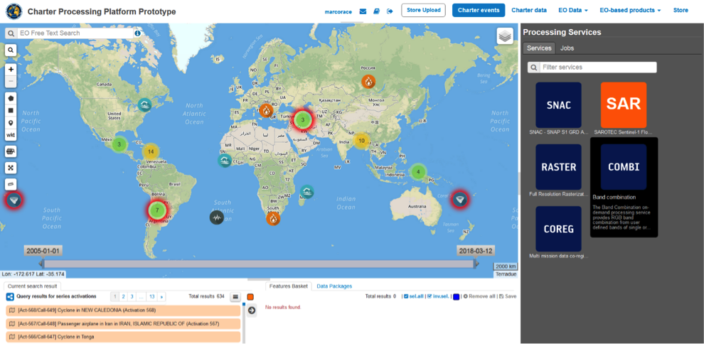

The “Band Combination” panel is displayed with several parameters values to be filled-in.

.. figure:: assets/tuto_combi_2.png
	:figclass: align-center
        :width: 750px
        :align: center  
 
Select the files to process
===========================

This service takes as input multi-mission commercial and open SAR and Optical EO data products available through Charter Processing Platform Prototype.

In the Charter Processing Platform Protoype it is possible to retrieve different types of data:

•	Commercial satellite imagery (e.g. UK-DMC) acquired during charter activations,
•	Selected open EO data collections (e.g. Sentinel-1),
•	Product metadata of historical and on-going charter activations.

In order to easily access each type of data some pre-defined contexts, which essentially consist of catalog query with pre-defined search parameters, are available on the top of the Charter Processing Platform Prototype interface:

•	Charter data: the Charter Processing Platform Prototype is connected to COS-2 and Charter Order Desks to harvest metadata and collect data products from the Charter virtual constellation. The Entry “Charter data” is providing access to all data collections as metadata collections i.e. footprints of images used for each activation and presented in the search result pane as a series of EO data products.
•	EO data: in addition to Charter data the platform is also able to fetch free EO data products via their dissemination services, such as Copernicus data via SciHub service. The Entry “EO data” allows the user to access the full archive of selected free collections (Sentinel-1, Sentinel-2, Landsat-8, DLR InSAR Browse)

Input SAR and Optical data selection must be carried out with particular care while filling required fields for the RGB band combination, since a wrong data entry can result to an unfeasible processing of the service. 

See table below for a full list of Optical and SAR mission supported by the current version of the “Band Combination” service.
 
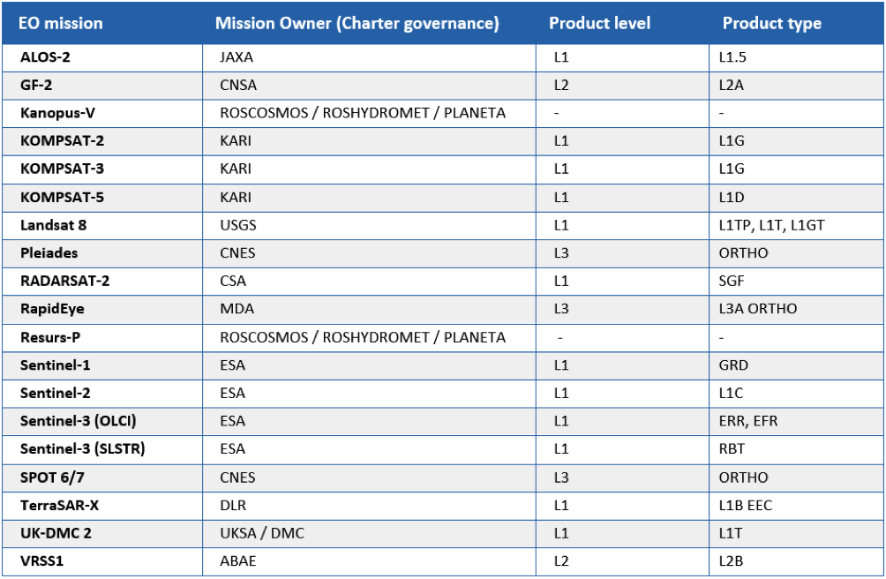
 
Open EO product catalogue entry
===============================

In this tutorial you are going to process a sample of free EO data product, derived from Sentinel-2 data collections, with the Band Combination processing service.

From the top bar click on the “EO data” context link to access the full archive of selected free collections (e.g. Sentinel-2).

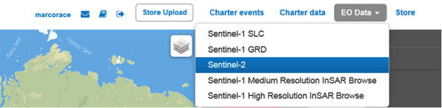

Zoom in into a specific area of interest (e.g. Italy). Apply spatial filter by drawing a rectangle on the map around an area of interest (e.g. Vercelli):
 
.. figure:: assets/tuto_combi_5.png
	:figclass: align-center
        :width: 750px
        :align: center 
 
Click on the “Search Form” icon and select as product type the L1C product. Apply temporal filter by selecting start and end date of the temporal interval (e.g. 4 August – 4 September 2020). Then click on the button Search:
 
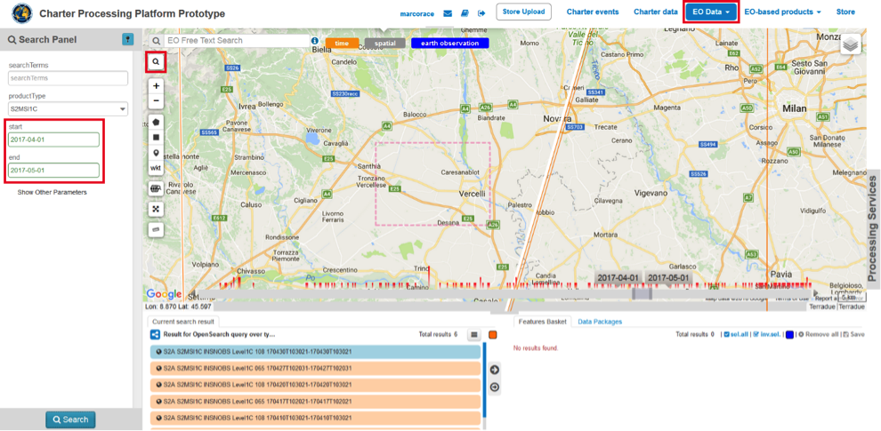

All acquisitions related to specified queries are listed in the Results tab:

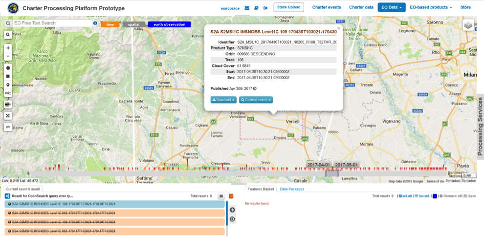
 
For future reference, you can also drag and drop one of the product listed in the Results tab (e.g. S2A_MSIL1C_20170430T103021) in the “Features Basket” tab.
 
Fill the parameters
===================

In this tutorial you are going to obtain a RGB composite from a single S2 product (e.g. (S2A_MSIL1C_20170430T103021) using a false color infrared band combination (8-3-2).

In order to do that you can follow below steps:

1.	Insert job title “Band Combination”
2.	Drag and Drop from the Results tab the S2 product in the “Product reference for RED” field
3.	From “RED channel band ID” field select S2 band 8
4.	Drag and Drop the same S2 product also in the “Product reference for GREEN” field
5.	From “GREEN channel band ID” field select S2 band 3
6.	Drag and Drop again the same S2 product also in the “Product reference for BLUE” field
7.	From “BLUE channel band ID” field select S2 band 2
8.	Set as “Product reference for output resolution” the same S2 product.
9.	In the “Perform data cropping” field set true and define as “Subset Bounding Box for Cropping” the extent of area of interest.
 
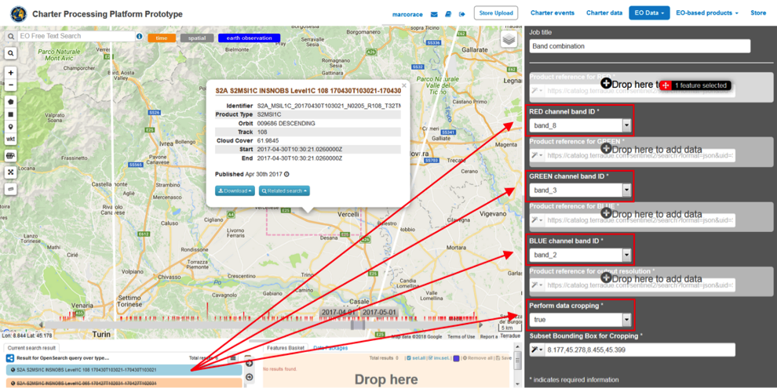
 
Running the job
===============

Click on “Run Job” button from the processor configuration panel and wait for the job to complete. After few minutes, see the Successful Job:

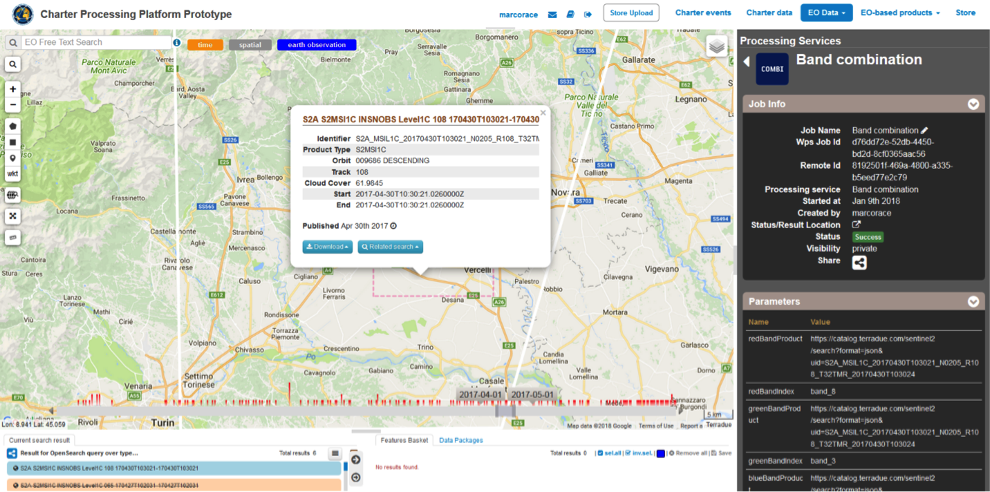
 
View results
============

Click on the Show results on map button after the job is completed. The Band combination result will appear in the map. You can download the RGB product as GeoTIFF file by clicking on the download link in the metadata popup window.

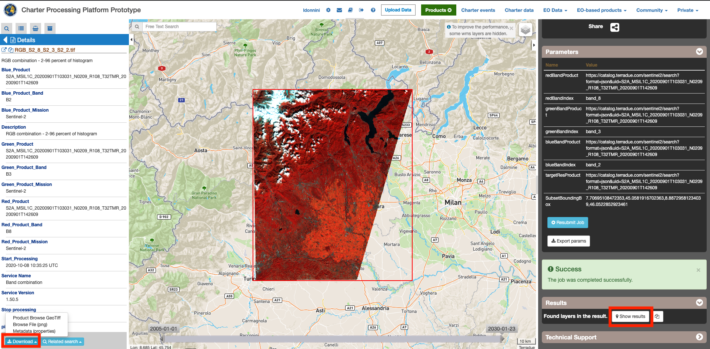
 
The resulting product should be like the one shown below.

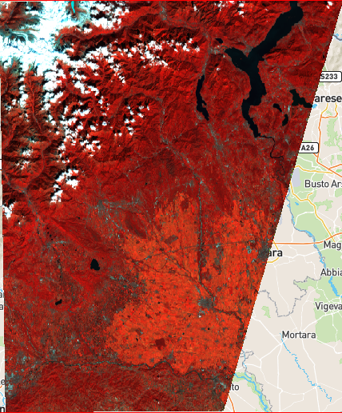

Example of multi-temporal SAR band combination output
=====================================================

In this section is shown an example of RGB composite obtained from a pair of Sentinel-1 SAR images (SAR Level-1 GRD product in IW mode) acquired from both S1A and S1B satellites. A proposed step by step procedure is reported below:

1.      Zoom in into a specific area of interest (e.g. **[Act-569/Call-650] Flood in Russian Federation**). Apply spatial filter by drawing a rectangle on the map around an area of interest (e.g. near "Wolgograd"), and select a couple of Sentinel-1 acquisitions (e.g. **S1B GRD IW DP L1 50 product acquired on Mon, 09 Apr 2018 05:13:28 GMT** and **S1A GRD IW DP L1 50 product acquired on Sun, 15 Apr 2018 05:14:14 GMT**),
2.      Insert job title "BC – Multi-temporal – Russian Federation",
3.      Drag and Drop from the Results tab the S1B product (e.g. S1B GRD IW DP L1 50 09042018) in the "Product reference for RED" field,
4.      From "RED channel band ID" field select S1B band 1,
5.      Drag and Drop the most recent S1 product (e.g. S1A GRD IW DP L1 50 15042018) in the "Product reference for GREEN" field,
6.      From "GREEN channel band ID" field select S1A band 1,
7.      Drag and Drop again the same S1A product also in the “Product reference for BLUE” field,
8.      From "BLUE channel band ID" field select S1A band 1,
9.      Set as “Product reference for output resolution” again the most recent S1 product,
10.     In the "Perform data cropping" field set true and define as "Subset Bounding Box for Cropping" the extent of area of interest,
11.     Once the job is completed, click on the Show results on map button and the resulting band combination product will appear in the map.
 
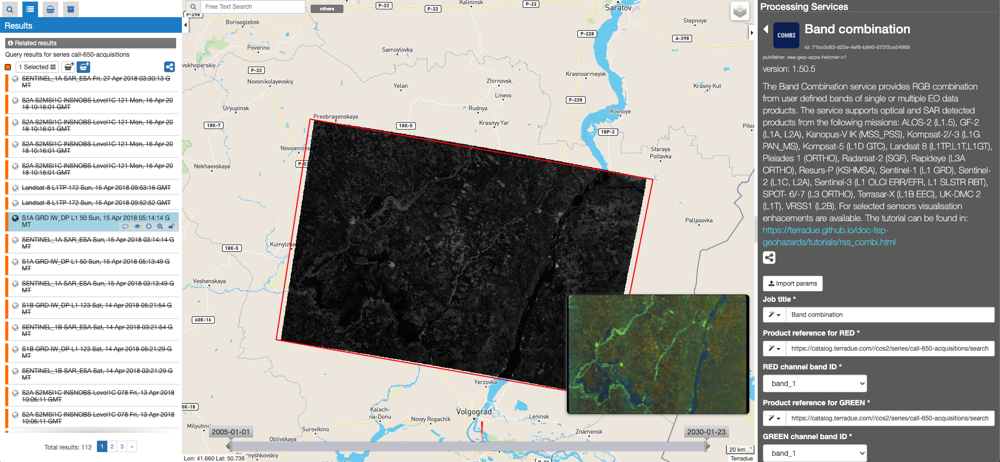
 
Example of multi-sensor and multi-temporal band combination output
==================================================================

Hereinafter is described a procedure to obtain a RGB composite from the combination of two EO data products derived from two different sensors (e.g. **UK-DMC-2** and **Sentinel-1**). In order to derive an RGB composite from both Optical and SAR data, you can follow this procedure:

1.      Zoom in into a specific area of interest (e.g. **[Act-573/Call-654] Flood in Sri Lanka**). Apply spatial filter by drawing a rectangle on the map around an area of interest (e.g. near "Moneragala"), and select a couple of images acquired from two different sensors (e.g **UK-DMC-2 SLIM-6-22 L1T product acquired on Sat, 14 Jan 2017 04:14:01 GMT** and **S1A IW GRDH 1SDV product acquired on Thu, 31 May 2018 14:49:00 GMT**),
2.      Insert job title "BC – Multi-sensor - Sri Lanka",
3.      Drag and Drop from the Results tab the S1A product in the "Product reference for RED" field,
4.      From "RED channel band ID" field select S1A band 1,
5.      Drag and Drop the UK-DMC-2 product in the "Product reference for GREEN" field,
6.      From "GREEN channel band ID" field and select UK-DMC-2 band 2,
7.      Drag and Drop again the same UK-DMC-2 product also in the “Product reference for BLUE” field,
8.      From "BLUE channel band ID" field and select UK-DMC-2 band 3,
9.      Set as "Product reference for output resolution” the S1A product,
10.     In the "Perform data cropping" field set true and define as "Subset Bounding Box for Cropping" the extent of area of interest,
11.     Once the job is completed, click on the Show results on map button and the resulting band combination product will appear in the map.

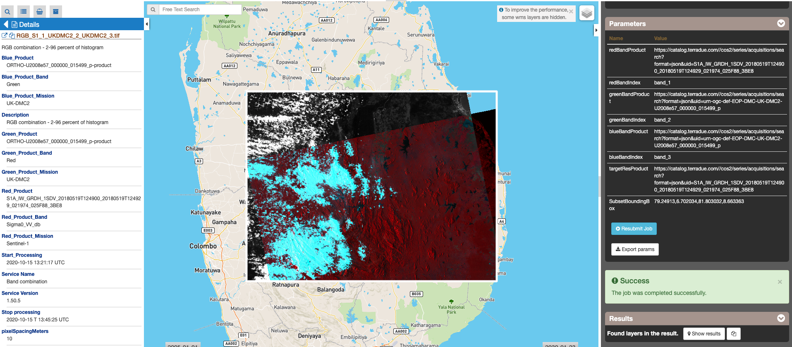
 
Enhanced RGB composite visualization
====================================

In order to improve the visualization of raster data, contrast enhancement of multispectral color composite is applied by stretching reflectance values across a portion or entire range of the raster histogram distribution. Histogram contrast stretching is a widely employed technique to visually enhance the appearance of the image. In this processor three different stretch types are applied:

1.      Percent clip from 2 to 96 percent of histogram,
2.      Minimum to Maximum,
3.      Image stretching between 0 and 0.3 reflectance.

As a result, the user will get as output the correspondent 3 RGB composite in GeoTIFF format:

1.      RGB_MM_X_MM_Y_MM_Z.tif (default product),
2.      RGB_MM_X_MM_Y_MM_Z_minmax.tif,
3.      RGB_MM_X_MM_Y_MM_Z_browse.tif.

in which “MM” stands for mission acronym (e.g. S2 for Sentinel-2), “X” for product band number for Red, “Y” for product band number for Green and “Z” product band number for Blue.

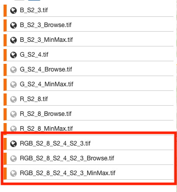

These three different outputs allow the user to choose the more effective RGB composite for the visualization of the image stack. This choice may be different according to cloud coverage percentage and or the surface heterogeneity of the scene.

The enhanced RGB composite visualization is currently available only for the following sensors:

•       Sentinel-2 (L1C, L2A),
•       Sentinel-3 (EFR, ERR),
•       Pleiades 1A/B,
•       Kompsat-2,
•       Kompsat-3,
•       Landsat-8.
 
Hereinafter is shown a sample result over the coast of Naples using the below combination of S2 products:

1.      Red band product: S2B_MSIL1C_20190811T095039_N0208_R079_T33TVF_20190811T122017
        Red band index: band_4
2.      Green band product: S2B_MSIL1C_20190702T095039_N0207_R079_T33TVF_20190702T115813
        Green band index: band_3
3.      Blue band product: S2B_MSIL1C_20190612T095039_N0207_R079_T33TVF_20190612T115445
        Blue band index: band_2

Location map:

.. figure:: assets/tuto_combi_15.png
        :figclass: align-center
        :width: 750px
        :align: center 
 
RGB_S2_4_S2_3_S2_2.tif – RGB combination 2-96 percent of histogram (RGB_S2_4_S2_3_S2_2.tif):

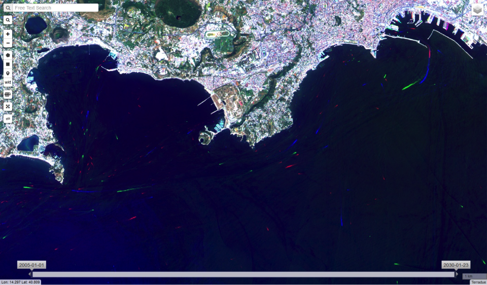

RGB combination – Min to Max (RGB_S2_4_S2_3_S2_2_MinMax.tif)
 
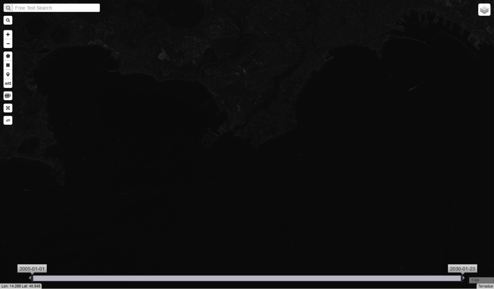
 
RGB_S2_4_S2_3_S2_2_QuickLook.tif – RGB composite - Stretched between 0 and 0.3
 
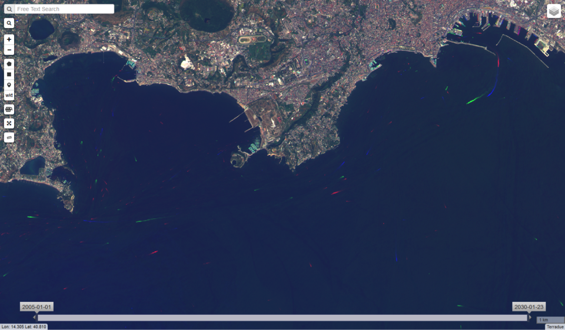
 

Service bands versus Platform bands
===================================

For a proper use of the COMBI service is worth to highlight the correspondences between the service band selection with the bands of some of the sensors supported by the service, such as Sentinel-2, Landsat 8 among others (see Table below for more complete information).

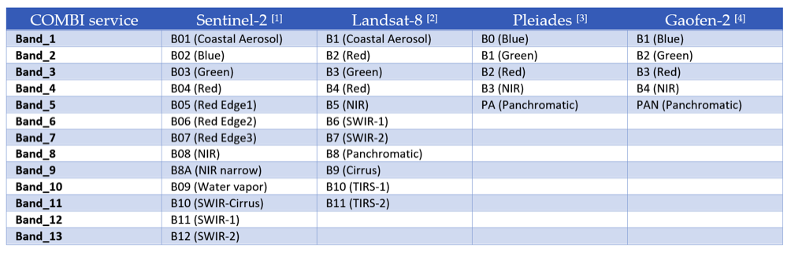
 
 
[1] ESA. SENTINEL-2 Radiometric Resolutions. https://sentinel.esa.int/web/sentinel/user-guides/sentinel-2-msi/resolutions/radiometric (Accessed 25th February 2020).

[2] USGS. Landsat 8 band designations for the Operational Land Imager (OLI) and Thermal Infrared Sensor (TIRS). https://www.usgs.gov/media/images/landsat-8-band-designations (Accessed 24th February 2020).

[3] Lachérade, S., Fourest, S., Gamet, P., & Lebègue, L. (2012). PLEIADES absolute calibration: inflight calibration sites and methodology. PAN, 1(B2), B3.

[4]. ESA. GF-2 (Gaofen-2) High-resolution Imaging Satellite / CHEOS series of China https://directory.eoportal.org/web/eoportal/satellite-missions/g/gaofen-2 (Accessed 1sth March 2020).

