Full Resolution Rasterization
~~~~~~~~~~~~~~~~~~~~~~~~~~~~~

This service provides the possibility to browse Optical or SAR EO data at full resolution. 
The “Full Resolution Rasterization” service of the Charter Processing Platform Prototype is meant to give the possibility to visualize satellite imagery at different succeeding map zoom levels without artifacts directly in the geobrowser. 
The processing chain of the service has been developed with the use of SNAP and GDAL. 
The output of the service is a pre-processed EO data product in GeoTIFF which is displayed in the map at full resolution  (RGB composite for Optical data and single band product Sigma0 in dB for SAR).
From the resulting layer it is also possible to download the original product through the metadata popup window.
Note: In case of Sentinel-1 data the resolution is 20mx20m in order to increase the number of looks and reduce image size.

This tutorial is referred to the service build V1.4.0.

Select the Processing Service
-----------------------------

Log in on the Charter Processing Platform Prototype portal and from the “Processing Services” tab, select the “Full Resolution Rasterization” service.

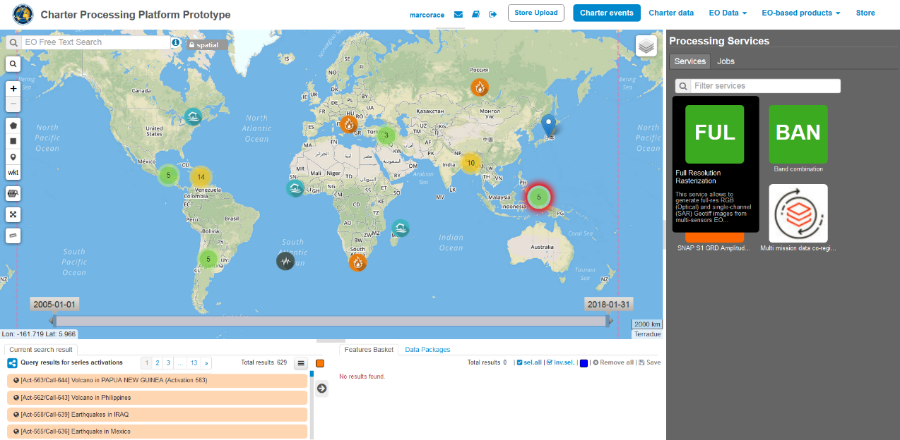

The “Full Resolution Rasterization” service panel is displayed with one parameter to be filled-in i.e. the EO data product to be visualized in the geobrowser.

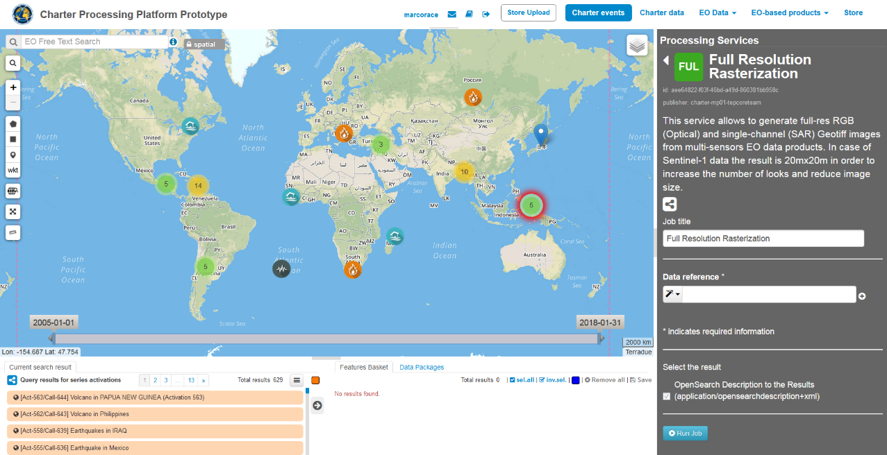

		
Data selection
--------------

This service takes as input SAR and Optical EO data products available through Charter Processing Platform Prototype.

In the Charter Processing Platform Prototype it is possible to retrieve different types of data:

* Commercial satellite imagery (e.g. ALOS2, UK-DMC etc.) acquired during charter activations,
* Selected open EO data collections (e.g. Sentinel-1, Sentinel-2 etc.),
* Product metadata of historical and on-going charter activations.

Each type of data can be easily accessed through some pre-defined context links available on the top menu of the Charter Processing Platform Prototype interface:

* Charter events: this context link allows the user to access all past and current Charter activations and to visualize them in the map. Charter activations are labeled in the map with a different symbol according to the hazard type and blinking labels indicate on-going Charter activations. By clicking on the hazard icon of one event a popup window will appear on the map with information/metadata about the selected disaster. According to the zoom level, a group of activations may be merged into a single feature (yellow if more than 10 events or green if less than 10 events). 
* Charter data: the Charter Processing Platform Prototype is connected to COS-2 and Charter Order Desks to harvest metadata and collect data products from the Charter virtual constellation. The Entry “Charter data” is providing access to all metadata collections e.g.footprints of images used for each activation and presented in the search result pane as a series of EO data products.
* EO data: in addition to Charter data the platform is also able to fetch free EO data products via their dissemination services, such as Copernicus data via SciHub service. The Entry “EO data” allows the user to access the full archive of selected free collections (Sentinel-1, Sentinel-2, Landsat-8, DLR InSAR Browse).

Before selecting the input SAR and Optical data the user shall refer to the table of EO data currently supported by the Full Resolution Rasterization service.

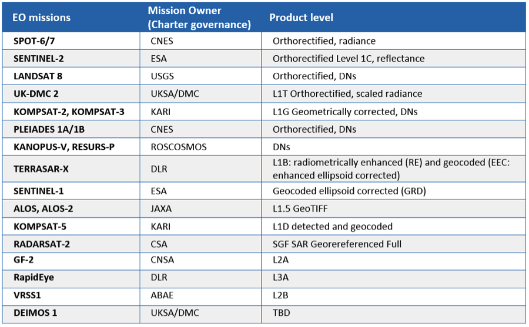

		
Full Resolution Rasterization of Open EO product catalogue entry
----------------------------------------------------------------

In this tutorial you are going to process a sample of free EO data product, derived from Sentinel-2 data collection, with the Full Resolution Rasterization service.
From the top bar click on the “EO data” context link to access the list of selected free EO data collections (e.g. Sentinel-2).

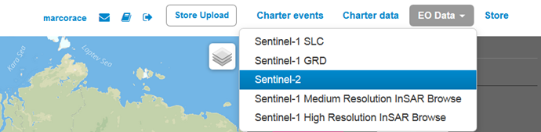
		
Zoom in into a specific area of interest (e.g. Italy). Apply spatial filter by drawing a rectangle on the map around an area of interest (e.g. Rome):

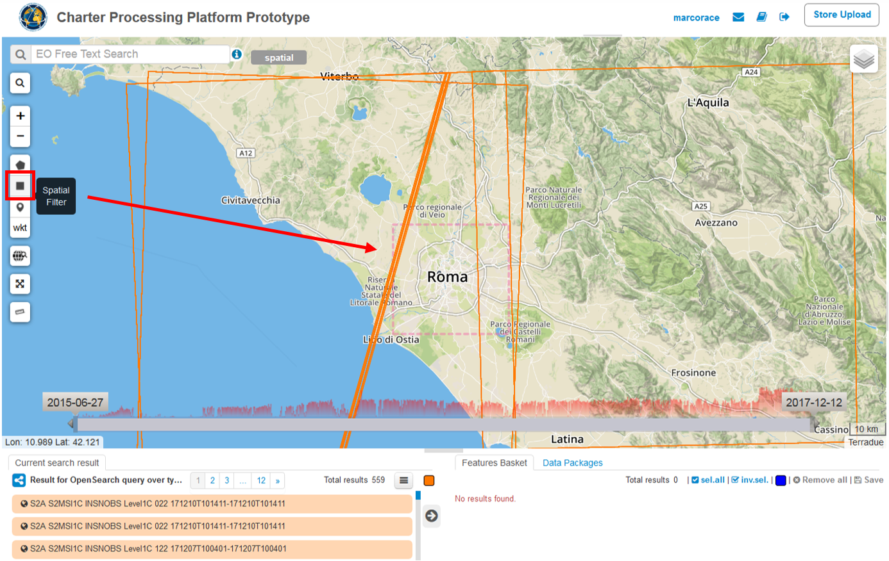
		
Click on the “Search Form” icon and select as product type the L1C product. Apply temporal filter by selecting start and end date of the temporal interval (e.g. 01 – 20 Aug 17). Then click on the button *Search*:

.. figure:: assets/tuto_rss_full_resolution_rasterization_6.png
	:figclass: align-center
        :width: 750px
        :align: center
		
All acquisitions related to specified queries are listed in the Results tab:

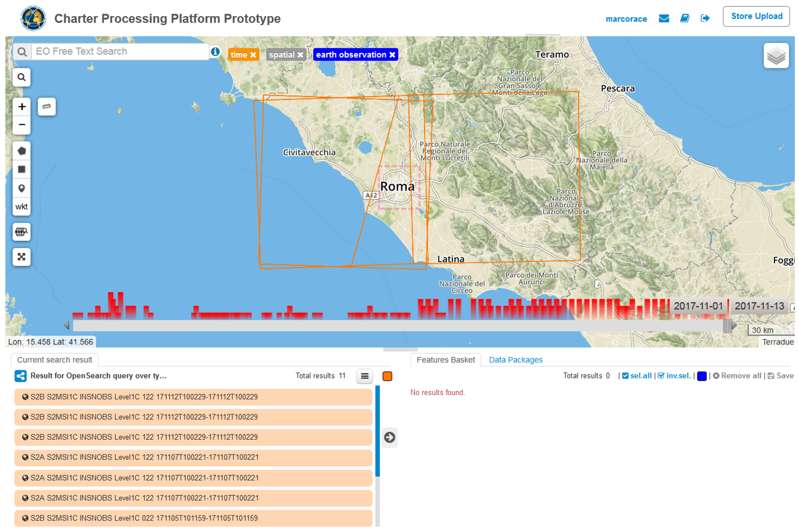

Drag and Drop one of the product listed in the Results tab in the “Data reference” field:

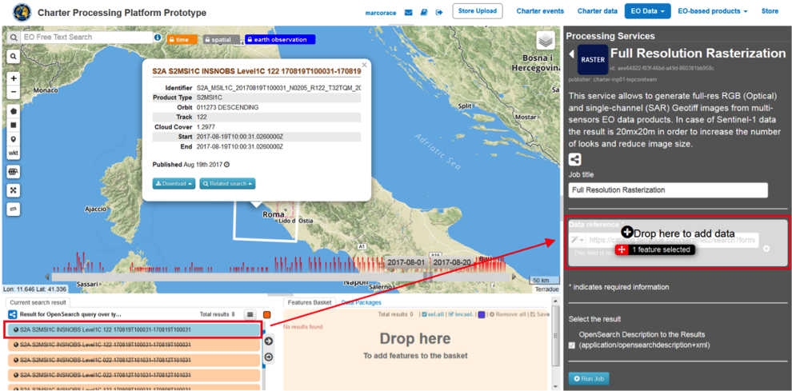
		

Running the job
---------------

Click on **Run Job** button from the processor configuration panel and wait for the job to complete.

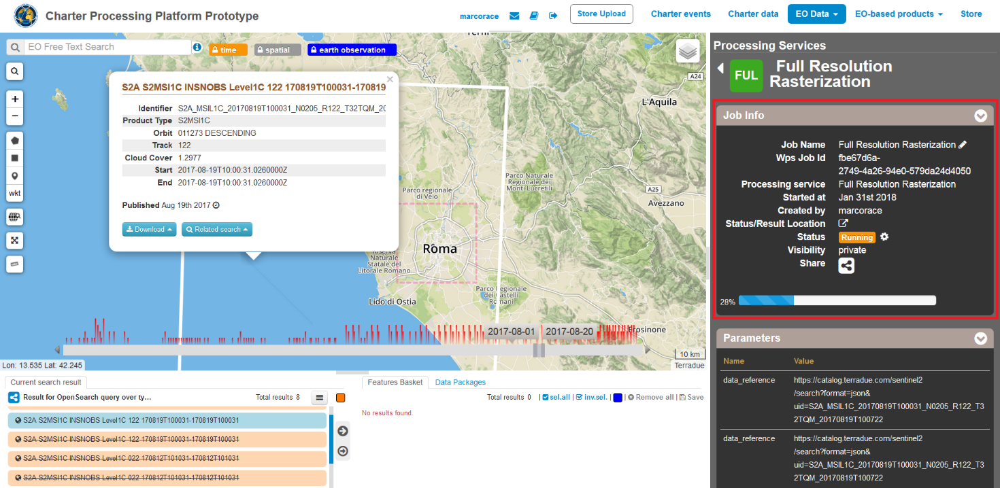
		
		
View results on the map
-----------------------

Upon successful completion of the job click on the *Show results on map* button.

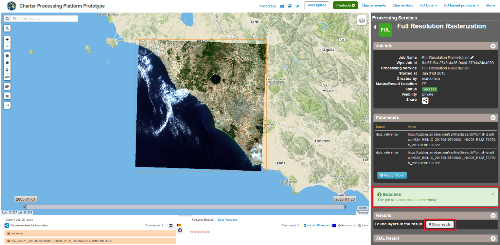

After that you can visualize selected image at full resolution in the map.

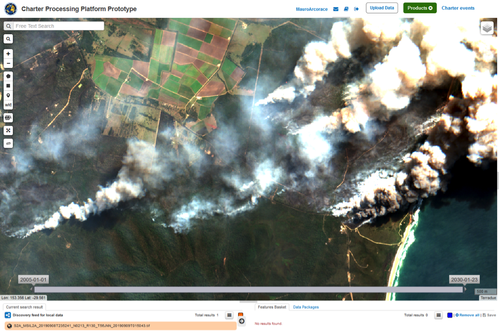

If needed you can also download the original product through the download link given in the metadata popup window.

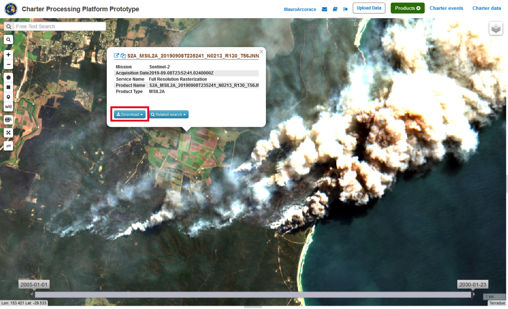

Output product specification are reported in below table.

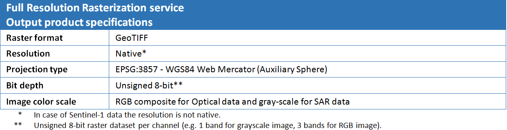

	
Visualizing charter data at full resolution (Systematic Processing Service)
---------------------------------------------------------------------------

The Charter Processing Platform Prototype is connected to COS-2 and Charter Order Desks to harvest metadata and collect data products. 
In addition to Charter EO data products the platform is also able to fetch free EO data products via their dissemination services. 
For those acquisitions for which a full resolution preview is available, the visualization of a data product is performed directly and immediately in the Charter Platform after the query is made by the User. 
Visualization of multiple full resolution raster images in the geobrowser is possible through the user customizable layer visibility settings.
	
To visualize a specific EO data product at full resolution from a selected Charter activation, the steps to be followed are listed below:

1)	From the top menu click on the *Charter Events* context link to visualize all charter activations in the map. Displayed activations are also listed in the Results tab.

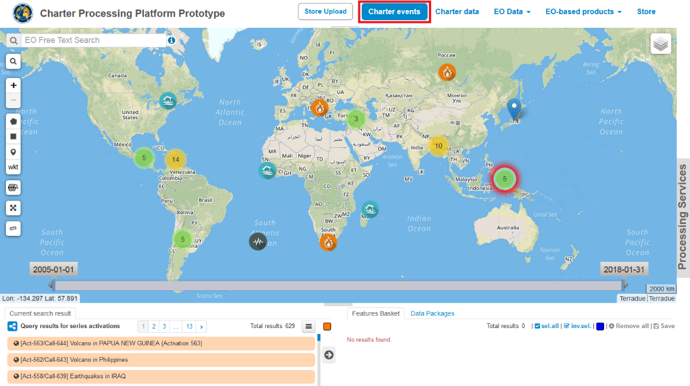

2)	In order to identify a specific event (e.g. the Flood in Chile charter activation, 13 May 2017, Call ID 609) temporal, geographical and free text filters can be applied to narrow the activations search from the catalog. From “EO text free search” you can type the event ID “609” to identify the event.

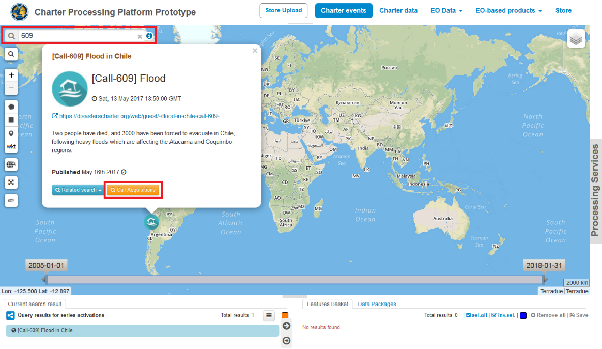

3)	After the selection of the event, click on the icon associated to the activation to open the popup window and the click on the “Call Acquisitions” button. Select a single satellite imagery product from the “Query results for series activations” list.

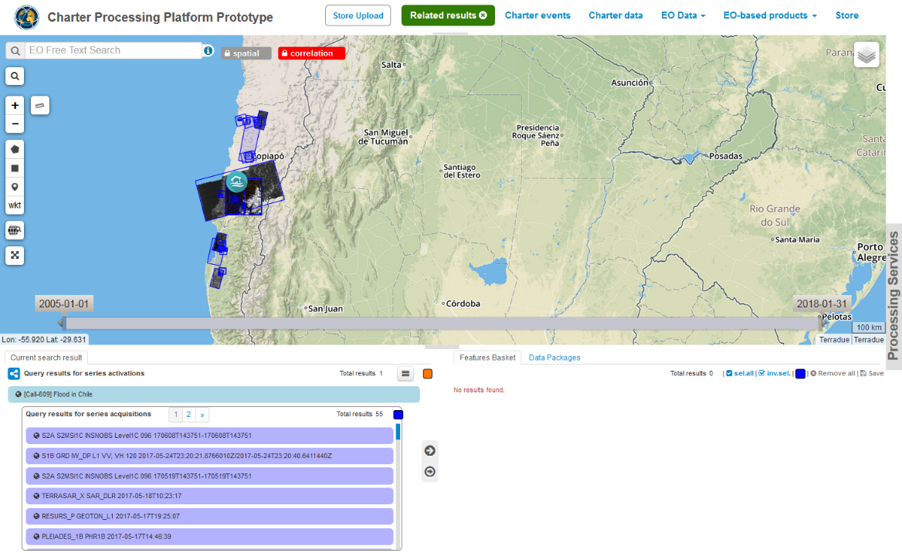
		
4)	From the “Query results for series activations” list select one desired product and click on “show only this feature” to visualize the image at full resolution in the map. To better visualize the EO data product in the map, click on “Zoom on feature” (lens on the left) and zoom in around an area inside the image footprint. You should be able to visualize the EO data product at different succeeding map zoom levels.

.. figure:: assets/tuto_rss_full_resolution_rasterization_17.png
	:figclass: align-center
        :width: 750px
        :align: center

5)	The User can download the original EO data by clicking on the given “Download” link in metadata pop up window. The download of free and open datasets (e.g. Sentinel-1, Sentinel-2, Landsat-8) is performed via SciHub and USGS services.