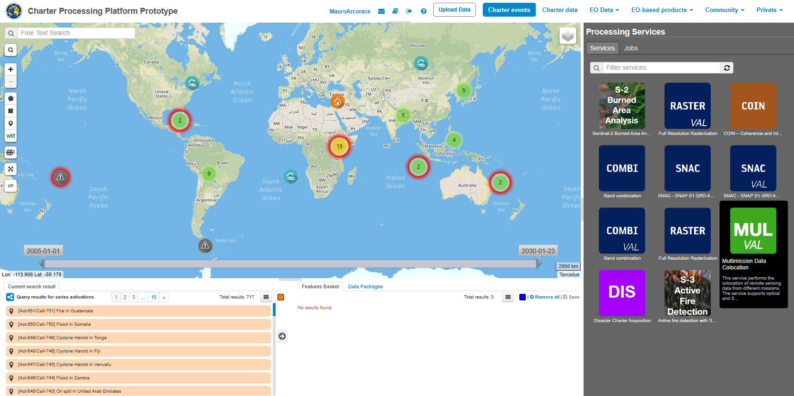
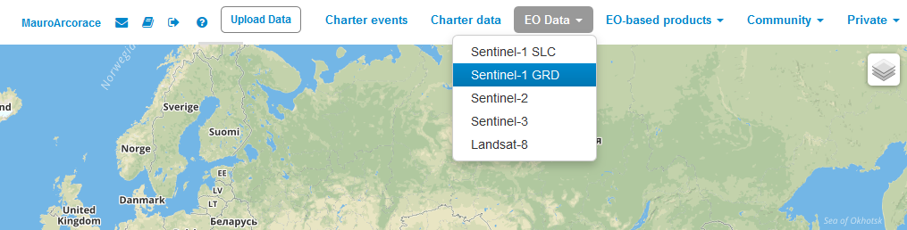
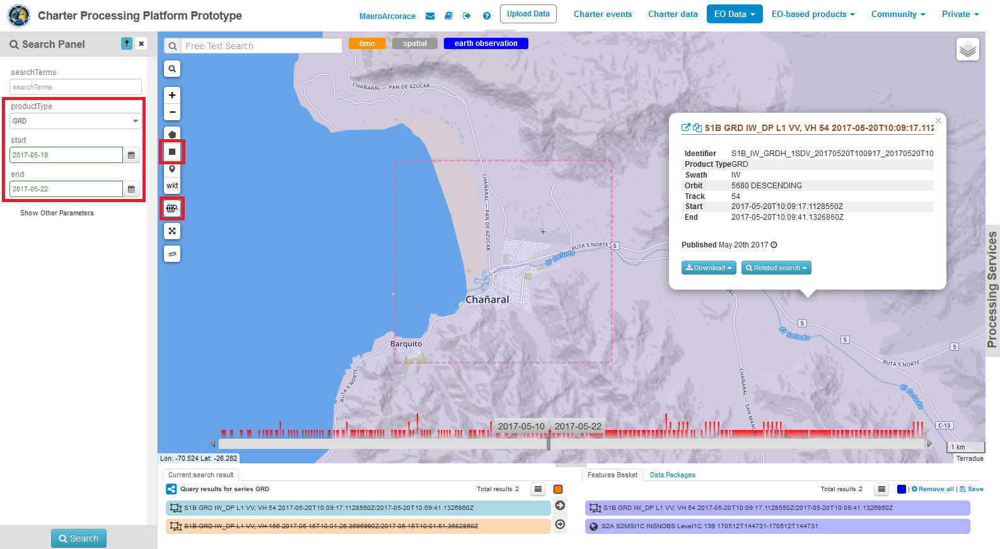
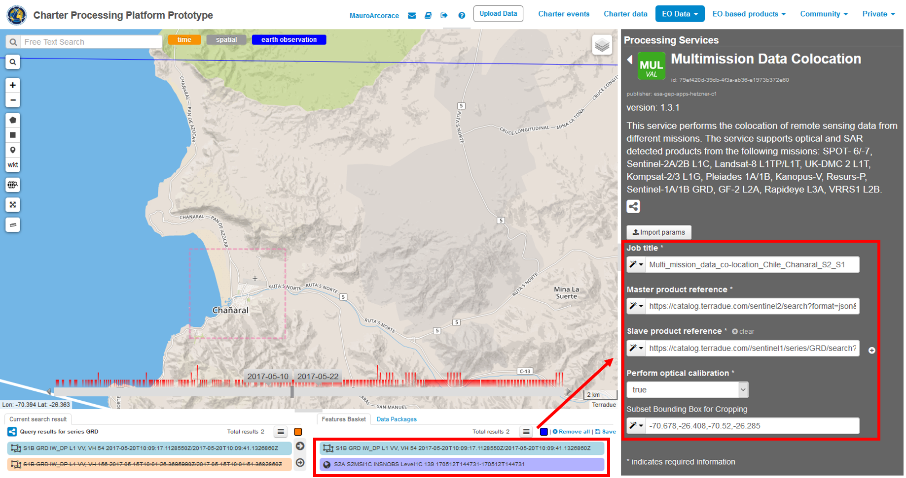
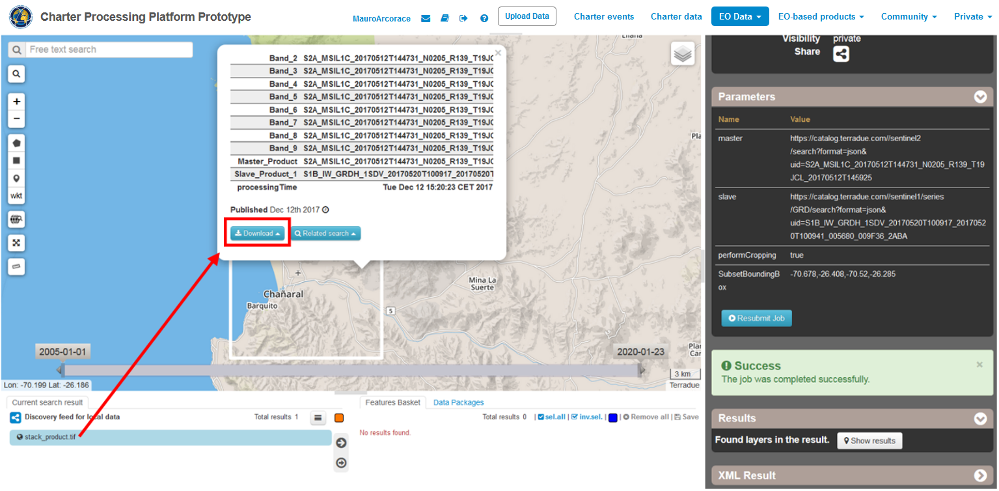
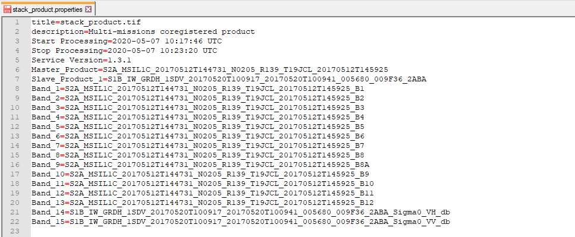
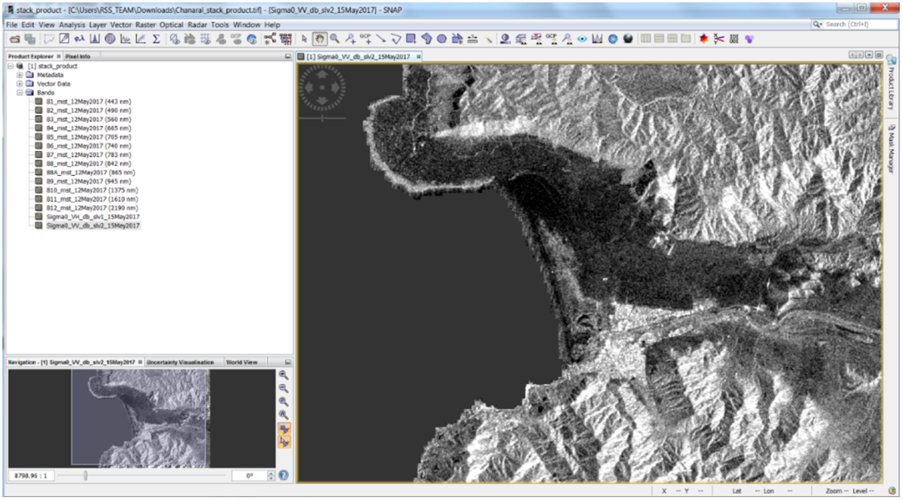

Charter Processing Platform Prototype
~~~~~~~~~~~~~~~~~~~~~~~~~~~~~~~~~~~~~

.. image:: assets/COLOC_logo.png

Multi-mission data co-location
==============================

This service provides the possibility to perform on-demand co-location on a set of user-defined satellite imagery. In particular, the COLOC service is meant to co-locate multiple EO data products derived from different sensors. The Multi-mission data co-location processing chain is implemented relying on SNAP (SeNtinel Application Platform) toolsets.
The service supports optical and SAR detected products from the following missions: Sentinel-2, SPOT-6/7, Pleiades-1A/1B, Kanopus-V, Resurs-P, GF-2, RapidEye, Landsat 8, UK-DMC 2, Kompsat-2 & 3, Sentinel-1, VRSS1.
The output of the service is a multi-mission co-located product that originated from a stack of user-defined EO data products. The corresponding footprint of the output stack product is displayed on the map with the possibility to access product metadata and to download it as a GeoTIFF file.

.. image:: assets/COLOC_fig_01.png

 
**A multi-mission data co-location**

Satellite imagery from both optical and SAR sensors in native format or partially pre-processed are taken as the input of the Multi-mission co-location service. From an overall perspective, the processing chain of this service consists of a first pre-processing step followed by a “Co-location/Stacking” step.
The first step workflow is not the same for Optical and SAR data. In the case of Optical EO data pre-processing, the chain converts input orthorectified product into common radiometric quantity, preferably TOA Reflectance, and then re-projects the data to a common Coordinate System. While handling SAR data instead, the pre-processing sequence consists of Radiometric calibration, Conversion to dB and Terrain correction.
In the Co-location/Stacking step, which is similar for processing SAR and Optical data, one image is declared to be the reference product (Master) on which the other ones (Slaves) are re-projected and resampled to the resolution of the master image.
The output of the service is a multiple band raster file in GeoTIFF format originating from a stack of multiple co-located products. Metadata of the output stack product is directly accessible for inspection in geobrowser through the pop-up window of the resulting layer and contains essential information such as sensor name and acquisition dates for master and slave images.

**Select the Processing Service**

Log in on the Charter Processing Platform Prototype portal and from the “Processing Services” tab, select the “Multi-mission co-location” service.
 

 
**Processing Service Parameters**

The “Multi-mission data co-location” panel is displayed with four parameter values to be filled in:

1.	Job title
2.	Master product reference
3.	Slave product reference
4.	Perform Optical calibration
5.	Subset Bounding Box for Cropping

The user can choose multiple EO data products to perform the multi-mission co-location and declare one data product as master, the others being slave. After the definition of a bounding box, the output multiband stack of the co-located images is clipped over the user given extent and resampled to the common resolution (by default the resolution of the master image).

.. image:: assets/COLOC_fig_03.png
 
**Select the files to process**

This service takes as input multi-mission commercial and open SAR and Optical EO data products available through Charter Processing Platform Prototype.

In the Charter Processing Platform Prototype, it is possible to retrieve different types of data:

•	Commercial satellite imagery (e.g. ALOS2, UK-DMC etc.) acquired during charter activations,
•	Selected open EO data collections (e.g. Sentinel-1, Sentinel-2 etc.),
•	Product metadata of historical and on-going charter activations.

To easily access each type of data some pre-defined contexts, which essentially consist of catalog query with pre-defined search parameters, are available on the top of the Charter Processing Platform Prototype interface:

•	Charter data: the Charter Processing Platform Prototype is connected to COS-2 and Charter Order Desks to harvest metadata and collect data products from the Charter virtual constellation. The Entry “Charter data” is providing access to all data collections as metadata collections i.e. footprints of images used for each activation and presented in the search result panel as a series of EO data products.

•	EO data: in addition to Charter data the platform is also able to fetch free EO data products via their dissemination services, such as Copernicus data via SciHub service. The Entry “EO data” allows the user to access the full archive of selected free collections (Sentinel-1, Sentinel-2, Sentinel-3, Landsat-8)

Input SAR and Optical data selection must be carried out with particular care while filling Master and Slave product fields since a wrong data entry can result in an unfeasible processing of the service.

See the table below for a full list of Optical and SAR missions supported by the current version of the “Multi-mission data co-location” service.

.. image:: assets/COLOC_fig_04.png
 
Note: Pleiades images are downgraded to 1m resolution because of current limitations in the system.
 
**Open EO data product catalog entry**

In this tutorial you are going to process a couple of free EO data products, derived from Sentinel-1 and Sentinel-2 data collections, with the Multi-mission data co-location processing service.

1.	From the top bar click on the “EO data” context link to access the full archive of selected free collections (e.g. Sentinel-1).

2.	Zoom in into a specific area of interest (e.g. Chile). Apply spatial filter by clicking on the “Spatial filter” button and by drawing a rectangle on the map around an area of interest such as Chañaral city (70.61W-26.34S). If needed, you can also use the “Search by location” button to find your area of interest.

3.	Click on the “Search Form” icon and select as product type the GRD product. Apply temporal filter by selecting the start and end date of the temporal interval, such as from 10/05/17 to 22/05/17 (you can also define the temporal filter by selecting a time interval on the time slider).

4.	Then click on the button “Search”. All acquisitions related to specified queries are listed in the Results tab.

5.	Drag and Drop one of the products listed in the Results tab (e.g. S1B_IW_GRDH_1SDV_20170520) in the Feature basket.

 
Repeat above mentioned steps and select a Sentinel-2 image using the same spatial and temporal filters (e.g. S2A_MSIL1C_20170512).

**Fill the parameters**

After the selection of input data, you can start filling the parameters:

1.	Insert a job title (e.g. “Multi_mission_data_co-location_Chile_Chanaral_S2_S1”)

2.	From the Feature basket table drag and drop the image that you want to use as master in the co-location toolset (e.g. S2A_MSIL1C_20170512).

3.	Once you define the master, drag and drop then the image that you want to use as slave (e.g. S1B_IW_GRDH_1SDV_20170520) from the Features basket to the dedicated field “Slave product reference”. If needed you can add additional slave products.

4.	Select true or false if you want to perform optical calibration on the images or not. 

5.	If you want to crop the data you can simply insert the bounding box coordinates on the “Subset bounding box for cropping” field (e.g. -70.678,-26.408,-70.52,-26.285). You can get the coordinates directly from the AOI or input them manually.

6.	Click on “Run Job”.

 
**Running the job**

Click on the “Run Job” button from the processor configuration panel and wait for the job to complete.

.. image:: assets/COLOC_fig_08.png
 
You can monitor the job status under the “My jobs” tag which contains the list of other jobs associated with your user. If a failure occurs, you can re-submit the job. Details on the submitted job can be accessed by clicking on the title of the job “Multi_mission_data_co-location_Chile_Chanaral_S2_S1”.
 
**View results**

Once the job is completed successfully, click on the “Show results” button. The output product is also included in the Result table: “stack_product.tif”.

The output multi-mission co-located product will include all the bands (e.g. 13 bands for Sentinel-plus 2 bands for the Sentinel-1).
 

From the product metadata popup window you can download the stack product in the GeoTIFF format and the stack_product.properties file which includes band naming list of the resulting product.

  
The resulting stack product can be used outside of the platform (e.g. in SNAP) for quantitative analysis such as change detection and image classification.

