COIN – Coherence and Intensity change for Sentinel-1
~~~~~~~~~~~~~~~~~~~~~~~~~~~~~~~~~~~~~~~~~~~~~~~~~~~~

        
**COIN – Coherence and Intensity change for Sentinel-1**

This service provides geocoded composites of coherence and amplitude images from a pair of Sentinel-1 TOPSAR IW data pairs. SNAP is a common architecture for all Sentinel Toolboxes, which is ideal for Earth Observation processing and analysis.

**EO sources supported**:

    - Sentinel-1 TOPSAR IW SLC

**Output specifications**

The service provides 7 output products.

1.	Output-1 – Coherence and Intensity RGB combination

+-------------------------------+---------------------------------------------------------------------------------------------------------------+
| Correspondent file 			| Coherence and Intensity RGB combination																		|
+-------------------------------+---------------------------------------------------------------------------------------------------------------+
| Information types				| RGB Composite: RED=(Coherence) ; GREEN=(Sigma0 average in dB computed over Master and Slave) ; BLUE=(null)	|
+-------------------------------+---------------------------------------------------------------------------------------------------------------+
| Raster format					| GeoTIFF 																										|
+-------------------------------+---------------------------------------------------------------------------------------------------------------+
| resolution					| Native or User selection 																						|
+-------------------------------+---------------------------------------------------------------------------------------------------------------+
| Projection types				| EPSG:3857  																									|
+-------------------------------+---------------------------------------------------------------------------------------------------------------+
| Bit depth						| Unsigned 8 																									|
+-------------------------------+---------------------------------------------------------------------------------------------------------------+
| Processing Level				| RGB composite 																								|
+-------------------------------+---------------------------------------------------------------------------------------------------------------+
| Physical product available	| NO but a 8 bit GeoTIFF Product is provided																	|
+-------------------------------+---------------------------------------------------------------------------------------------------------------+
| Browse product available   	| YES as 8 bit PNG file 																						|
+-------------------------------+---------------------------------------------------------------------------------------------------------------+
| Output Filename example		| coh_sigmaAvrg_IW_VV_04Jun2016_28Jun2016_Coh_Ampl.tif 															|	
+-------------------------------+---------------------------------------------------------------------------------------------------------------+

2.	Output-2 – Coherence product 

+-------------------------------+---------------------------------------------------------------------------------------------------------------+
| Correspondent file 			| Coherence product																								|
+-------------------------------+---------------------------------------------------------------------------------------------------------------+
| Information types				| Interferometric Coherence computed on input SLC couple														|
+-------------------------------+---------------------------------------------------------------------------------------------------------------+
| Raster format					| GeoTIFF 																										|
+-------------------------------+---------------------------------------------------------------------------------------------------------------+
| resolution					| Native or User selection 																						|
+-------------------------------+---------------------------------------------------------------------------------------------------------------+
| Projection types				| EPSG:4326 - WGS84   																							|
+-------------------------------+---------------------------------------------------------------------------------------------------------------+
| Bit depth						| Float 32 																										|
+-------------------------------+---------------------------------------------------------------------------------------------------------------+
| Processing Level				| L2 																											|
+-------------------------------+---------------------------------------------------------------------------------------------------------------+
| Physical product available	| YES																											|
+-------------------------------+---------------------------------------------------------------------------------------------------------------+
| Browse product available   	| YES (GeoTIFF) 																								|
+-------------------------------+---------------------------------------------------------------------------------------------------------------+
| Output Filename example		| coherence_IW_VV_04Jun2016_28Jun2016.tif 																		|	
+-------------------------------+---------------------------------------------------------------------------------------------------------------+

3.	Output-3 – Backscatter average product

+-------------------------------+---------------------------------------------------------------------------------------------------------------+
| Correspondent file 			| Backscatter average product																					|
+-------------------------------+---------------------------------------------------------------------------------------------------------------+
| Information types				| Backscatter Intensity average in dB of input SLC couple														|
+-------------------------------+---------------------------------------------------------------------------------------------------------------+
| Raster format					| GeoTIFF 																										|
+-------------------------------+---------------------------------------------------------------------------------------------------------------+
| resolution					| Native or User selection 																						|
+-------------------------------+---------------------------------------------------------------------------------------------------------------+
| Projection types				| EPSG:4326 - WGS84   																							|
+-------------------------------+---------------------------------------------------------------------------------------------------------------+
| Bit depth						| Float 32 																										|
+-------------------------------+---------------------------------------------------------------------------------------------------------------+
| Processing Level				| L2 																											|
+-------------------------------+---------------------------------------------------------------------------------------------------------------+
| Physical product available	| YES																											|
+-------------------------------+---------------------------------------------------------------------------------------------------------------+
| Browse product available   	| YES (GeoTIFF) 																								|
+-------------------------------+---------------------------------------------------------------------------------------------------------------+
| Output Filename example		| sigmaAverage_dB_IW_VV_04Jun2016_28Jun2016.tif																	|	
+-------------------------------+---------------------------------------------------------------------------------------------------------------+

4.	Output-4 – Backscatter difference product

+-------------------------------+---------------------------------------------------------------------------------------------------------------+
| Correspondent file 			| Backscatter difference product																				|
+-------------------------------+---------------------------------------------------------------------------------------------------------------+
| Information types				| Backscatter Intensity difference in dB of input SLC couple													|
+-------------------------------+---------------------------------------------------------------------------------------------------------------+
| Raster format					| GeoTIFF 																										|
+-------------------------------+---------------------------------------------------------------------------------------------------------------+
| resolution					| Native or User selection 																						|
+-------------------------------+---------------------------------------------------------------------------------------------------------------+
| Projection types				| EPSG:4326 - WGS84   																							|
+-------------------------------+---------------------------------------------------------------------------------------------------------------+
| Bit depth						| Float 32 																										|
+-------------------------------+---------------------------------------------------------------------------------------------------------------+
| Processing Level				| L2 																											|
+-------------------------------+---------------------------------------------------------------------------------------------------------------+
| Physical product available	| YES																											|
+-------------------------------+---------------------------------------------------------------------------------------------------------------+
| Browse product available   	| YES (GeoTIFF) 																								|
+-------------------------------+---------------------------------------------------------------------------------------------------------------+
| Output Filename example		| sigmaDiff_dB_IW_VV_04Jun2016_28Jun2016.tif																	|	
+-------------------------------+---------------------------------------------------------------------------------------------------------------+

5.	Output-5 – Sigma Master and Slave RGB combination

+-------------------------------+---------------------------------------------------------------------------------------------------------------+
| Correspondent file 			| Sigma Master and Slave RGB combination																		|
+-------------------------------+---------------------------------------------------------------------------------------------------------------+
| Information types				| RGB Composite: RED=(Sigma0 Slave in dB) ; GREEN=(Sigma0 Master in dB) ;BLUE=(Sigma0 Master in dB)				|
+-------------------------------+---------------------------------------------------------------------------------------------------------------+
| Raster format					| GeoTIFF 																										|
+-------------------------------+---------------------------------------------------------------------------------------------------------------+
| resolution					| Native or User selection 																						|
+-------------------------------+---------------------------------------------------------------------------------------------------------------+
| Projection types				| EPSG:3857 		  																							|
+-------------------------------+---------------------------------------------------------------------------------------------------------------+
| Bit depth						| Unsigned 8 																									|
+-------------------------------+---------------------------------------------------------------------------------------------------------------+
| Processing Level				| RGB composite 																								|
+-------------------------------+---------------------------------------------------------------------------------------------------------------+
| Physical product available	| NO but a 8 bit GeoTIFF Product is provided																	|
+-------------------------------+---------------------------------------------------------------------------------------------------------------+
| Browse product available   	| YES as 8 bit PNG file 																						|
+-------------------------------+---------------------------------------------------------------------------------------------------------------+
| Output Filename example		| sigmaSlave_dB_28Jun2016_sigmaMaster_dB_04Jun2016_IW_VV_Amp_Change.tif											|	
+-------------------------------+---------------------------------------------------------------------------------------------------------------+

6.	Output-6 – Sigma Master product

+-------------------------------+---------------------------------------------------------------------------------------------------------------+
| Correspondent file 			| Sigma Master product																							|
+-------------------------------+---------------------------------------------------------------------------------------------------------------+
| Information types				| SAR backscatter calibrated and terrain corrected [dB] of Master image											|
+-------------------------------+---------------------------------------------------------------------------------------------------------------+
| Raster format					| GeoTIFF 																										|
+-------------------------------+---------------------------------------------------------------------------------------------------------------+
| resolution					| Native or User selection 																						|
+-------------------------------+---------------------------------------------------------------------------------------------------------------+
| Projection types				| EPSG:4326 - WGS84   																							|
+-------------------------------+---------------------------------------------------------------------------------------------------------------+
| Bit depth						| Float 32 																										|
+-------------------------------+---------------------------------------------------------------------------------------------------------------+
| Processing Level				| L2 																											|
+-------------------------------+---------------------------------------------------------------------------------------------------------------+
| Physical product available	| YES																											|
+-------------------------------+---------------------------------------------------------------------------------------------------------------+
| Browse product available   	| YES (GeoTIFF) 																								|
+-------------------------------+---------------------------------------------------------------------------------------------------------------+
| Output Filename example		| sigmaMaster_dB_IW_VV_04Jun2016.tif																			|	
+-------------------------------+---------------------------------------------------------------------------------------------------------------+

6.	Output-6 – Sigma Slave product

+-------------------------------+---------------------------------------------------------------------------------------------------------------+
| Correspondent file 			| Sigma Slave product																							|
+-------------------------------+---------------------------------------------------------------------------------------------------------------+
| Information types				| SAR backscatter calibrated and terrain corrected [dB] of Slave image											|
+-------------------------------+---------------------------------------------------------------------------------------------------------------+
| Raster format					| GeoTIFF 																										|
+-------------------------------+---------------------------------------------------------------------------------------------------------------+
| resolution					| Native or User selection 																						|
+-------------------------------+---------------------------------------------------------------------------------------------------------------+
| Projection types				| EPSG:4326 - WGS84   																							|
+-------------------------------+---------------------------------------------------------------------------------------------------------------+
| Bit depth						| Float 32 																										|
+-------------------------------+---------------------------------------------------------------------------------------------------------------+
| Processing Level				| L2 																											|
+-------------------------------+---------------------------------------------------------------------------------------------------------------+
| Physical product available	| YES																											|
+-------------------------------+---------------------------------------------------------------------------------------------------------------+
| Browse product available   	| YES (GeoTIFF) 																								|
+-------------------------------+---------------------------------------------------------------------------------------------------------------+
| Output Filename example		| sigmaSlave_dB_IW_VV_28Jun2016.tif																				|	
+-------------------------------+---------------------------------------------------------------------------------------------------------------+

.. NOTE::

	- the "Browse GeoTIFF" product is always a GeoTIFF file with the same resolution of the physical product, with Uint8 bit depth and projection EPSG:3857.
	- The “Browse PNG” product is always a PNG file with the same resolution of the physical product, with Uint8 bit depth.

-----

This tutorial processes a pair of Sentinel-1 TOPSAR IW data with the COIN – Coherence and Intensity change for Sentinel-1 service. 

SNAP (SeNtinel Application Platform) [#f1]_ is the common architecture for all Sentinel Toolboxes which is ideal for Earth Observation processing and analysis. It has been jointly developed by Brockmann Consult, Array Systems Computing and C-S.

The coherence and intensity processing chain for Sentinel 1 TOPSAR IW images is implemented through the tools contained in the Sentinel-1 Toolbox.

This tutorial is referred to the service build V1.4.3.

The Coherence and Intensity change
==================================

The coherence between an images pair can show if the images have strong similarities, represented in a scale from 0 to 1. Areas of high coherence will appear bright (values near 1). Areas with poor coherence will be dark (values near 0). For example, vegetation and water have poor coherence and buildings have very high coherence.

The intensity represents the strength of the radar response from the observed scene. Such intensity can vary dependent on changes occurred in time between the acquisitions and also on the scene physical characteristics. 

To better detect the intensity change this service provides, in addition to the intensity in dB of the individual images, the dB average and dB difference of the image pair.
Also a couple of results combinations are provided: 

	- An RGB image with Red = Coherence, Green = Intensity average, Blue = Null. Thanks to this representation is possible to show urban centres in yellow, which have high coherence and intensity. Green can represent vegetated fields and forests. The reds and oranges represent unchanging features such as bare soil or possibly rocks.
	- An RGB image with Red = Slave Intensity, Green = Blue = Master Intensity. Thanks to this representation is possible to clearly show inundated areas in cyan.

Sentinel-1 Interferometric Wide Swath Products
==============================================

The Interferometric Wide (IW) swath mode is the main acquisition mode over land for Sentinel-1. It acquires data with a 250 km swath at 5 m by 20 m spatial resolution (single look). IW mode captures three sub-swaths using Terrain Observation with Progressive Scans SAR (TOPSAR). With the TOPSAR technique, in addition to steering the beam in range as in ScanSAR, the beam is also electronically steered from backward to forward in the azimuth direction for each burst, avoiding scalloping and resulting in homogeneous image quality throughout the swath. TOPSAR mode replaces the conventional ScanSAR mode, achieving the same coverage and resolution as ScanSAR, but with a nearly uniform SNR (Signal-to-Noise Ratio) and DTAR (Distributed Target Ambiguity Ratio). IW SLC products contain one image per sub-swath and one per polarisation channel, for a total of three (single polarisation) or six (dual polarisation) images in an IW product. Each sub-swath image consists of a series of bursts, where each burst has been processed as a separate SLC image. The individually focused complex burst images are included, in azimuth time order, into a single sub-swath image with black-fill demarcation in between, similar to ENVISAT ASAR Wide ScanSAR SLC products.

The tutorial uses a pair of Sentinel-1 TOPSAR IW data around Rome of June 2016.

The processing service code is available in the GitHub repository (https://github.com/geohazards-tep/dcs-rss-snap-s1-coin).

Select the processing
---------------------

* Login to the platform (see :doc:`user <../community-guide/user>` section)

* Select the processing service **COIN – Coherence and Intensity change for Sentinel-1**:

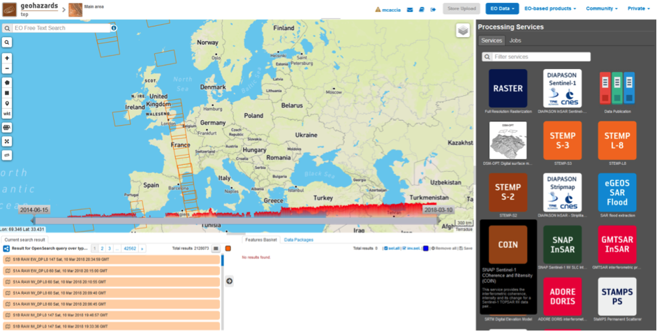

The "COIN – Coherence and Intensity change for Sentinel-1" panel is displayed with parameters values to be filled-in.

Select the files to process
---------------------------

This service takes as input a couple of Sentinel-1 TOPSAR-IW SLC images.
One image is selected to be the **Master** one, i.e. the reference product on which the other one (the **Slave**) is reprojected and resampled to compute the interferometric coherence and the backscatter intensities. 

Input SAR data selection must be carried out with particular care, since a wrong data selection can result to an unfeasible processing.

* The processing service accepts as inputs **only Sentinel-1 Single Look Complex (i.e. Level 1 SLC) data**.
* The Sentinel-1 SLC pair must pertain to the same acquisition mode **TOPSAR-IW**.
* The user must select **images related to the same track only**. 
* The user must select **images related to the same polarization only**. 
* Spatial overlap is strictly needed between the images pair.

For this tutorial, a pre-defined data set has been prepared to speed up data selection step.

* Browse the Data Packages looking for *COIN test data* package and click on the load button to upload it.

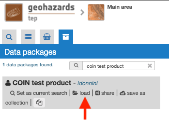
		
* Click on the product related to 2016-06-04, then drag and drop the selected data in the **Master product reference** field.
		
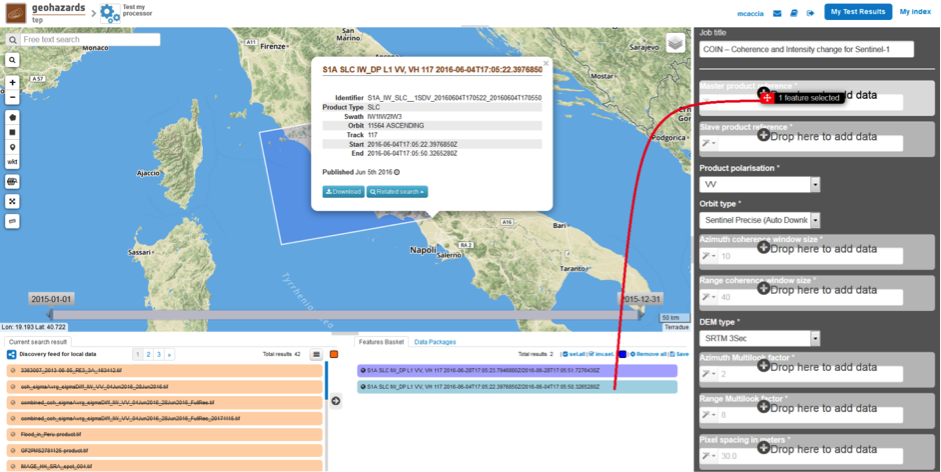

* Click on the product related to 2016-06-28, then drag and drop the selected data in the **Slave product reference** field.
		
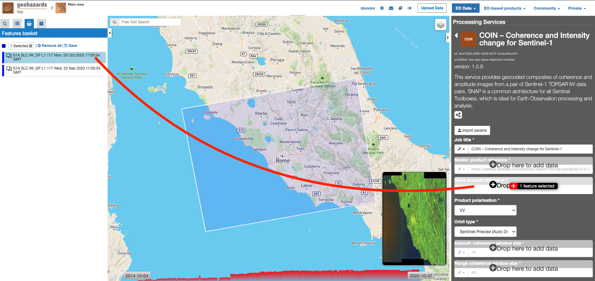

		
Fill parameters
---------------
		
Scroll down the COIN configuration menu to show all the parameters.	

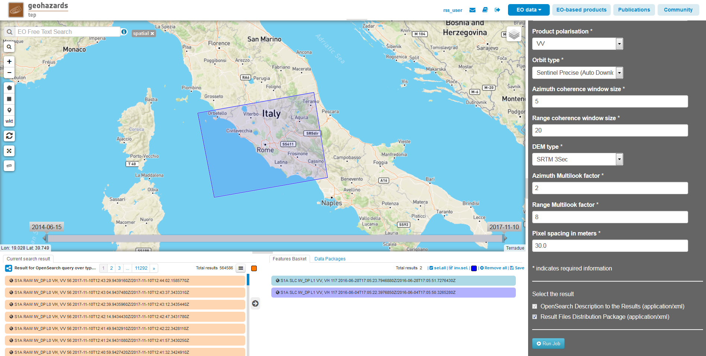
		
Product polarisation
==================== 

This is the product polarization related to the input data pair. The Sentinel-1 acquisitions on can have different polarization types:
	* **Vertical dual-polarization (DV data)**: Vertical in trasmission phase and both Vertical and Horizontal in receiving phase (This is the most operated one).
	* **Horizontal dual-polarization (DH data)**: Horizontal in trasmission phase and both Horizontal and Vertical in receiving phase.	
	* **Vertical single-polarization (SV data)**: Vertical in both trasmission and receiving phases.
	* **Horizontal single-polarization (SH data)**: Horizontal in both trasmission and receiving phases.
COIN processes only one polarization channel between that can be selected between:
	* **VV**: Vertical in both trasmission and receiving phases, contained in DV and SV products (default value).
	* **VH**: Vertical in trasmission phase and Horizontal in receiving phase, contained only in DV products.
	* **HH**: Horizontal in both trasmission and receiving phases, contained in DH and SH products.
	* **HV**: Horizontal in trasmission phase and Vertical in receiving phase, contained only in DH products.

**For this run leave the VV default value**.	

Orbit type 
==========

The orbit state vectors provided in the metadata of a SAR product are generally not accurate and can be refined with the precise orbit files which are available days-to-weeks after the generation of the product. 
The orbit file provides accurate satellite position and velocity information. Based on this information, the orbit state vectors in the abstract metadata of the product are updated.
A more accurate satellite position and velocity information ensure a better accuracy in the images terrain correction processing.
For Sentinel-1 the following orbit files can be applied: 

	* **Sentinel Precise** (default value). Precise orbits are produced a few weeks after acquisition.
	* **Sentinel Restituted**. Less accurate than Precise but available sooner than the Precise. 	

**For this run leave the Sentinel Restituted (Auto Download) default value**.

Azimuth and Range coherence window size
=======================================

The input parameters are size of the shifting window for the coherence estimation. The window size is defined, in both azimuth and range directions.
* **Azimuth coherence window size**: leave **5** as the default value.
* **Range coherence window size**: leave **20** as the default value.

DEM type
========

Define the DEM source for the Back-Geocoding Coregistration and Terrain Correction processing.
The **SRTM 3 Sec** (90 m of resolution) is used. 
NOTE: SRTM valid in the [-56 deg,+60 deg] range of latitudes.

Azimuth and Range Multilook factor
==================================

Generally, a SAR original image appears speckled with inherent speckle noise. To reduce this inherent speckled appearance, several images are incoherently combined as if they corresponded to different looks of the same scene. This processing is generally known as multilook processing. As a result the multilooked image improves the image interpretability. 
The implemented multilooking technique is the spatial one, produced by space-domain averaging of a single look image.
The selectable parameters are the number of azimuth and range looks. 

* **Azimuth Multilook factor**: leave **2** as the default value.
* **Range Multilook factor**: leave **8** as the default value.

Pixel spacing in meters
=======================

Due to topographical variations of a scene and the tilt of the satellite sensor, distances can be distorted in the SAR images. Image data not directly at the sensor Nadir location will have some distortion. Terrain corrections are intended to compensate for these distortions so that the geometric representation of the image will be as close as possible to the real world.
Terrain Correction allows geometric overlays of data from different sensors and/or geometries.

The user can select the pixel spacing in meters of the terrain corrected image.

* **Pixel spacing in meters**: leave **30.0** as the default value.

Run the job and results browsing
--------------------------------

Click on the button **Run Job** and see the Running Job.

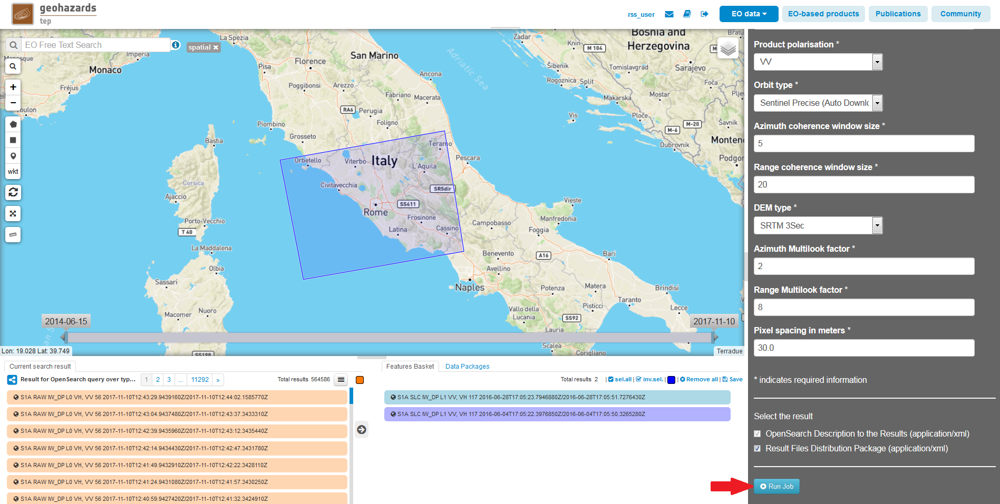

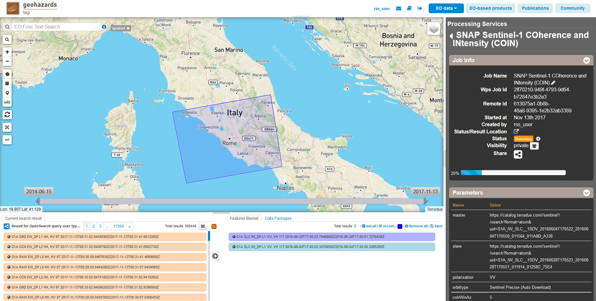

* After the processing end (it can take 2/3 hours), see the Successful Job:

.. figure:: assets/tuto_rss_snap_s1_coin_8.png
	:figclass: align-center
        :width: 750px
        :align: center

Scroll down the Job status screen, click on the button *Show results*, then check the results list on the *Results Table* in the bottom left side:

* **coherence_IW_VV_04Jun2016_28Jun2016.png**: this is the PNG image representing the quick-look of coherence_IW_VV_04Jun2016_28Jun2016 product. This image is displayed on the map.
* **coherence_IW_VV_04Jun2016_28Jun2016.tif**: this is the GeoTIFF product that contains the interferometric coherence computed between master and slave images. Each pixel is a Float32 number from 0 (no coherence) to 1 (maximum coherence).
* **combined_coh_sigmaAvrg_sigmaDiff_IW_VV_04Jun2016_28Jun2016.tif**: this is the "physical" GeoTIFF product with a combination of the processing results. This is useful to have some of the returned algorithm output already stacked. It is constituted by 3 bands: 
	* 1st) The interferometric coherence computed between master and slave images. Each pixel is a Float32 number from 0 (no coherence) to 1 (maximum coherence).
	* 2nd) The dB average between backscatter intensities of master and slave products *(sigmaMaster_dB+sigmaSlave_dB)/2* . Each pixel is a Float32 number with the intensity in decibel.
	* 3rd) The dB difference between backscatter intensities of master and slave products *(sigmaMaster_dB-sigmaSlave_dB)*. Each pixel is a Float32 number with the intensity in decibel.
* **combined_coh_sigmaAvrg_sigmaDiff_IW_VV_04Jun2016_28Jun2016_FullRes.tif**: this is the "visualization" GeoTIFF product with a combination of the processing results. This is useful to have a full resolution image already suitable for visualization in next version of GEP. It is constituted by 3 bands: 
	* 1st=Red) The interferometric coherence computed between master and slave images. Each pixel is a scaled coherence value with Byte precision (from 0 to 255).
	* 2nd=Green) The dB average between backscatter intensities of master and slave products *(sigmaMaster_dB+sigmaSlave_dB)/2* . Each pixel is a scaled intensity value in Byte (from 0 to 255).
	* 3rd=Blue) The dB difference between backscatter intensities of master and slave products *(sigmaMaster_dB-sigmaSlave_dB)*. Each pixel is a scaled intensity value in Byte (from 0 to 255).
* **combined_coh_sigmaAvrg_sigmaDiff_IW_VV_04Jun2016_28Jun2016_QL.png**: this is the PNG image representing the quick-look of combined_coh_sigmaAvrg_sigmaDiff_IW_VV_04Jun2016_28Jun2016_FullRes product. This image is displayed on the map.
* **combined_sigmaMaster_dB_sigmaSlave_dB_IW_VV_04Jun2016_28Jun2016.tif**: this is the "physical" GeoTIFF product with a combination of the processing results. This is useful to have some of the returned algorithm output already stacked. It is constituted by 2 bands: 
	* 1st) The backscatter intensity of Master product in dB *(sigmaMaster_dB)*. Each pixel is a Float32 number with the intensity in decibel.
	* 2nd) The backscatter intensity of Slave product in dB *(sigmaSlave_dB)*. Each pixel is a Float32 number with the intensity in decibel.
* **combined_sigmaMaster_dB_sigmaSlave_dB_IW_VV_04Jun2016_28Jun2016_FullRes.tif**: this is the "visualization" GeoTIFF product with a combination of the processing results. This is useful to have a full resolution image already suitable for visualization in next version of GEP. It is constituted by 3 bands: 
	* 1st=Red) The backscatter intensity of Master product in dB *(sigmaMaster_dB)*. Each pixel is a scaled intensity value in Byte (from 0 to 255).
	* 2nd=Green) The backscatter intensity of Slave product in dB *(sigmaSlave_dB)*. Each pixel is a scaled intensity value in Byte (from 0 to 255).
	* 3rd=Blue) The backscatter intensity of Slave product in dB *(sigmaSlave_dB)*. Each pixel is a scaled intensity value in Byte (from 0 to 255).
* **combined_sigmaMaster_dB_sigmaSlave_dB_IW_VV_04Jun2016_28Jun2016_QL.png**: this is the PNG image representing the quick-look of combined_sigmaMaster_dB_sigmaSlave_dB_IW_VV_04Jun2016_28Jun2016_FullRes product. This image is displayed on the map.
* **sigmaAverage_dB_IW_VV_04Jun2016_28Jun2016.png**: this is the PNG image representing the quick-look of sigmaAverage_dB_IW_VV_04Jun2016_28Jun2016 product. This image is displayed on the map.
* **sigmaAverage_dB_IW_VV_04Jun2016_28Jun2016.tif**: this is the GeoTIFF product that contains the dB average between backscatter intensities of master and slave products *(sigmaMaster_dB+sigmaSlave_dB)/2* . Each pixel is a Float32 number with the intensity in decibel.
* **sigmaDiff_dB_IW_VV_04Jun2016_28Jun2016.png**: this is the PNG image representing the quick-look of sigmaDiff_dB_IW_VV_04Jun2016_28Jun2016 product. This image is displayed on the map.
* **sigmaDiff_dB_IW_VV_04Jun2016_28Jun2016.tif**: this is the GeoTIFF product that contains the dB difference between backscatter intensities of master and slave products *(sigmaMaster_dB-sigmaSlave_dB)*. Each pixel is a Float32 number with the intensity in decibel.
* **sigmaMaster_dB_IW_VV_04Jun2016.png**: this is the PNG image representing the quick-look of sigmaMaster_dB_IW_VV_04Jun2016 product. This image is displayed on the map.
* **sigmaMaster_dB_IW_VV_04Jun2016.tif**: this is the GeoTIFF product that contains the dB intensity of Master product. Each pixel is a Float32 number with the intensity in decibel.
* **sigmaSlave_dB_IW_VV_28Jun2016.png**: this is the PNG image representing the quick-look of sigmaSlave_dB_IW_VV_28Jun2016 product. This image is displayed on the map.
* **sigmaSlave_dB_IW_VV_28Jun2016.tif**: this is the GeoTIFF product that contains the dB intensity of Slave product. Each pixel is a Float32 number with the intensity in decibel.

Click on each result name. A tab with processing information will be displayed for the tif products (except for the _FullRes.tif one). Click on png results to see quick-look images on map. 
Every product can be downloaded by clicking on the product name and the on the "Download" button that appears in the info tab.

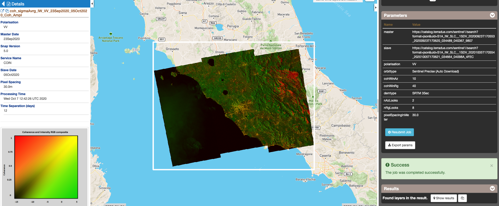
		
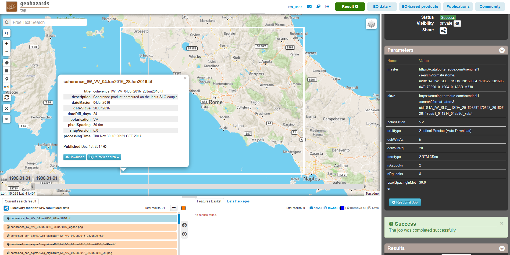
		
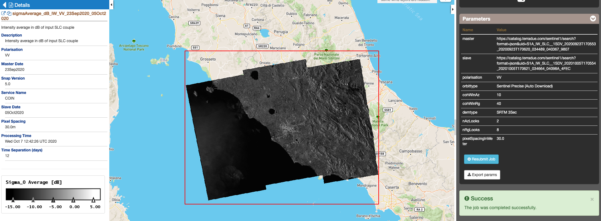

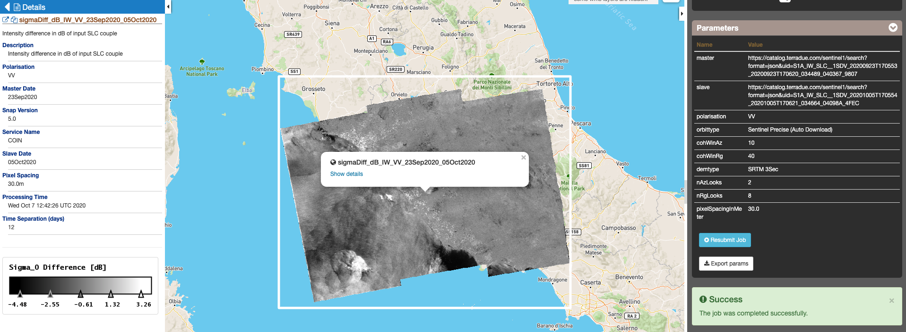

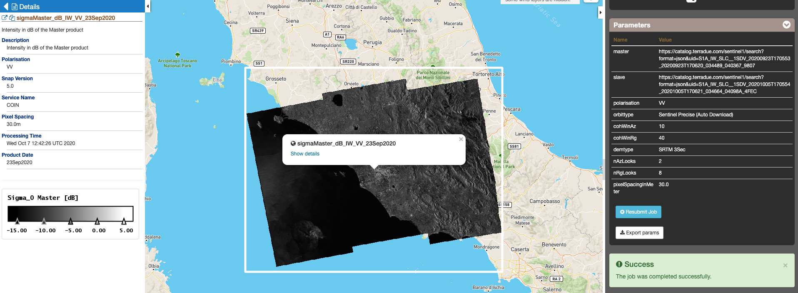
		
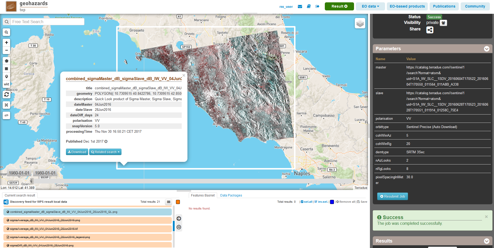
		
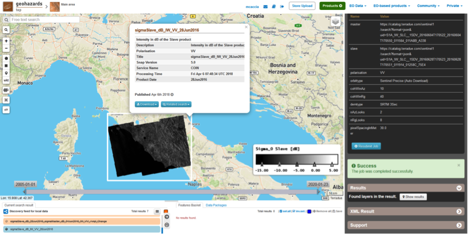

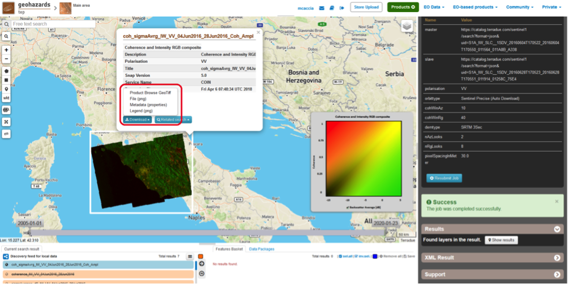

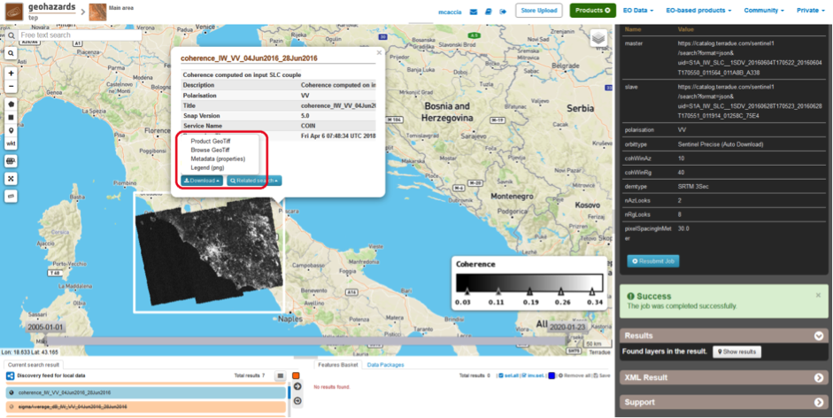
		
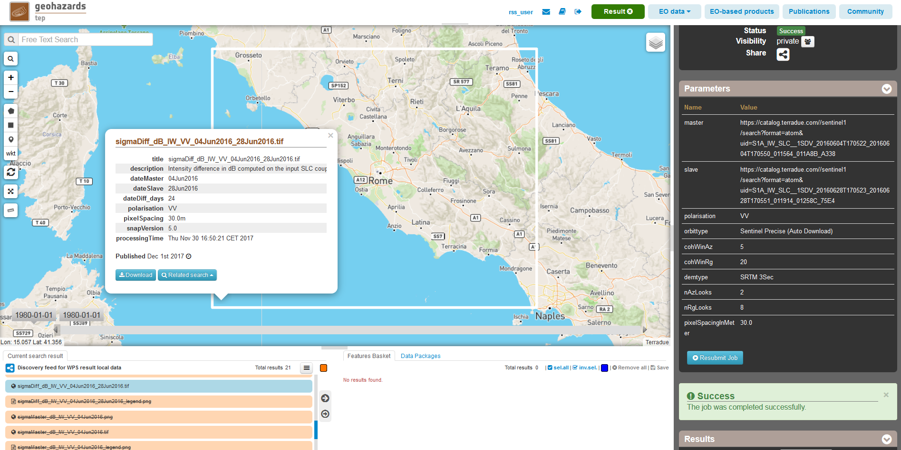
		
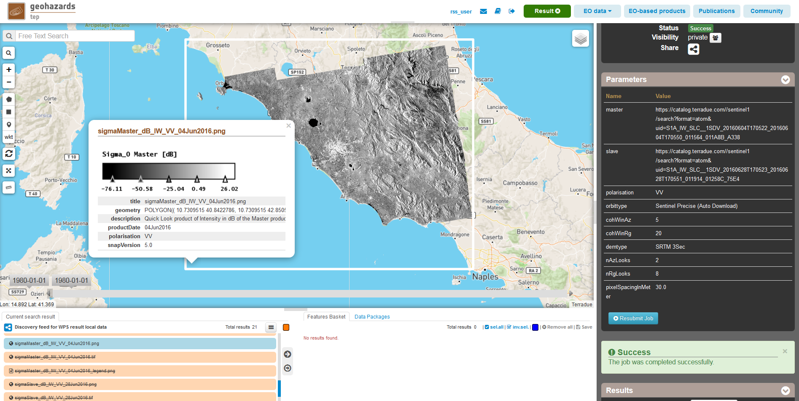

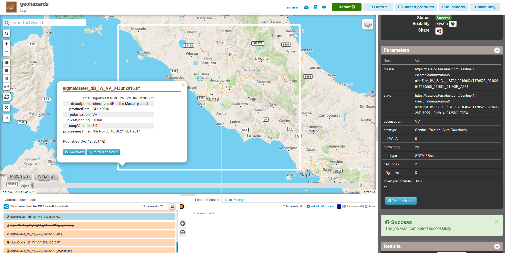
		
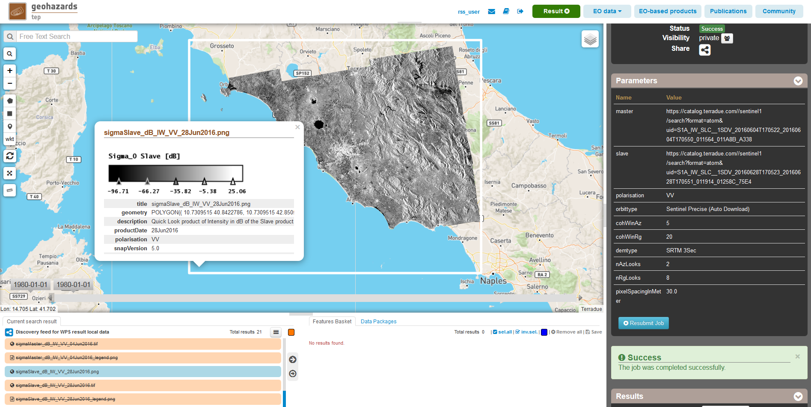

		

Warning on visualization products extent
========================================

For some selected input SLC pairs it can happen that not all the bursts are overlapping. In these cases the SNAP default behavior is: 

* the coeherence band is computed only on the overlapping area; 
* the intensity for Slave bursts that don't overlap with Master ones is dropped; 
* the intensity for Master bursts with no overlap is kept. 

This leads to have a Master with a wider domain than Slave, impacting on the backscatter average and difference products (i.e. average and difference computed also in areas where Slave is not present). 

This problem is fixed for the visualization products **(combined_coh_sigmaAvrg_sigmaDiff_IW_*_FullRes.tif, combined_coh_sigmaAvrg_sigmaDiff_IW_*_QL.png, sigmaDiff_dB_IW_*.png, sigmaAverage_dB_IW_*.png, combined_sigmaMaster_dB_sigmaSlave_dB_IW_*_FullRes.tif, combined_sigmaMaster_dB_sigmaSlave_dB_IW_*_QL.png)** by producing output with the minumum extent (i.e. the same as coherence product) to avoid visualization artifacts. 
In the other products all the available data is kept, so the product extent can slightly differ from Master to Slave. 
		
Warning on output products deletion
===================================

Please note that the generated output (in particular the GeoTIFF products) are not stored in a persistent manner on the platform. 
The Tiff products will be automatically deleted after two weeks.
  	

.. rubric:: References

.. [#f1] `SNAP Website <http://step.esa.int/main/toolboxes/snap>`_