SNAP-InSAR – SNAP Sentinel-1 IW SLC Interferogram and Displacements
~~~~~~~~~~~~~~~~~~~~~~~~~~~~~~~~~~~~~~~~~~~~~~~~~~~~~~~~~~~~~~~~~~~

        
**SNAP-InSAR – SNAP Sentinel-1 IW SLC Interferogram and Displacements**

This service provides the interferometric processor for the Sentinel-1 TOPSAR IW SLC data performed through SNAP. SNAP is a common architecture for all Sentinel Toolboxes, which is ideal for Earth Observation processing and analysis.

**EO sources supported**:

    - Sentinel-1 TOPSAR IW SLC

**Output specifications**

The service provides 3 output products.

+-------------------------------+---------------------------------------------------------------------------------------------------------------+
| Output-1 – Coherence product                                                                                                                  |
+===============================+===============================================================================================================+
| Correspondent file            | Coherence product                                                                                             |
+-------------------------------+---------------------------------------------------------------------------------------------------------------+
| Information types             | Interferometric Coherence computed on input SLC couple                                                        |
+-------------------------------+---------------------------------------------------------------------------------------------------------------+
| Raster format                 | GeoTIFF                                                                                                       |
+-------------------------------+---------------------------------------------------------------------------------------------------------------+
| resolution                    | Native or User selection                                                                                      |
+-------------------------------+---------------------------------------------------------------------------------------------------------------+
| Projection types              | EPSG:4326 - WGS84                                                                                             |
+-------------------------------+---------------------------------------------------------------------------------------------------------------+
| Bit depth                     | Float 32                                                                                                      |
+-------------------------------+---------------------------------------------------------------------------------------------------------------+
| Processing Level              | L2                                                                                                            |
+-------------------------------+---------------------------------------------------------------------------------------------------------------+
| Physical product available    | YES                                                                                                           |
+-------------------------------+---------------------------------------------------------------------------------------------------------------+
| Browse product available      | YES (Both PNG and GeoTIFF)                                                                                    |
+-------------------------------+---------------------------------------------------------------------------------------------------------------+
| Output Filename example       | coh_VV_21Aug2016_27Aug2016.tif                                                                                |   
+-------------------------------+---------------------------------------------------------------------------------------------------------------+

+-------------------------------+---------------------------------------------------------------------------------------------------------------+
| Output-2 – Phase product                                                                                                                      |
+===============================+===============================================================================================================+
| Correspondent file            | Phase product                                                                                                 |
+-------------------------------+---------------------------------------------------------------------------------------------------------------+
| Information types             | Interferometric Phase computed on input SLC couple                                                            |
+-------------------------------+---------------------------------------------------------------------------------------------------------------+
| Raster format                 | GeoTIFF                                                                                                       |
+-------------------------------+---------------------------------------------------------------------------------------------------------------+
| resolution                    | Native or User selection                                                                                      |
+-------------------------------+---------------------------------------------------------------------------------------------------------------+
| Projection types              | EPSG:4326 - WGS84                                                                                             |
+-------------------------------+---------------------------------------------------------------------------------------------------------------+
| Bit depth                     | Float 32                                                                                                      |
+-------------------------------+---------------------------------------------------------------------------------------------------------------+
| Processing Level              | L2                                                                                                            |
+-------------------------------+---------------------------------------------------------------------------------------------------------------+
| Physical product available    | YES                                                                                                           |
+-------------------------------+---------------------------------------------------------------------------------------------------------------+
| Browse product available      | YES (Both PNG and GeoTIFF)                                                                                    |
+-------------------------------+---------------------------------------------------------------------------------------------------------------+
| Output Filename example       | phase_VV_21Aug2016_27Aug2016.tif                                                                              |
+-------------------------------+---------------------------------------------------------------------------------------------------------------+

+-------------------------------+---------------------------------------------------------------------------------------------------------------+
| Output-3 – Displacement product                                                                                                               |
+===============================+===============================================================================================================+
| Correspondent file            | Displacement product                                                                                          |
+-------------------------------+---------------------------------------------------------------------------------------------------------------+
| Information types             | Line of sight displacement                                                                                    |
+-------------------------------+---------------------------------------------------------------------------------------------------------------+
| Raster format                 | GeoTIFF                                                                                                       |
+-------------------------------+---------------------------------------------------------------------------------------------------------------+
| resolution                    | Native or User selection                                                                                      |
+-------------------------------+---------------------------------------------------------------------------------------------------------------+
| Projection types              | EPSG:4326 - WGS84                                                                                             |
+-------------------------------+---------------------------------------------------------------------------------------------------------------+
| Bit depth                     | Float 32                                                                                                      |
+-------------------------------+---------------------------------------------------------------------------------------------------------------+
| Processing Level              | L2                                                                                                            |
+-------------------------------+---------------------------------------------------------------------------------------------------------------+
| Physical product available    | YES                                                                                                           |
+-------------------------------+---------------------------------------------------------------------------------------------------------------+
| Browse product available      | YES (Both PNG and GeoTIFF)                                                                                    |
+-------------------------------+---------------------------------------------------------------------------------------------------------------+
| Output Filename example       | displacement_VV_21Aug2016_27Aug2016.tif                                                                       |
+-------------------------------+---------------------------------------------------------------------------------------------------------------+

.. NOTE::

    - the "Browse GeoTIFF" product is always a GeoTIFF file with the same resolution of the physical product, with Uint8 bit depth and projection EPSG:3857.
    - The “Browse PNG” product is always a PNG file with the same resolution of the physical product, with Uint8 bit depth.

-----

This tutorial processes a pair of Sentinel-1 TOPSAR IW data with the SNAP S1 TOPS-IW Interferometric processor. 
SNAP (SeNtinel’s Application Platform) [#f1]_ is the common architecture for all Sentinel Toolboxes jointly developed by Brockmann Consult, Array Systems Computing and C-S. The interferometric processing chain for Sentinel 1 TOPSAR IW images is implemented through the tools contained in the Sentinel-1 Toolbox.

This tutorial is referred to the service build V1.5.2

The interferometric SAR technique
---------------------------------

Interferometric synthetic aperture radar (InSAR) exploits the phase difference between two complex radar SAR observations taken from slightly different sensor positions and extracts information about the earth’s surface. A SAR signal contains amplitude and phase information. The amplitude is the strength of the radar response and the phase is the fraction of one complete sine wave cycle (a single SAR wavelength). The phase of the SAR image is determined primarily by the distance between the satellite antenna and the ground targets. By combining the phase of these two images after coregistration, an interferogram can be generated whose phase is highly correlated to the terrain topography. The InSAR technique can potentially measure millimetre-scale changes in deformation over spans of days to years. It has applications for geophysical monitoring of natural hazards, for example earthquakes, volcanoes and landslides, and in structural engineering, in particular monitoring of subsidence and structural stability.

Sentinel-1 Interferometric Wide Swath Products
----------------------------------------------

The Interferometric Wide (IW) swath mode is the main acquisition mode over land for Sentinel-1. It acquires data with a 250 km swath at 5 m by 20 m spatial resolution (single look). IW mode captures three sub-swaths using Terrain Observation with Progressive Scans SAR (TOPSAR). With the TOPSAR technique, in addition to steering the beam in range as in ScanSAR, the beam is also electronically steered from backward to forward in the azimuth direction for each burst, avoiding scalloping and resulting in homogeneous image quality throughout the swath. TOPSAR mode replaces the conventional ScanSAR mode, achieving the same coverage and resolution as ScanSAR, but with a nearly uniform SNR (Signal-to-Noise Ratio) and DTAR (Distributed Target Ambiguity Ratio). IW SLC products contain one image per sub-swath and one per polarisation channel, for a total of three (single polarisation) or six (dual polarisation) images in an IW product. Each sub-swath image consists of a series of bursts, where each burst has been processed as a separate SLC image. The individually focused complex burst images are included, in azimuth time order, into a single sub-swath image with black-fill demarcation in between, similar to ENVISAT ASAR Wide ScanSAR SLC products.

The tutorial uses a coseismic pair of Sentinel-1 TOPSAR IW data related to the August 2016 center Italy's earthquake.

The 2016 center Italy's earthquake (also known as 2016 Amatrice earthquake) was an earthquake, measuring 6.2 on the moment magnitude scale, hit Central Italy on 24 August 2016 at 03:36:32 CEST (01:36 UTC). Its epicentre was close to Accumoli, with its hypocentre at a depth of 4 km, approximately 75 km (47 mi) southeast of Perugia and 45 km (28 mi) north of L'Aquila, in an area near the borders of the Umbria, Lazio, Abruzzo and Marche regions.
Learn more about the event in the `2016 center Italy's earthquake Wikipedia <https://en.wikipedia.org/wiki/2016_Central_Italy_earthquake>`_ entry.

The processing service code is available in the GitHub repository `geohazards-tep/rss-snap-s1-insar <https://github.com/geohazards-tep/dcs-rss-snap-s1-insar>`_.

Select the processing
=====================

* Login to the platform (see :doc:`user <../community-guide/user>` section)

* Select the processing service **SNAP-InSAR – SNAP Sentinel-1 IW SLC Interferogram and Displacements**:

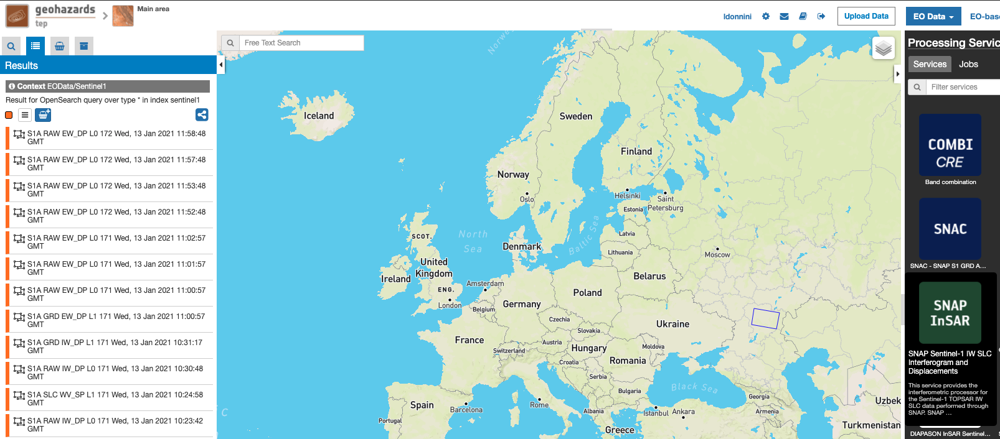

The **SNAP-InSAR – SNAP Sentinel-1 IW SLC Interferogram and Displacements** panel is displayed with parameters values to be filled-in.

Select the files to process
===========================

This service takes as input a couple of Sentinel-1 TOPSAR-IW SLC images.

One image is selected to be the **Master** one, i.e. the reference product on which the other one (the Slave) is re-projected and resampled to compute the interferometric phase, interferometric coherence and LOS displacement. 

Input SAR data selection must be carried out with particular care, since a wrong data selection can result to an unfeasible processing:

    •   The processing service accepts as inputs **only Sentinel-1 Single Look Complex (i.e. Level 1 SLC) data**.
    •   The Sentinel-1 SLC pair must pertain to the same acquisition mode **TOPSAR-IW**.
    •   The user must select **images related to the same track only**. 
    •   The user must select **images related to the same polarization only**. 
    •   Spatial overlap is strictly needed between the images pair.

For this tutorial, a pre-defined data set has been prepared to speed up data selection step.

* Browse the Data Packages looking for **SNAP-InSAR test dataset** package and click on the load button to upload it.

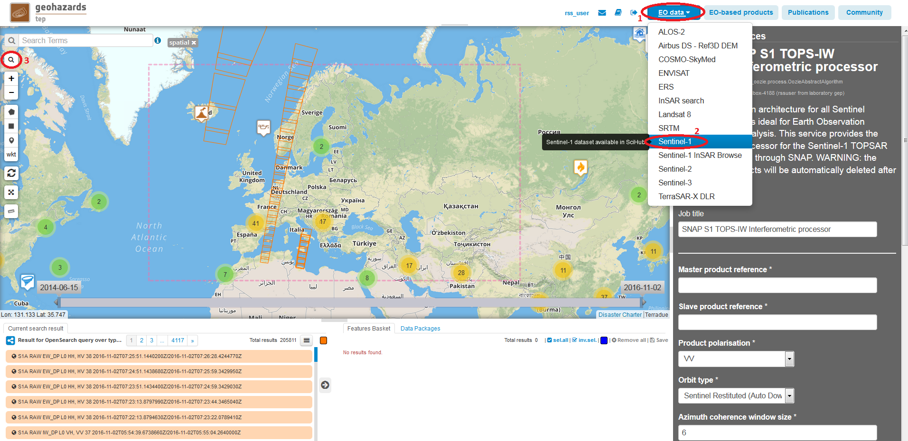

* Click on the product related to 2016-08-21, then drag and drop the selected data in the **Master product reference** field.

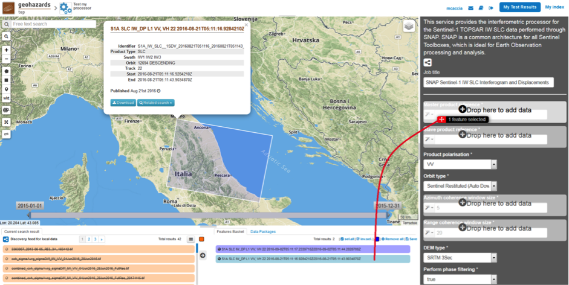

*   Click on the product related to 2016-09-02, then drag and drop the selected data in the **Slave product reference** field.

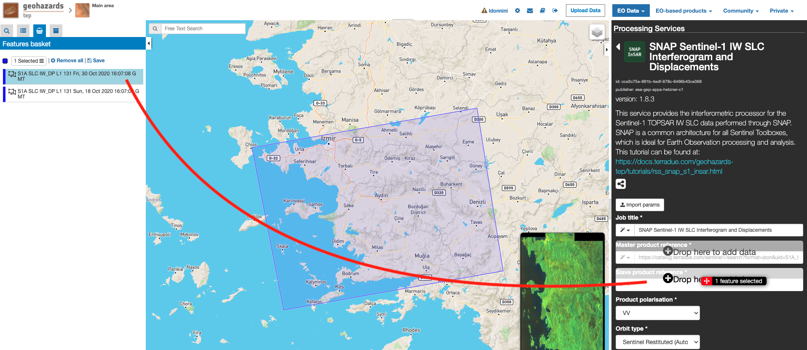

Fill parameters
===============

Scroll down the SNAP-InSAR configuration menu to show all the parameters.   

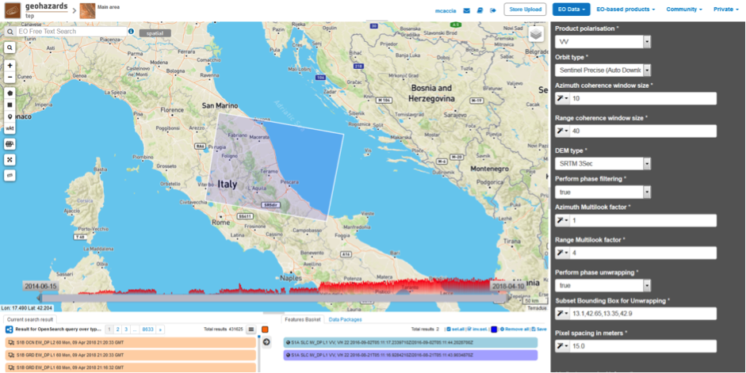

Product polarisation
++++++++++++++++++++

This is the product polarization related to the input data pair. The Sentinel-1 acquisitions can have different polarization types:

    •   **Vertical dual-polarization (DV data)**: Vertical in transmission phase and both Vertical and Horizontal in receiving phase (This is the most operated one).
    •   **Horizontal dual-polarization (DH data)**: Horizontal in transmission phase and both Horizontal and Vertical in receiving phase.   
    •   **Vertical single-polarization (SV data)**: Vertical in both transmission and receiving phases.
    •   **Horizontal single-polarization (SH data)**: Horizontal in both transmission and receiving phases.

SNAP-InSAR processes only one polarization channel between that can be selected between:

    •   **VV**: Vertical in both transmission and receiving phases, contained in DV and SV products (default value).
    •   **VH**: Vertical in transmission phase and Horizontal in receiving phase, contained only in DV products.
    •   **HH**: Horizontal in both transmission and receiving phases, contained in DH and SH products.
    •   **HV**: Horizontal in transmission phase and Vertical in receiving phase, contained only in DH products.

**For this run leave the VV default value.**    

Orbit type
++++++++++

The orbit state vectors provided in the metadata of a SAR product are generally not accurate and can be refined with the precise orbit files which are available days-to-weeks after the generation of the product. 
The orbit file provides accurate satellite position and velocity information. Based on this information, the orbit state vectors in the abstract metadata of the product are updated.
A more accurate satellite position and velocity information ensure a better accuracy in the images terrain correction processing.

For Sentinel-1 the following orbit files can be applied: 

    •   **Sentinel Precise**: Precise orbits are produced a few weeks after acquisition.
    •   **Sentinel Restituted (default value)**: Less accurate than Precise but available sooner than the Precise.  

**For this run set Sentinel Precise (Auto Download) value.**

Azimuth and Range coherence window size
+++++++++++++++++++++++++++++++++++++++

The input parameters are size of the shifting window for the coherence estimation. The window size is defined, in both azimuth and range directions.

    •   **Azimuth coherence window size**: leave 10 as the default value.
    •   **Range coherence window size**: leave 40 as the default value.

DEM type
++++++++

Define the DEM source for the Back-Geocoding Coregistration and Terrain Correction processing.
The SRTM 3 Sec (90 m of resolution) is used. 

.. NOTE:: SRTM valid in the [-56 deg, +60 deg] range of latitudes.

Perform phase filtering
+++++++++++++++++++++++

Interferometric phase can be corrupted by noise from:

    •   Temporal decorrelation 
    •   Geometric decorrelation 
    •   Volume scattering 
    •   Processing error 
    
Where there is loss of coherence, the interference pattern is lost. 

To be able to properly unwrap the phase, the signal-to-noise ratio needs to be increased by filtering the phase. 

The adopted algorithm is the Goldstein phase filtering.

This flag can be set to: 

    •   **True** (default value): the phase filtering is performed. 
    •   **False**: the phase filtering is not performed.

**For this run leave the “true” default value.**

Azimuth and Range Multilook factor
++++++++++++++++++++++++++++++++++

Generally, a SAR original image appears speckled with inherent speckle noise. To reduce this inherent speckled appearance, several images are incoherently combined as if they corresponded to different looks of the same scene. This processing is generally known as multilook processing. As a result the multilooked image improves the image interpretability. 
The implemented multilooking technique is the spatial one, produced by space-domain averaging of a single look image.

The selectable parameters are the number of azimuth and range looks.

    •   **Azimuth Multilook factor**: leave **1** as the default value.
    •   **Range Multilook factor**: leave **4** as the default value.

Perform phase unwrapping
++++++++++++++++++++++++

In the interferogram, the interferometric phase is ambiguous and only known within 2π. In order to be able to relate the interferometric phase to the topographic height, the phase must first be unwrapped.
Thanks to the unwrapping the phase variation between two points on the flattened interferogram provides a measurement of the actual altitude variation.

This flag can be set to: 

    •   **True**: the phase unwrapping is performed. 
    •   **False** (default value): the phase unwrapping is not performed.

**For this run set the “true” value.**

Subset Bounding Box for Unwrapping
++++++++++++++++++++++++++++++++++

With this parameter is possible to set the AOI (Area Of Interest) where the phase unwrapping processing is performed. 
The AOI format is:
    
    lon_min,lat_min,lon_max,lat_max

.. NOTES::
    
    •   Area is limited to 0.25*0.25 degrees around the center if the box is wider than 0.25 deg.
    •   The Subset Bounding Box for Unwrapping parameter is mandatory even if the phase unwrapping is not requested (i.e. when “Perform phase unwrapping”=false). Please put “-180.0,-56.0,180.0,60.0” as bounding box value in this case.

**For this run set this AOI: 13.1,42.65,13.35,42.9**

Pixel spacing in meters
+++++++++++++++++++++++

Due to topographical variations of a scene and the tilt of the satellite sensor, distances can be distorted in the SAR images. Image data not directly at the sensor Nadir location will have some distortion. Terrain corrections are intended to compensate for these distortions so that the geometric representation of the image will be as close as possible to the real world.
Terrain Correction allows geometric overlays of data from different sensors and/or geometries.

The user can select the pixel spacing in meters of the terrain corrected image.

    •   **Pixel spacing in meters**: leave **15.0** as the default value.

Run the job and results browsing
================================

Click on the button Run Job and see the Running Job.

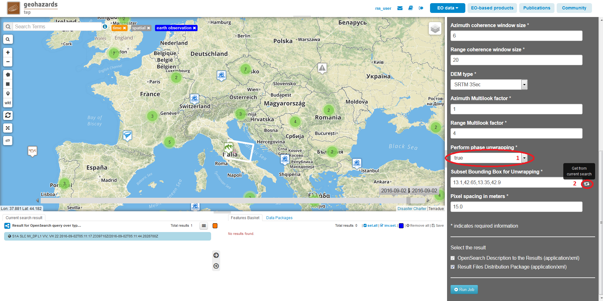

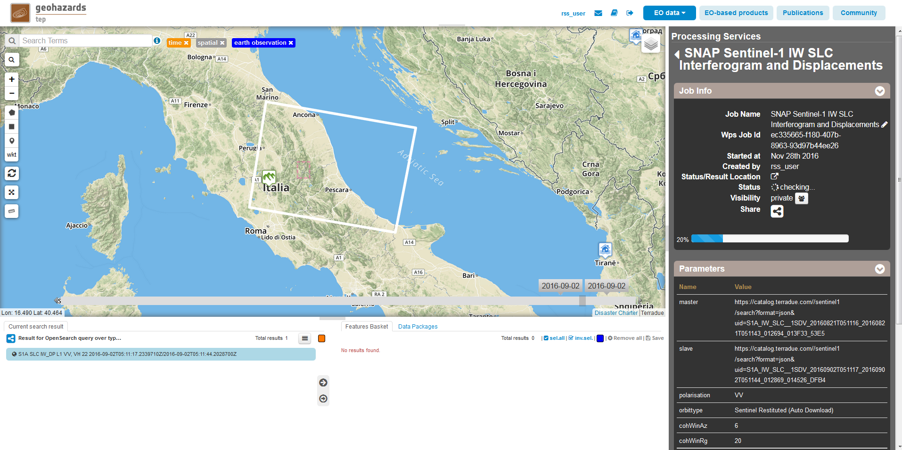

*   After the processing end (it can take some hours), see the Successful Job:

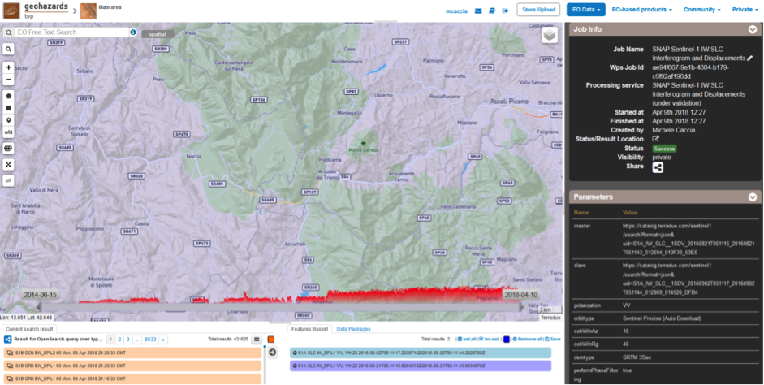

Scroll down the Job status screen, click on the button **Show results**, then check the results list on the **Results Table** in the bottom left side:

The following outputs are listed:
    
    •   **coh_VV_21Aug2016_02Sep2016**: this is the product that contains the interferometric coherence computed between master and slave images. The Browse product is shown on the map and both Physical and Browse products are available for download.
    •   **phase_VV_21Aug2016_02Sep2016**: this is the product that contains the interferometric phase computed between master and slave images. The Browse product is shown on the map and both Physical and Browse products are available for download.
    •   **displacement_VV_21Aug2016_02Sep2016**: this is the displacement product that contains the terrain height variation in the Line Of Sight direction in the selected AOI. The Browse product is shown on the map and both Physical and Browse products are available for download.

Click on each result name. The result will be shown on the map together with metadata information tab and colour-table legend. 

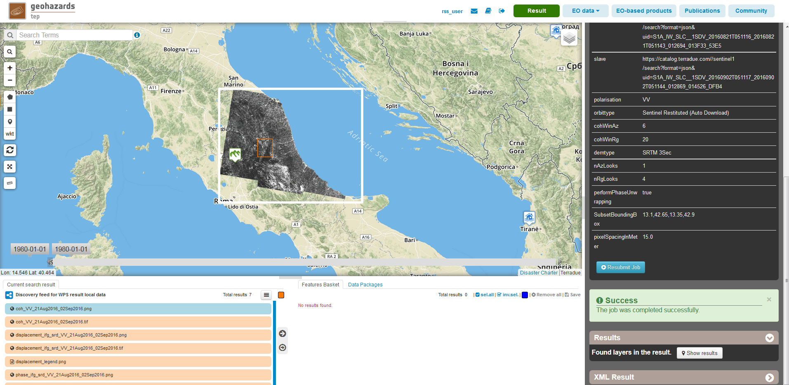

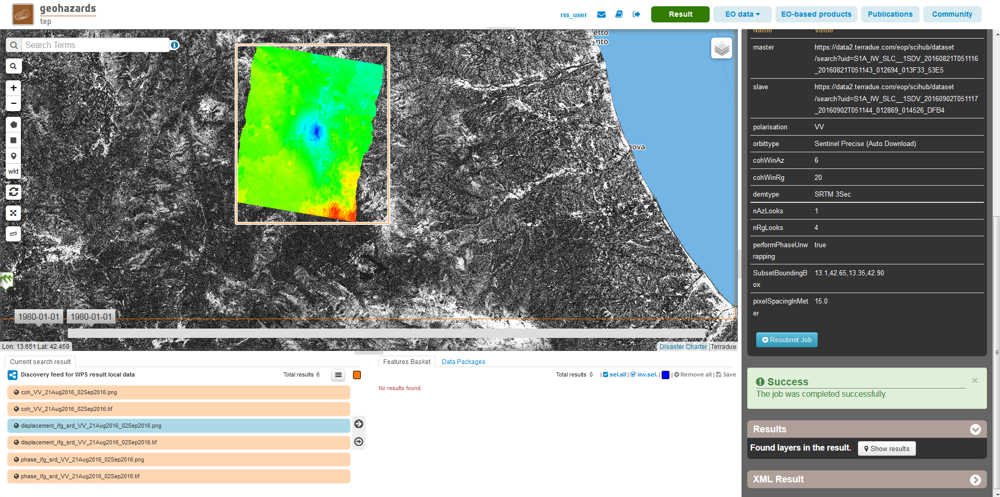

.. figure:: assets/tuto_rss_snap_s1_insar_11.png
    :figclass: align-center
        :width: 750px
        :align: center

Click on the product name and then on the **Download** button that appears in the info tab. Depending on the output the following products can be downloaded:

    •   **Product GeoTiff**: this is the physical quantity.
    •   **Browse Product GeoTiff**: this is the GeoTiff browse product as shown on the map.
    •   **Browse Product PNG**: this is the PNG browse product.
    •   **Metadata (properties)**: a txt file containing all the metadata info displayed in the info tab.
    •   **Legend (png)**: this is a PNG representing the colour-table of the displayed image.

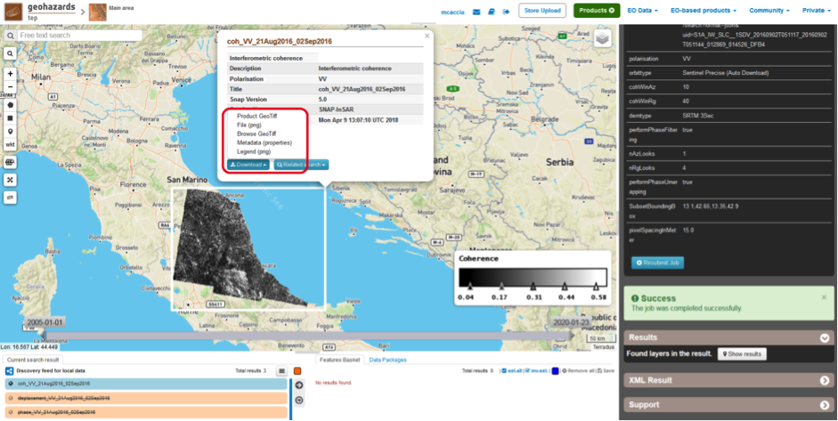

.. rubric:: References

.. [#f1] `SNAP Website <http://step.esa.int/main/toolboxes/snap>`_