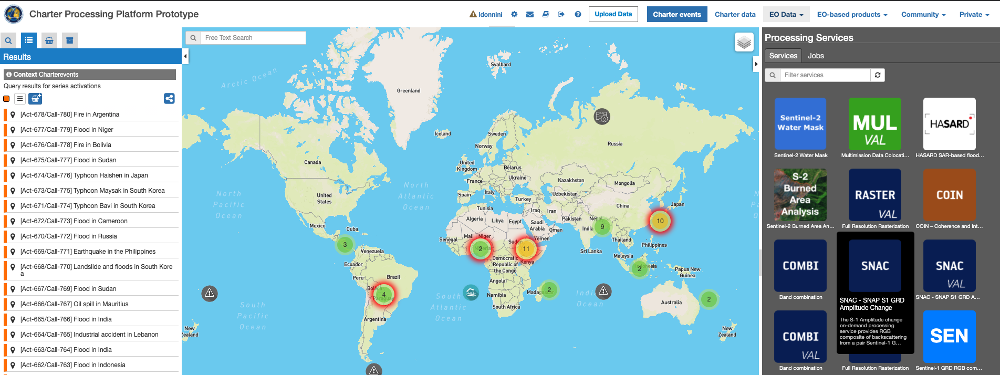
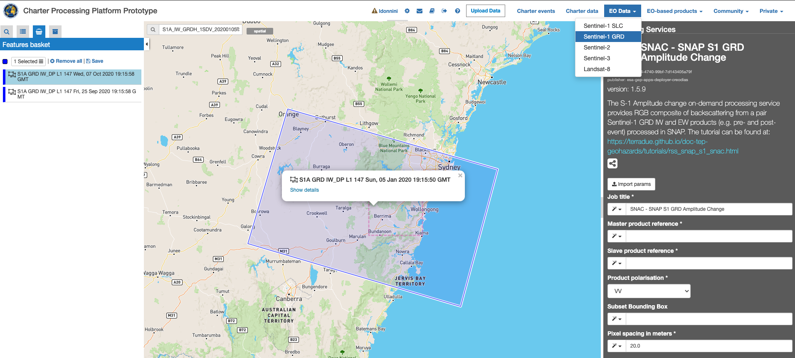
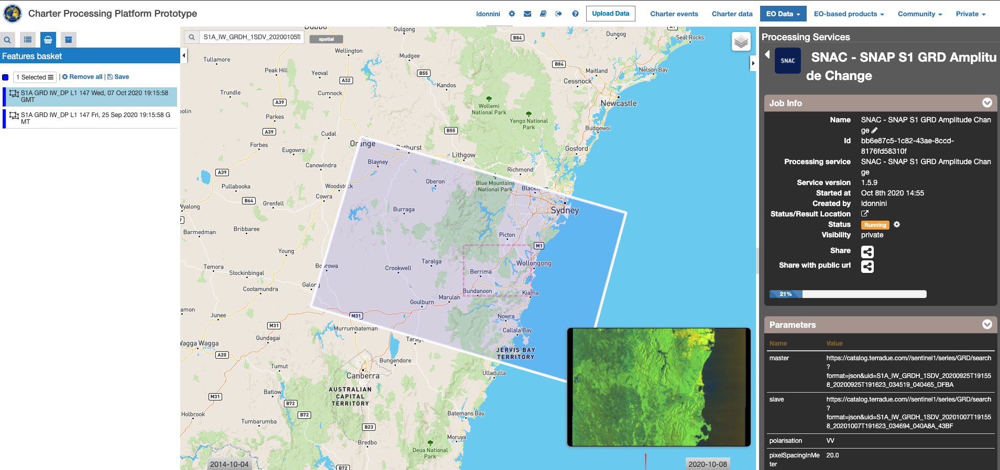
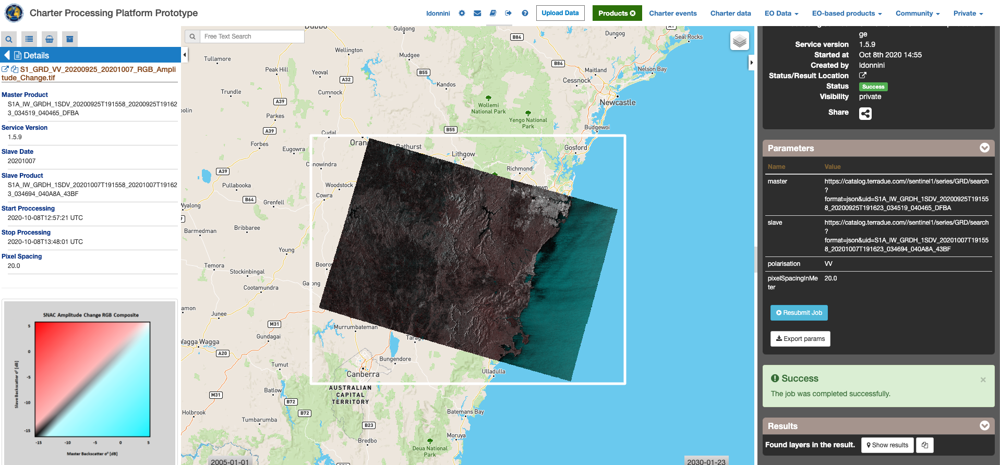

SNAC - SNAP S-1 GRD Amplitude Change
~~~~~~~~~~~~~~~~~~~~~~~~~~~~~~~~~~~~

        
**SNAC - SNAP S-1 GRD Amplitude Change**

The S-1 Amplitude change on-demand processing service provides RGB composite of backscattering from a pair Sentinel-1 GRD IW and EW products (e.g. pre- and post-event) processed in SNAP.

**EO sources supported**:

    - Sentinel-1 IW and EW GRD products

**Output specifications**

The service provides 3 output products.

+-------------------------------+---------------------------------------------------------------------------------------------------------------+
| Output-1 – Amplitude Change RGB Composite                                                                                                     |
+===============================+===============================================================================================================+
| Correspondent file            | Amplitude Change RGB Composite                                                                                |
+-------------------------------+---------------------------------------------------------------------------------------------------------------+
| Information types             | RGB Composite   : RED=(Slave Sigma0), GREEN=(Master Sigma0), BLUE=(Master Sigma0)                             |
+-------------------------------+---------------------------------------------------------------------------------------------------------------+
| Raster format                 | GeoTIFF                                                                                                       |
+-------------------------------+---------------------------------------------------------------------------------------------------------------+
| resolution                    | Native or User selection                                                                                      |
+-------------------------------+---------------------------------------------------------------------------------------------------------------+
| Projection types              | EPSG:3857 - WGS84 – Pseudo Mercator                                                                           |
+-------------------------------+---------------------------------------------------------------------------------------------------------------+
| Bit depth                     | Unsigned Integer 8 bit                                                                                        |
+-------------------------------+---------------------------------------------------------------------------------------------------------------+
| Processing Level              | RGB composite                                                                                                 |
+-------------------------------+---------------------------------------------------------------------------------------------------------------+
| Physical product available    | NO but a 8 bit GeoTIFF Product is provided                                                                    |
+-------------------------------+---------------------------------------------------------------------------------------------------------------+
| Browse product available      | YES as 8 bit PNG file                                                                                         |
+-------------------------------+---------------------------------------------------------------------------------------------------------------+
| Output Filename example       | S1_GRD_VV_20171216_20171204_RGB_Amplitude_Change.tif                                                          |    
+-------------------------------+---------------------------------------------------------------------------------------------------------------+

+-------------------------------+---------------------------------------------------------------------------------------------------------------+
| Output-2 - Master Product Backscatter                                                                                                         |
+===============================+===============================================================================================================+
| Correspondent file            | Master Product Backscatter                                                                                    |
+-------------------------------+---------------------------------------------------------------------------------------------------------------+
| Information types             | SAR backscatter calibrated and terrain corrected [db]                                                         |
+-------------------------------+---------------------------------------------------------------------------------------------------------------+
| Raster format                 | GeoTIFF                                                                                                       |
+-------------------------------+---------------------------------------------------------------------------------------------------------------+
| resolution                    | Native or User selection                                                                                      |
+-------------------------------+---------------------------------------------------------------------------------------------------------------+
| Projection types              | EPSG:4326 - WGS84                                                                                             |
+-------------------------------+---------------------------------------------------------------------------------------------------------------+
| Bit depth                     | Float 32                                                                                                      |
+-------------------------------+---------------------------------------------------------------------------------------------------------------+
| Processing Level              | L2                                                                                                            |
+-------------------------------+---------------------------------------------------------------------------------------------------------------+
| Physical product available    | YES                                                                                                           |
+-------------------------------+---------------------------------------------------------------------------------------------------------------+
| Browse product available      | YES (GeoTIFF)                                                                                                 |
+-------------------------------+---------------------------------------------------------------------------------------------------------------+
| Output Filename example       | S1B_IW_GRDH_1SDV_20171204T105228_20171204T105253_008568_00F359_76F2_Orb_Cal_ML_TC_DB.tif                      |    
+-------------------------------+---------------------------------------------------------------------------------------------------------------+

+-------------------------------+---------------------------------------------------------------------------------------------------------------+
| Output-3 – Slave Product Backscatter                                                                                                          |
+===============================+===============================================================================================================+
| Correspondent file            | Slave Product Backscatter                                                                                     |
+-------------------------------+---------------------------------------------------------------------------------------------------------------+
| Information types             | SAR backscatter calibrated and terrain corrected [db]                                                         |
+-------------------------------+---------------------------------------------------------------------------------------------------------------+
| Raster format                 | GeoTIFF                                                                                                       |
+-------------------------------+---------------------------------------------------------------------------------------------------------------+
| resolution                    | Native or User selection                                                                                      |
+-------------------------------+---------------------------------------------------------------------------------------------------------------+
| Projection types              | EPSG:4326 - WGS84                                                                                             |
+-------------------------------+---------------------------------------------------------------------------------------------------------------+
| Bit depth                     | Float 32                                                                                                      |
+-------------------------------+---------------------------------------------------------------------------------------------------------------+
| Processing Level              | L2                                                                                                            |
+-------------------------------+---------------------------------------------------------------------------------------------------------------+
| Physical product available    | YES                                                                                                           |
+-------------------------------+---------------------------------------------------------------------------------------------------------------+
| Browse product available      | YES (GeoTIFF)                                                                                                 |
+-------------------------------+---------------------------------------------------------------------------------------------------------------+
| Output Filename example       | S1B_IW_GRDH_1SDV_20171216T105228_20171216T105253_008743_00F8E8_8E00_Orb_Cal_ML_TC_DB.tif                      |    
+-------------------------------+---------------------------------------------------------------------------------------------------------------+

.. NOTE::

    - the "Browse GeoTIFF" product is always a GeoTIFF file with the same resolution of the physical product, with Uint8 bit depth and projection EPSG:3857.
    - The “Browse PNG” product is always a PNG file with the same resolution of the physical product, with Uint8 bit depth.

-----

The S-1 Amplitude change on-demand processing service provides RGB composite of backscattering from a pair Sentinel-1 GRD IW and EW products (e.g. pre- and post-event) processed in SNAP. For the purpose of change detection, the user can create RGB band combination out of two amplitude bands of S-1 for instance pre-disaster and post-disaster. The user can manually (e.g. drag and drop, choosing from the list) specify EO data products. Additionally, the user can cut the output product to the specified bounding box. The output product can be used in further processing (outside of the platform) to extract for instance extent of flood.

Select the processing
=====================

* Login to the platform (see :doc:`user <../community-guide/user>` section)

* Select the processing service **SNAC – SNAP S-1 GRD Amplitude Change**:

Select Input Data
=================

The service accept in input:  **Sentinel-1 IW and EW GRD** products

In order to perform a catalogue search for the selection of the input product to be processed the user shall:

	•	Click on the “EO data” button on the top right menu
	•	Select the mission:  Sentinel-1
	•	Click on the lens icon on the left side menu to set additional query parameters
	•	Select GRD as product type
	•	Draw a rectangular bounding box over the map which correspond to the area of interest
	•	Set the start and stop time on the bottom sliding bar in order to select the time interval
	•	Perform the catalogue search and select the products of interest

Processing Service Parameters
=============================

The “S-1 SNAP Amplitude Change” service panel is displayed with six parameter values to be filled-in:

	•	**Job title**: a job caption to be assigned in order to recognize the job within the job list
	•	**Master product reference**:  selected master product from the catalogue search results basket
	•	**Slave product reference**:  selected slave product from the catalogue search results basket
	•	**Product Polarization**  product polarization to be considered in the processing 
	•	**Subset Bounding Box (optional)**: Bounding Box to be used to crop the output product around the area of interest ; if left empty the full scene is considered and no crop is applied
	•	**Pixel Spacing in meter**: output product pixel spacing in meter unit

Fill the parameters
===================

After the selection of input data, the user can start filling the parameters:
	
	•	Insert a job title (e.g. “Amplitude Change 2017-12-20”).
	•	From the Feature basket table drag and drop the EO data product that you want to use as master.

.. figure:: assets/tuto_rss_snap_s1_snac_3.png
	:figclass: align-center
        :width: 750px
        :align: center

	•	Once you define the master, drag and drop the EO data product that you want to use as slave.
	•	Select the product polarization to be considered which shall be present on both input master and slave products
	•	Define the Subset Bounding Box for cropping the output product around the area of interest
	•	Define the output product pixel spacing in meter 
	•	Click on Run Job

.. figure:: assets/tuto_rss_snap_s1_snac_4.png
	:figclass: align-center
        :width: 750px
        :align: center

Running the job
===============

Click on “Run Job” button from the processor configuration panel and wait for the job to complete.

 
You can monitor the job status under “My jobs” tag which contains the list of other jobs associated to your user. If a failure occur you can re-submit the job. Details on the submitted job can be accessed by clicking on the title of the job.

View results
============

Once the job is completed successfully, click on the Show results on map button.

The service provides as output the following products in GeoTIFF format:

	-	RGB combination : Red=( Sigma0 slave ), Green=( Sigma0 master ) , Blue=( Sigma0 master ) 
	-	Sigma0 of master product [db]
	-	Sigma0 of slave product [db]

