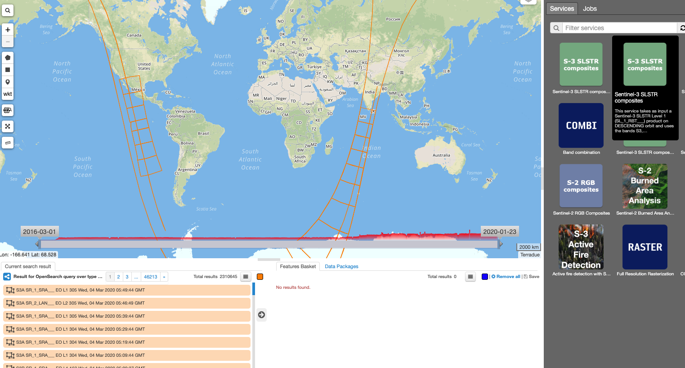
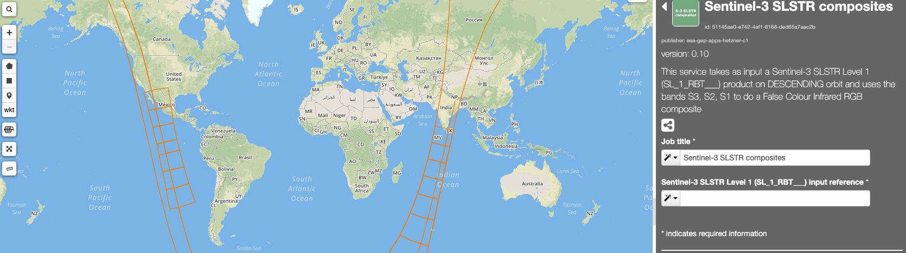
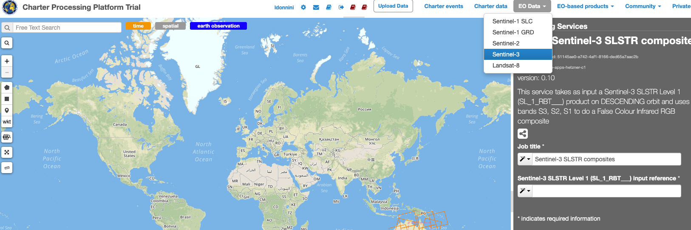
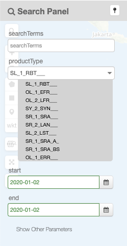
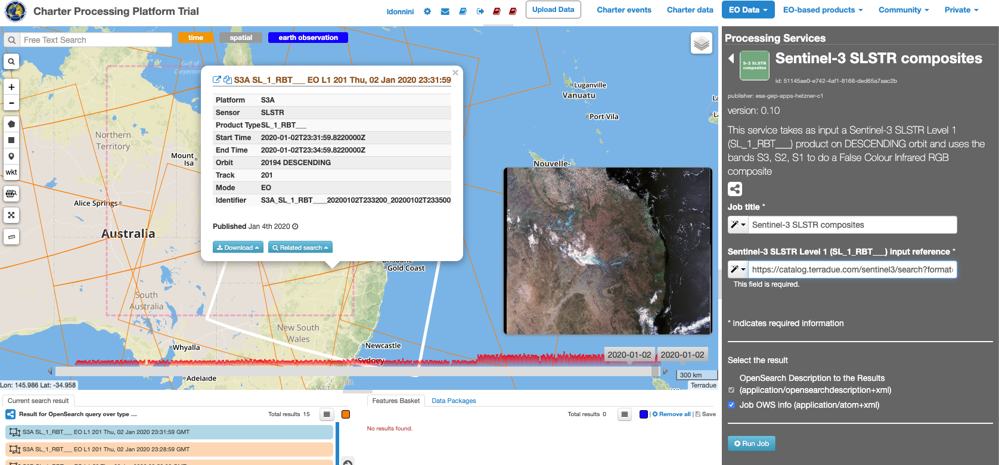
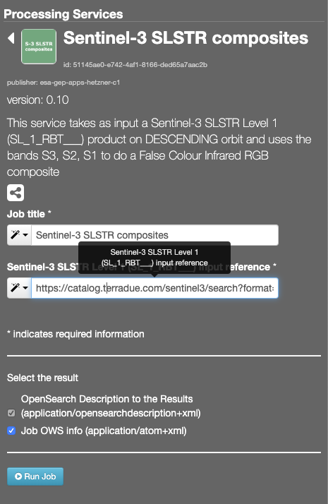
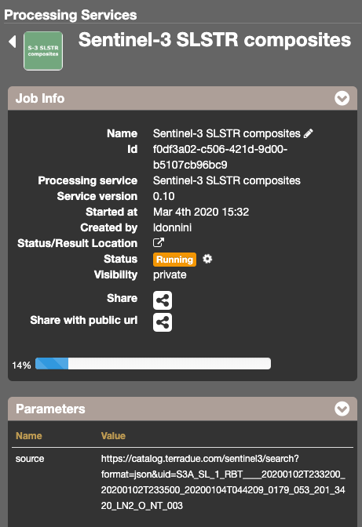
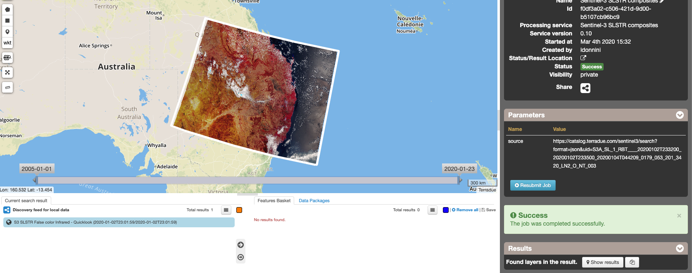

Sentinel-3 SLSTR composites
~~~~~~~~~~~~~~~~~~~~~~~~~~~~~~~~~~~~~~~~~~~

**Sentinel-3 SLSTR composites**

This service takes as input a Sentinel-3 SLSTR Level 1 (SL_1_RBT___) product on DESCENDING orbit and uses the bands S3, S2, S1 to do a False Colour Infrared RGB composite.

**EO sources supported**

    - Sentinel-3 SLSTR Level 1 (SL_1_RBT___) product until 15-Jan-2020 with DESCENDING orbit only [1]_
    
       
**Output specifications**

    - False Colour Infrared RGB composite (DESCENDING orbits only)

-----

This tutorial will describe the processing of Sentinel-3 SLSTR Level 1 (SL_1_RBT___) product on DESCENDING orbit and uses the bands S3, S2, S1 to generate a False Colour Infrared RGB composite for the one input Sentinel-3 acquisitions on the GEP.

Select the processing
=====================

* Login to the platform (see :doc:`user <../community-guide/user>` section)

* Go to the Geobrowser, expand the panel “Processing services” on the right hand side and select the processing service “Sentinel-3 SLSTR composites”:

This will display the "Sentinel-3 SLSTR composites" service panel including several pre-defined parameters values to be filled-in.

        
Fill the parameters
===================

Reference input
---------------

* Select the Sentinel-3 data collection in the EO Data button.

        
* Select the area for which you want to do an anlysis, e.g over Australia.

.. figure:: assets/s3-slstr-composite-4.png
	:figclass: align-center
        :width: 750px
        :align: center

* Click on the lens icon to open the Search Panel
* Select **SL_1_RBT___** as Product Type
* Apply the date value, for example **2020-01-02**, in both **time:start** and **time:end** fields

        
* Verify that the product has DESCENDING Orbit 
* Drag and Drop the selected item in the *Sentinel-3 SLSTR Level 1 (SL_1_RBT___) input reference* field:

.. NOTE:: input can be picked up directly by using the following text filter: S3A_SL_1_RBT____20200102T233200_20200102T233500_20200104T044209_0179_053_201_3420_LN2_O_NT_003

Run the job
===========

* Click on the button Run Job and see the Running Job

* After about 20 minutes, see the Successful Job:

.. figure:: assets/s3-slstr-composite-9.png
	:figclass: align-center
        :width: 750px
        :align: center

Results: download and visualization
===================================

* Click on the button *Show results*

* See the result on map:

* The following files are produced:

    - **S3 SLSTR False color Infrared - Quicklook (2020-01-11T23:01:47/2020-01-11T23:01:47)**
    
==================================    
    
.. [1] SNAP6 is used in this service and supports only products with Baseline collection equal to 003 or less
    
