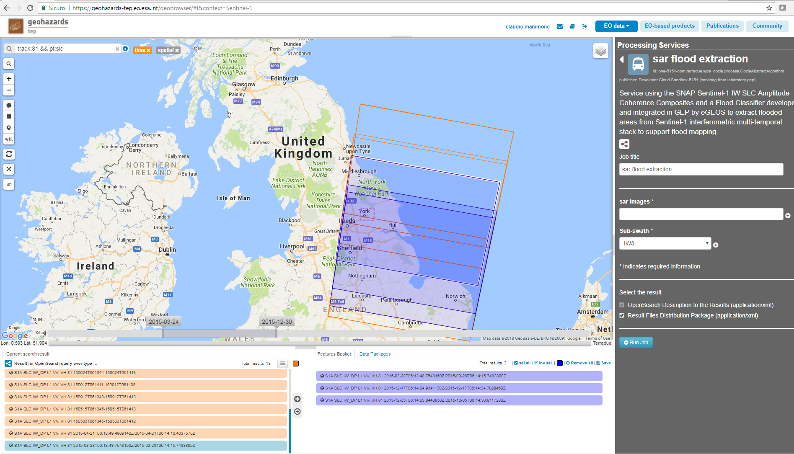
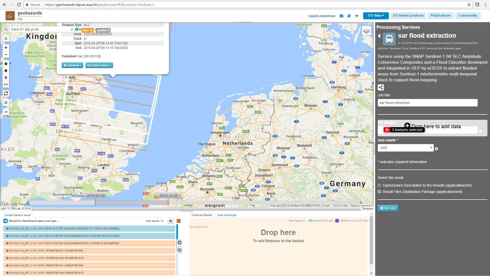
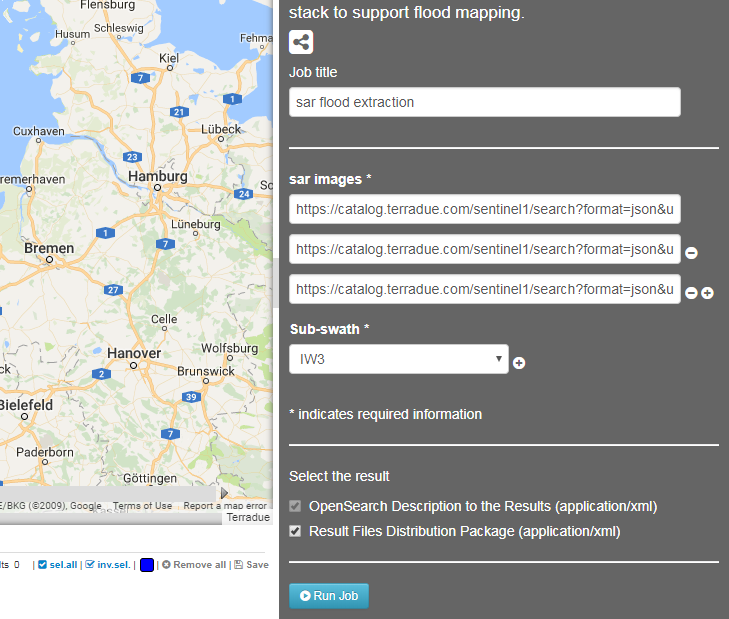
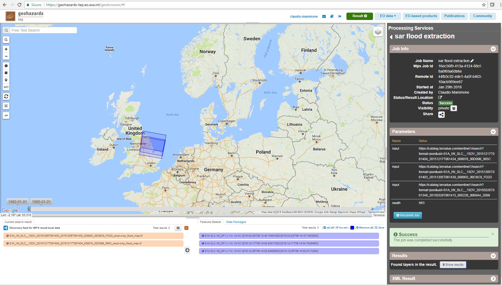
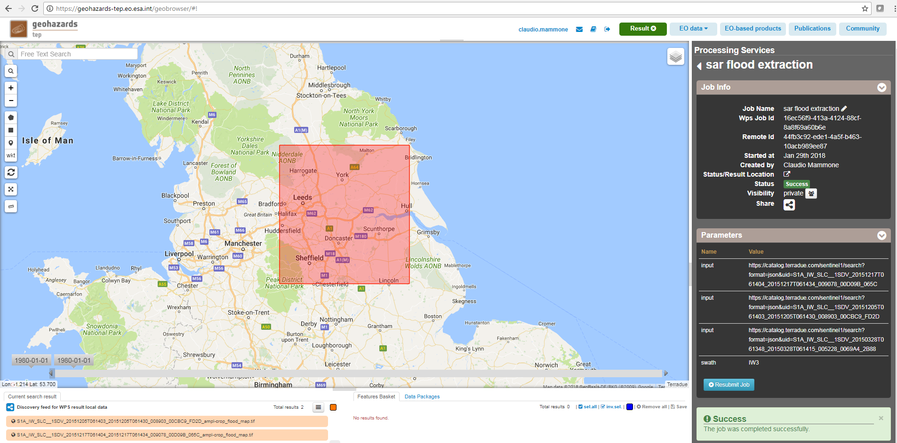

SAR Flood Tool Service
~~~~~~~~~~~~~~~~~~~~~~

Select the processing
=====================

* Sign-in on the Portal https://geohazards-tep.eo.esa.int/ (see guidance :doc:`user <../community-guide/user>` section)

* Access the Geobrowser: https://geohazards-tep.eo.esa.int/geobrowser/

* Open the tab "Processing services" from the right of the map, then select the processing service “SAR flood extraction”.

Select the files to process
===========================

* Click on the *Data Packages* button in the bottom right of the screen, within the Features Basket panel. 
Then select from the list the "SAR-flood-trial-case" data package and click on *load*. 
The selected data package contains the reference to the following input file:

.. code-block:: parameter

    S1A_IW_SLC__1SDV_20150328T061348_20150328T061415_005228_0069A4_2B88
    S1A_IW_SLC__1SDV_20151205T061403_20151205T061430_008903_00CBC9_FD2D
    S1A_IW_SLC__1SDV_20151217T061404_20151217T061434_009078_00D09B_065C

Fill the parameter values
=========================
Define values for the "Job title", the "SAR images" and the "Sub-swath" fields.

* As *Job title*, type:

.. code-block:: parameter

  SAR flood extraction

* As input *SAR images*, drag and drop the selected input file:

* As *Sub-swath*, select:

.. code-block:: parameter

  IW-3
  

Run the job
===========

* Click on the button "Run Job" at the bottom of the sar flood extraction processor tab, and monitor the progress of the running Job:

* Wait for the Job completion, then check the status is set as "Successful Job”.

* Download the sar flood extraction processing results once the Job is completed:

