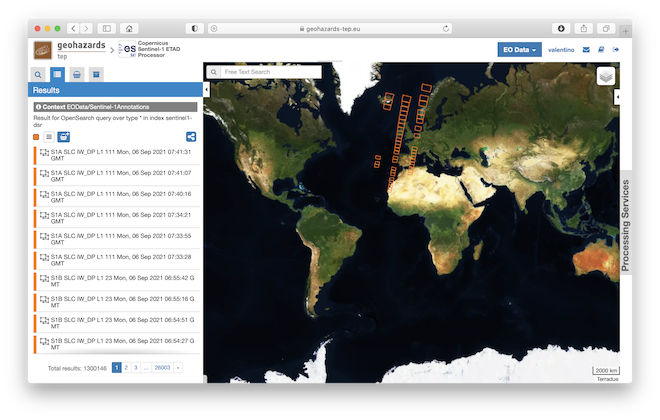
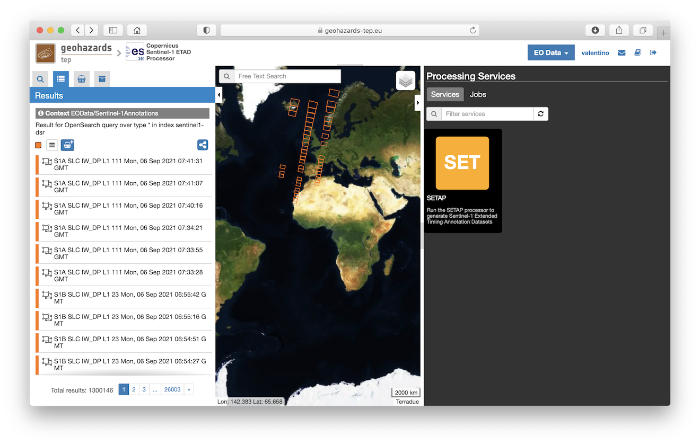
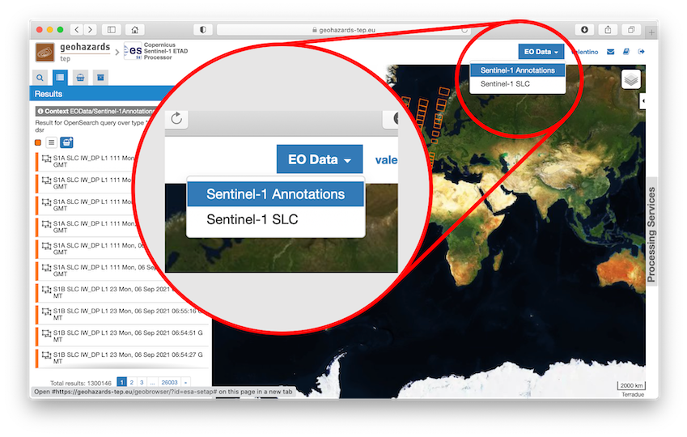
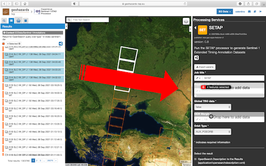
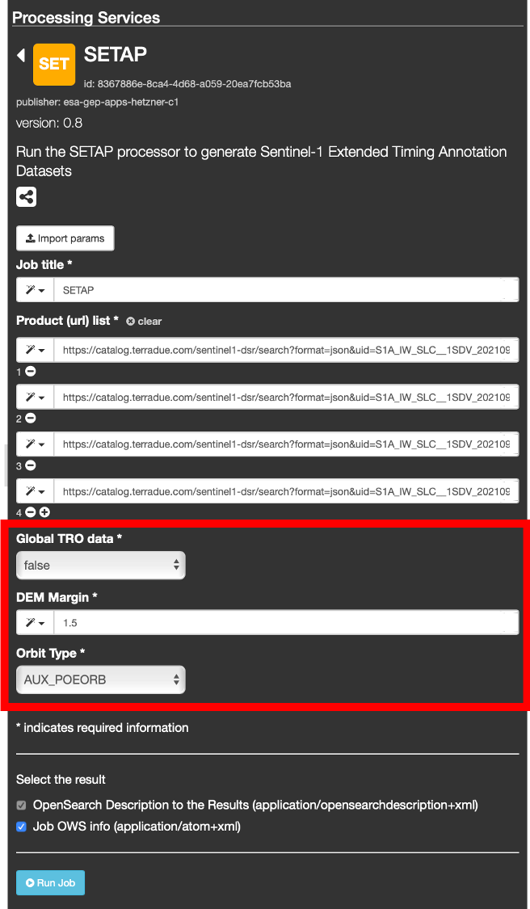
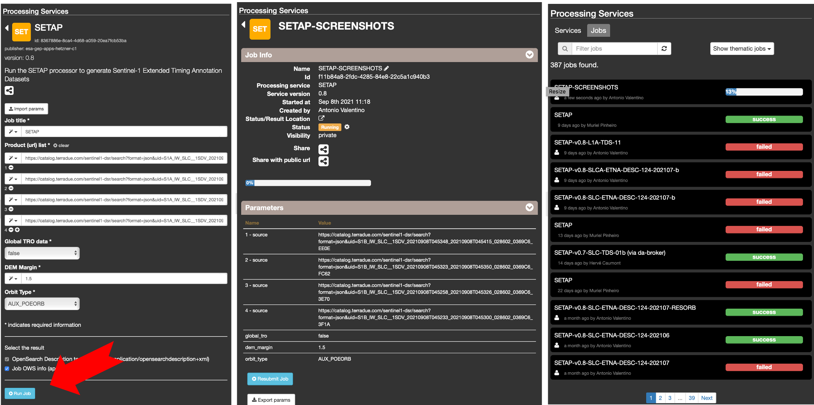
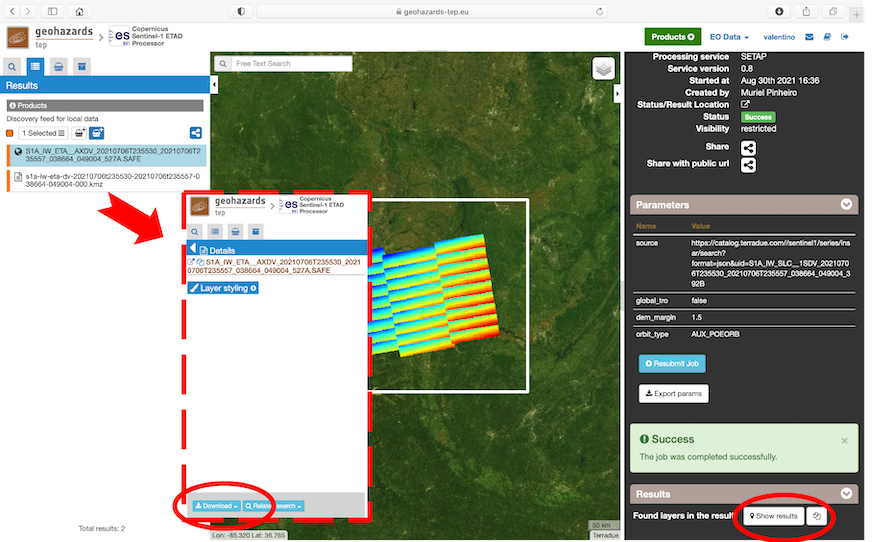

SETAP Service
~~~~~~~~~~~~~

**Sentinel-1 Extended Timing Annotation Processor (SETAP)**

The Extended Timing Annotation Dataset for Copernicus Sentinel-1 (S1-ETAD)
is a new auxiliary product developed by ESA (with DLR as contractor),
providing users with corrections to improve geometric accuracy of
Sentinel-1 (SM and IW) SLC images to centimetric levels.

The product contains analysis-ready layers for removing the atmospheric path
delays, the solid Earth tidal deformation, and the Sentinel-1 system specific
effects related to the IPF SAR processor (Doppler shift, accurate bi-static
correction and height dependent FM-rate mismatch).

To generate such corrections, the SETAP service uses precise information from
different ancillary data sources such as IGS and ECMWF.

.. _data-sources-label:
**EO sources supported**:

* **Sentinel-1 SLC**: standard Sentinel-1 L1A products
* **Sentinel-1 Annotations**: Sentinel-1 L1A products containing only the
  XML annotations.
  The information contained in XML annotation is the only one used by
  the S1-ETAD processor.
  The advantage of using S1-Annotation products is that they have a size
  (in MB) by far smaller than standard ones so they can be downloaded faster.

  Please refer to the
  :ref:`Sentinel-1 Annotations caching policy <sentinel-1-annotations-caching-policy-label>`
  section below for more details on characteristics and limitations of this
  EO source.

**Output specifications**

* `Format specification document`_ of the output auxiliary product containing
  the corrections layers.

.. _`Format specification document`: https://sentinels.copernicus.eu/documents/247904/4629150/Sentinel-1-ETAD-Product-Format-Specification.pdf

-----

This tutorial describes how to submit a processing job for the SETAP service
to obtain one or more S1-ETAD products.

The tutorial is addressed to users already familiar with Geohazards thematic
Exploitation Platform (GEP), and gives some hints and recommendation
for the best service usage experience.

The main user actions are the following:

* select the desired data source ("Sentinel-1 SLC" or "Sentinel-1 Annotations")
* select the input SAR SLC data to be processed
* optionally set input parameters for processing (default values shall be
  fine for all use cases). See also the `Fill the parameter values`_ section)
* obtain S1-ETAD products.

Select the processing
=====================

* Sign-in on the Portal https://geohazards-tep.eu/ (see the
  :ref:`community-guide-user-sign-in-label` section for guidance)

* Access the Geobrowser: https://geohazards-tep.eu/geobrowser/?id=esa-setap

* Open the tab "Processing services" from the right of the map, and then
  select the processing service “SETAP”.

Select the files to process
===========================

* Select the data source (see also the
  :ref:`community-guide-platform-geobrowser-context-menu-label` section).

* Filter and select data for your job as described in the
  :ref:`community-guide-platform-geobrowser-search-panel-label` documentation
  and in the
  :ref:`community-guide-platform-geobrowser-intelligent-map-tools-label`
  section.

* Insert the selected data into the *Product (url) list* field in the
  application panel on the right of the Web UI.
  A single "drag and drop" can be used to insert all data.
  Of course *Product (url) list* can also be edited manually.

During the selection of the input data for your processing, take
into account that, internally, the processing itself is organized as follows:

* input products (S1 slices) are grouped by the SETAP service according to
  their `data-take`_ ID
* each group corresponds to a complete or partial acquisition data-take
* groups are processed independently (and concurrently) to generate a single
  S1-ETAD product per group (i.e. one per data-take).

Please also consider that, currently, the maximum number of products per
job is 35.
To process a larger number of input products, it is possible to run multiple
jobs but it is strongly recommended to feed all the products belonging to a
same data-take to the same job.

.. _`data-take`: https://sentinels.copernicus.eu/web/sentinel/technical-guides/sentinel-1-sar/appendices/glossary

.. rubric:: Example 1

A job is started with 35 S1-SLC input products belonging to the same data-take
(possibly incomplete).

In this case only one S1-ETAD product is generated.

.. rubric:: Example 2

The job is started with 35 S1-SLC input products belonging to an
interferometric stack (single slice).

In this case each input product belongs to a different data-take and the
service generates 35 S1-ETAD products.

.. rubric:: Example 3

The job is started with 30 S1-SLC input products belonging to an
interferometric stack covering a wide area.
3 SLC slices are necessary to cover the requested area.

In this case the input products are grouped in 10 different groups and the
service generates 10 S1-ETAD products.

Fill the parameter values
=========================

Once the *Product (url) list* field is filled with the selected data, it is
possible to set the remaining parameters.

Please note that all the remaining parameters have a default value that
should be perfectly fine for practically all cases.
Nevertheless it is possible to tweak them for very specific purposes.

* **Global TRO data**:
    If set to *true* this parameter specifies that the global ECMWF dataset
    have to be used for troposphere computation.
    By default the value of this parameter is set to *false* to indicate
    that only the relevant region of the global ECMWF dataset covering the
    requested area shall be used for the processing.
    In this case the data download is typically by far faster.
    The computation of the data region covering the requested input products
    is performed automatically by the application.
* **DEM Margin**:
    This parameter can be used to tweak the amount of margin to be applied to
    the S1 data footprint when the Copernicus DEM is ingested for the
    processing.
* **Orbit Type**:
    By default the *Orbit type* parameter is set to *AUX_POEORB* meaning that
    orbit with the maximum available accuracy are used for the computation.
    *Precise Orbits* are typically available 20 days after the S1 data
    acquisition.

    It is strongly recommended not to change this setting.

    *Orbit type* parameter can also be set to *AUX_RESORB* that have a
    lower nominal accuracy w.r.t. to *AUX_POEORB*, but are typically available
    1-2 days after the acquisition.

    .. important::

        Support for *Restituted Orbits* (`AUX_RESORB`) is considered
        experimental.

Run the job
===========

* Click on the button "Run Job" at the bottom of the SETAP processor tab,
  and monitor the progress of the running Job:

* The Job can take long time to execute depending on the request and on the
  platform load (typically form 2 to 20 hours).
  When the processing is complete the status is set as "Successful Job"

* Download the S1-ETAD products once the Job is completed.
  Please note that the browsing layer of the S1-ETAD product, consisting in
  a KMZ file, is also published separately, to allow a quicker download.

-----

.. _how-to-use-label:
**How to use the S1-ETAD products**

Basic information on the S1-ETAD product and how to use it are provided in
the `Product Definition Document`_.
Details on the file format and on the algorithms used to generaate it can
be found in the `Format specification document`_ and the
`Algorithm Theoretical Baseline Document`_ respectively.

A `Python API`_ that allows to easily access the product and perform basic
operations is also available.

In general all main information and news about the S1-ETAD product are
collected in the `Product Page`_ on the ESA web site.

.. _`Product Definition Document`: https://sentinels.copernicus.eu/documents/247904/4629150/Sentinel-1-Product-Definition-Document.pdf
.. _`Algorithm Theoretical Baseline Document`: https://sentinels.copernicus.eu/documents/247904/4629150/Sentinel-1-ETAD-Algorithm-Technical-Baseline-Document.pdf
.. _`Python API`: https://gitlab.com/s1-etad/s1-etad
.. _`Product Page`: https://sentinels.copernicus.eu/web/sentinel/missions/sentinel-1/data-products/etad-dataset

.. _`sentinel-1-annotations-caching-policy-label`:
**Sentinel-1 Annotations caching policy**

The "Sentinel-1 Annotations” products (cf. "EO Data" menu) benefit from a
data caching mechanism on GEP.
The cache (Manifest and Annotation files) is managed for a pre-defined set
of geographic areas and time span.
These areas are specified according to the seismic areas defined by the
`CEOS Seismic Hazards`_ work group, as follows:

* mask_eu (Europe seismic areas)
* mask1 (20% of he world's seismic areas)
* ask2 (35%)
* mask3 (50%)
* mask70 (70%)
* mask100 (100%)

For the launch of the GEP SETAP service (September 2021), the cache is
initialised as follows:

* mask_eu (Europe)
* January-September 2021
* adding up new 2021 acquisitions from September 2021 onwards

Moreover, when a processing Job is started over a spatial and temporal
data search outside of the current data caching automation, an opportunistic
approach will keep in cache the retrieved input products.

This is resulting in an additional cache capacity, mutualised, that is
growing based on user activities (so, without a planification on the GEP
side, but with a monitoring of the user interests).

User selected job inputs falling outside current cached products,
for spatial and temporal domains with some limitations (see further
below the FAQ section, :ref:`Q1<faq-q1-label>`_.

For the future of SETAP operations on GEP, a plan with progressive caching
based on these CEOS tectonic areas can be achieved according to user needs
gathered through user engagement activities. For example:

* the European seismic area,
* then extended to cover 20% of the world seismic zones,
* then 50%
* and potentially up to 100% of the CEOS-defined seismic areas worldwide

In terms of performances of a processing job, SETAP will be the fastest when
accessing pre-cached input products, a little bit slower if products not yet
in cache can be accessed from the Copernicus SciHub, and quite slow for older
products only available from other remote data repositories
(e.g. the Alaska Satellite Facility) connected to GEP.

Users can provide clear information about their area of interest and time
period of interest, sending requests as follows:

* the study area(s) you would work on
* the time periods interest (Sentinel-1 acquisitions dates span)

Then, send it to s1-etad@esa.int with subject:

  Study requirements for optimised data access from the SETAP processing service

.. _`CEOS Seismic Hazards`: https://ceos.org/ourwork/workinggroups/disasters/earthquakes

**FAQ**

.. _`faq-q1-label`:
:Q1:
    Are there limitations in terms of geographic areas, product type,
    acquisition date, maximum number of jobs per user?
:A1:
    Main service limitations are listed below:

    * Geographic limitation: none
    * Temporal limitation:

      - it is not possible to generate S1-ETAD products for dates prior to
        27th of June 2016
      - the generation of S1-ETAD products can only happen 3 weeks after
        the acquisition date of the corresponding SLC product.
        
        This limitation is due to the availability of POE orbits.
        
        In principle it is also possible to use "Restituted Orbits"
        (`AUX_RESORB`), as described in the `Fill the parameter values`_
        section.
        Restituted orbits are available in a couple of days after the
        acquisition but support for them in the GEP SETAP service is
        considerd "experimental".

    * Product type: the S1-ETAD Service only supports S1-SLC products
      acquired in Stripmap (SM) or Interferometric Wide swath (IW) mode;
      EW is not officially supported at the moment, if you need it please
      contact s1-etad@esa.int
:Q2:
    Do you need KML files for the study regions we are using or is the
    service global?
:A2:
    The service is global. The area of interest for data selection can be
    specified by the user by means of the Web UI (see
    :doc:`Discover data<../community-guide/data>`).
    If the user already has a KML file for its Area Of Interest (AOI),
    it can be uploaded in the Web UI to select the AOI (see the
    "Spatial Filters" section in :doc:`../community-guide/platform/geobrowser`).
:Q3:
    Which periods are you planning to provide ETAD, or will it be done for
    new S1 acquisitions in NRT?
:A3:
    NRT product generation is not supported, also, there is no systematic
    processing on GEP.
    The product generation have to be triggered by the user for any date
    compatible with the the limitations described in **A1**.
:Q4:
    How to apply ETAD corrections to an S1 SLC product?
:A4:
    Basic information about how to apply ETAD corrections are provided in
    the `Product Definition Document`_ (see also the
    :ref:`How to use the S1-ETAD products<how-to-use-label>` section).
