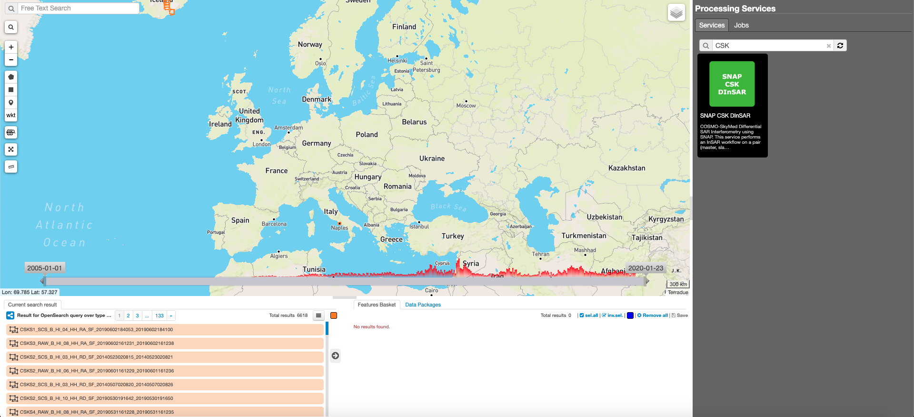
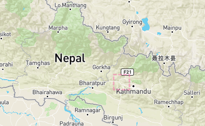
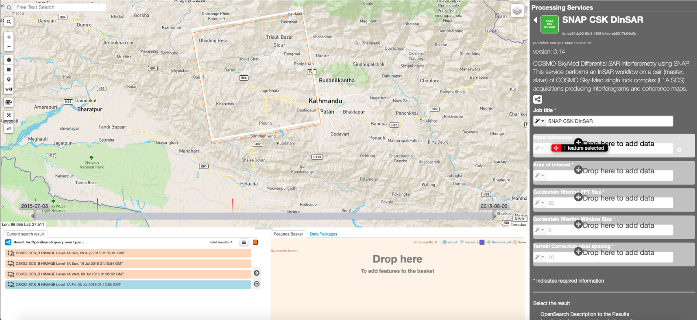
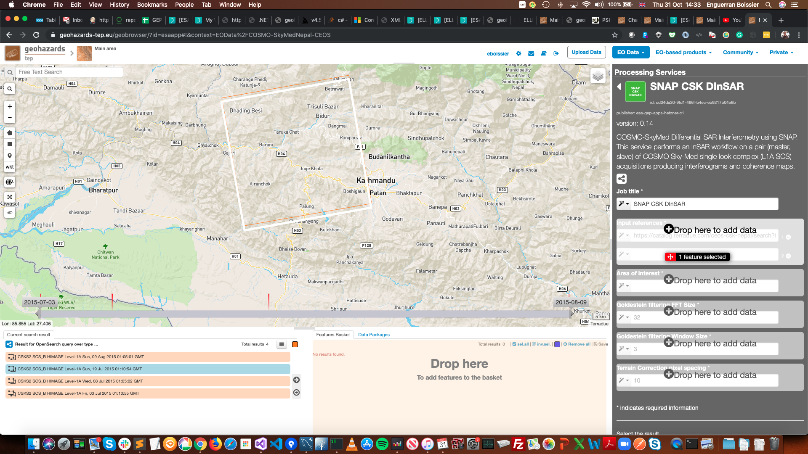
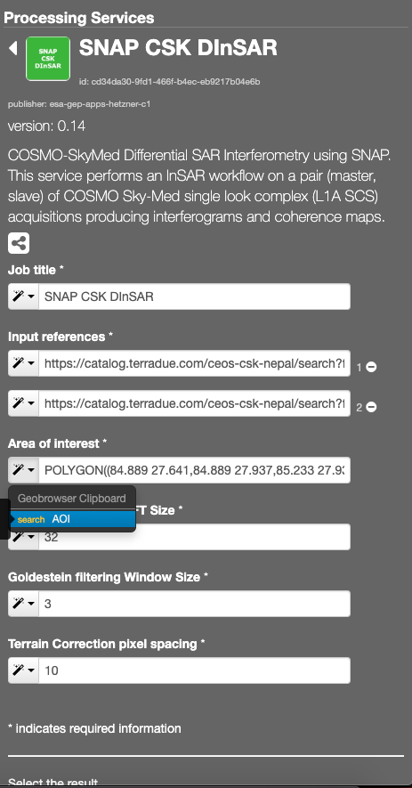
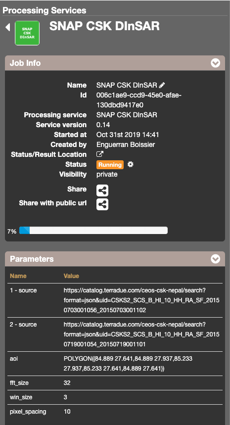
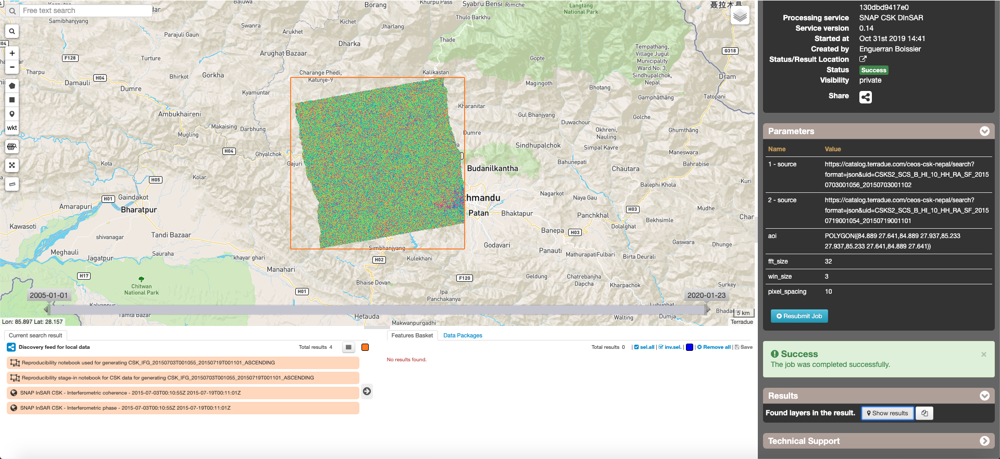

SNAP CSK DInSAR
~~~~~~~~~~~~~~~

**SNAP CSK DInSAR**

COSMO-SkyMed Differential SAR Interferometry using SNAP. This service performs an InSAR workflow on a pair (master, slave) of COSMO Sky-Med single look complex (L1A SCS) acquisitions producing interferograms and coherence maps.

**EO sources supported**

    - COSMO Sky-Med L1A SCS

**Output specifications**

    - interferogram
    - coherence map
    - reproducibility notebooks

-----

This tutorial will describe the processing of a pair of COSMO Sky-Med single look complex (L1A SCS) acquisitions to generate an interferogram and a coherence map on the GEP.

Select the processing
=====================

* Login to the platform (see :doc:`user <../community-guide/user>` section)

* Select the processing service “SNAP CSK DInSAR”:

The "SNAP CSK DInSAR" panel is displayed with parameters values to be filled-in.

Fill the parameters
===================

Master product reference
------------------------

* Select the *COSMO-SkyMed Nepal CEOS* data collection in the EO Data button.
* Select the area for which you want to do an anlysis, e.g over Nepal.

* Click on the lens icon and Apply the date value **2015-07-03** in both **time:start** and **time:end** fields in the Search Panel
* Drag and Drop the selected item in the first *Input references* field:

.. NOTE:: master input can be picked up directly by using the following text filter: CSKS2_SCS_B_HI_10_HH_RA_SF_20150703001056_20150703001102

Slave product reference
-----------------------

* Click on the small + button close to the *Input references* field, to make appear another input field (the one for the slave)

* Perform the same procedure described previously (`Master product reference`_), using the value **2015-07-19**.
Pick one of the results having the same track, then drag and drop one of the results in the *Input references* field:

.. NOTE:: slave input can be picked up directly by using the following text filter: S2B_MSIL2A_20190830T140059_N0213_R067_T21KUU_20190830T180923

Area Of Interest
----------------

* Click on the *Magic tool wizard* and select **AOI**. The input parameter is automatically filled with the WKT representing the area selected in (`Master product reference`_).

.. NOTE:: you can use the following value **POLYGON((84.889 27.641,84.889 27.937,85.233 27.937,85.233 27.641,84.889 27.641)) or specify a different AOI in WKT format, provided it is fully contained in the Master product footprint area**

Goldstein filtering FFT Size 
-----------------------------

* Use the default value **32**

Goldstein filtering Window Size
--------------------------------

* Use the default value **3**

Terrain Correction pixel spacing
--------------------------------

* Use the default value **10**

Run the job
===========

* Click on the button Run Job and see the Running Job

* After about 20 minutes, see the Successful Job

Results: download and visualization
===================================

* Click on the button *Show results*

* See the result on map:

* The following files are produced:

    - **SNAP InSAR CSK - Interferometric coherence - 2015-07-03T00:10:55Z 2015-07-19T00:11:01Z**: this is the product that contains the interferometric coherence computed between master and slave images. The Browse product is shown on the map and both Physical and Browse products are available for download
    - **SNAP InSAR CSK - Interferometric phase - 2015-07-03T00:10:55Z 2015-07-19T00:11:01Z**: this is the product that contains the interferometric phase computed between master and slave images. The Browse product is shown on the map and both Physical and Browse products are available for download.
