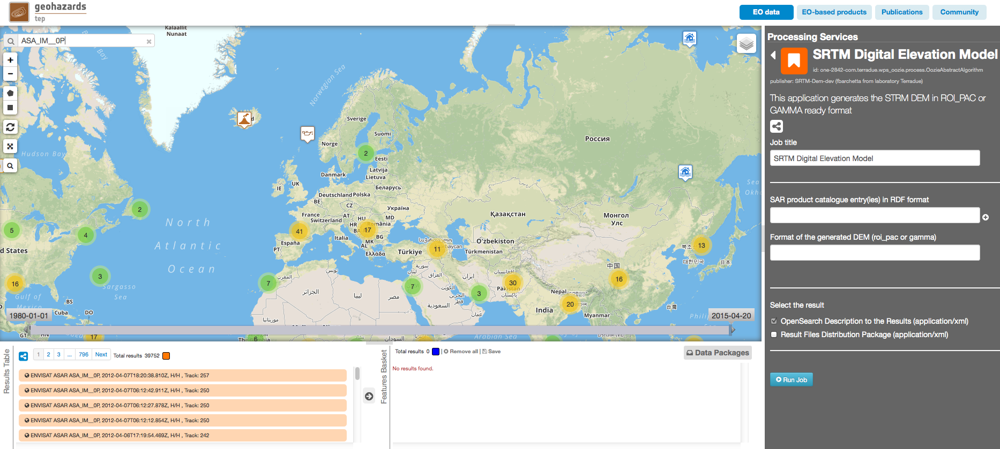
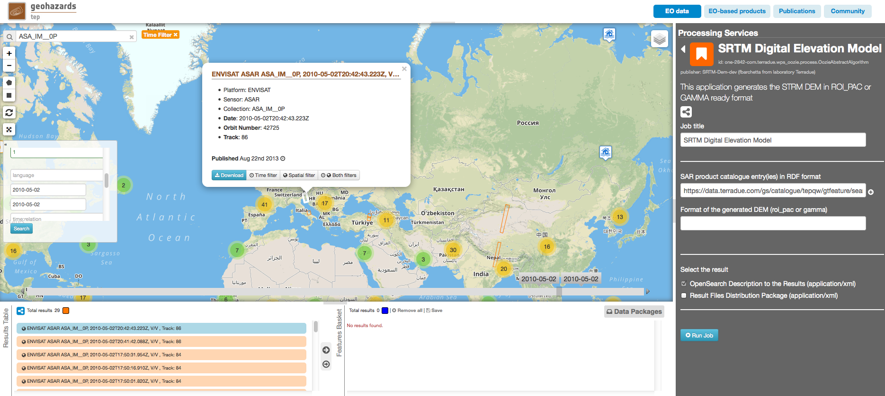
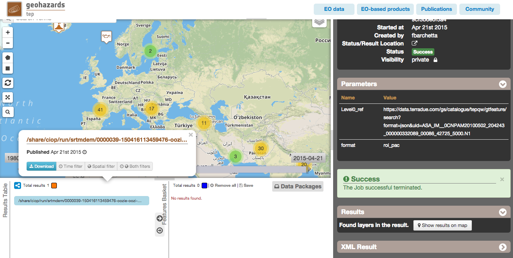

SRTM Digital Elevation Model on Hadoop Cloud Sandbox
~~~~~~~~~~~~~~~~~~~~~~~~~~~~~~~

Select the processing
=====================

* Login to the platform (see :doc:`User Profile <../community-guide/user>` section).

* Select the processing service “SRTM Digital Elevation Model”:

.. figure:: assets/tuto_srtm_1.png
	:figclass: align-center
        :width: 750px
        :align: center

The "SRTM Digital Elevation Model" panel is displayed with parameters values to be filled-in.

Fill the parameters
===================

SAR product catalogue entry
-----------------------

* Type **ASA_IM__0P** in the Search Terms field (1) and then click on the lens icon (2):

* Click on Show Other Parameters and apply the date value **2010-05-02** in both:
- time:start field
- time:end field 
then click on the button **Search**:

.. figure:: assets/tuto_srtm_3.png
	:figclass: align-center
        :width: 750px
        :align: center

* Drag and Drop the first result in the *SAR product catalogue entry(ies) in RDF format* field:

Format of the generated DEM 
------------------------

* Fill the *Format of the generated DEM (roi_pac or gamma)* filed with **gamma** or **roi_pac**

.. figure:: assets/tuto_srtm_5.png
	:figclass: align-center
        :width: 750px
        :align: center

Run the job
===========

* Click on the button Run Job and see the Running Job

.. figure:: assets/tuto_srtm_6.png
	:figclass: align-center
        :width: 750px
        :align: center

* After few minutes, see the Successful Job:

.. figure:: assets/tuto_srtm_7.png
	:figclass: align-center
        :width: 750px
        :align: center

* Click on the button *Show results on map*, then on the tgz result on the *Results Table* in the bottom left side

* You can also download the .tgz file: 

