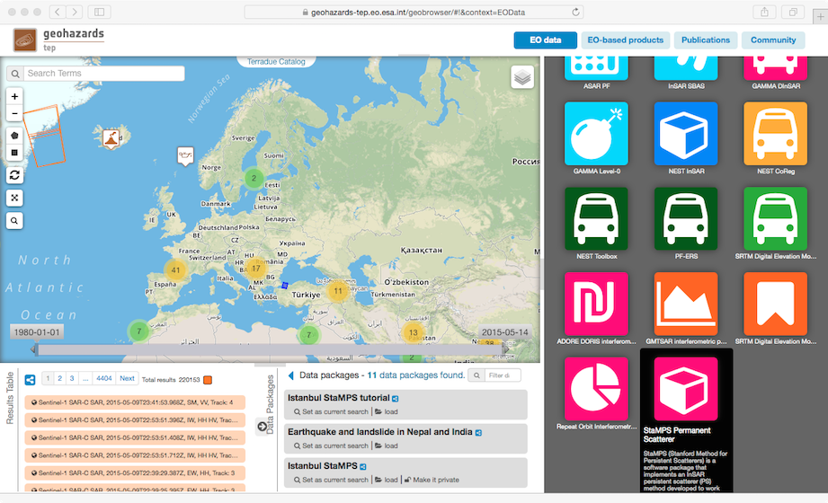
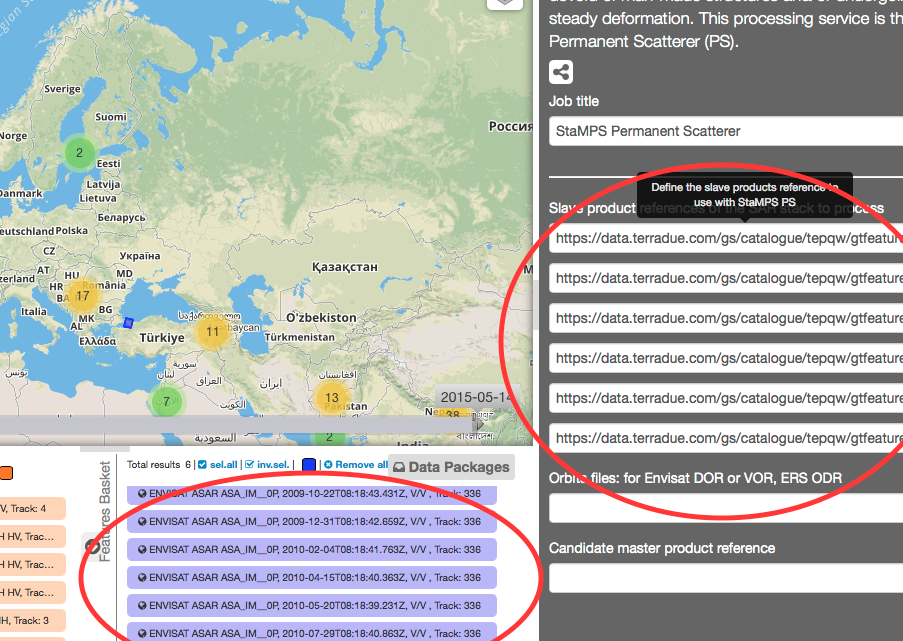
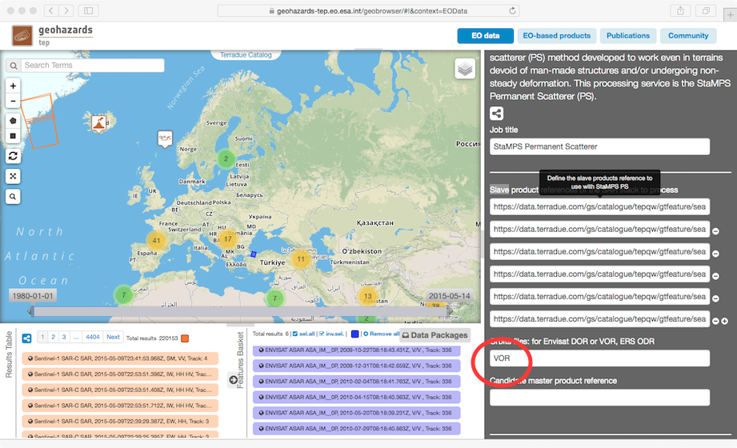
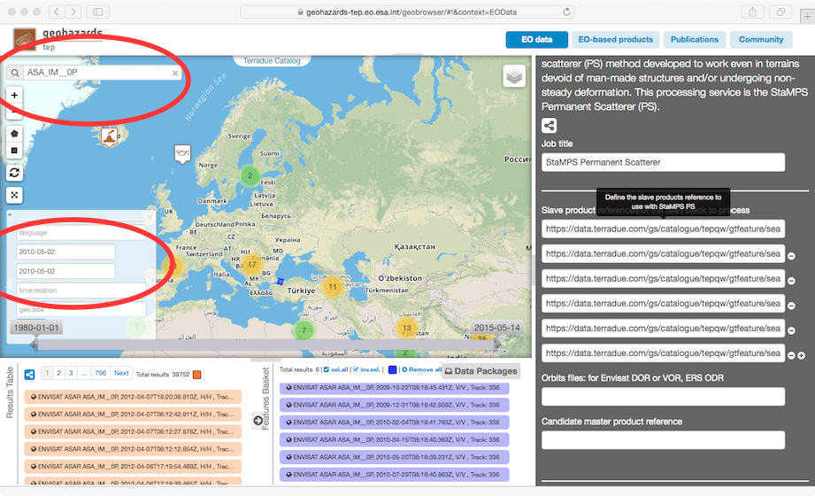
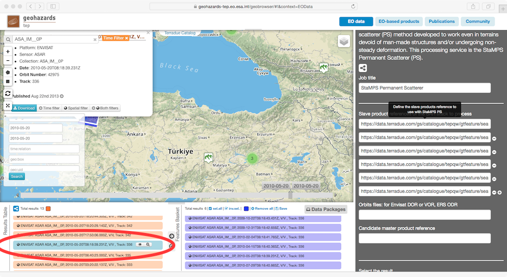
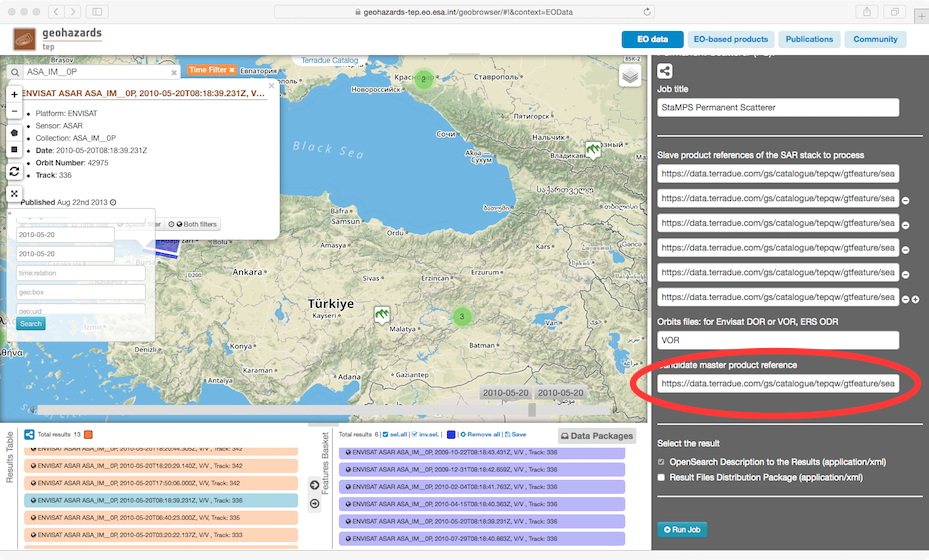
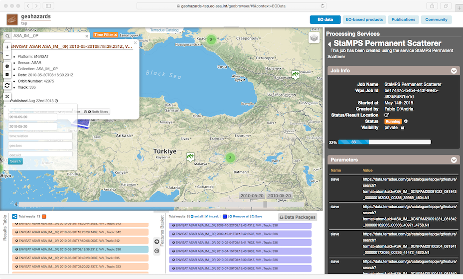

StaMPS Permanent Scatterer processing
~~~~~~~~~~~~~~~~~~~~~~~~~~~~~~~~~~~~~

This processing service is in beta phase.

This processing service uses the StaMPS version 3.3b1, patched:

* Includes computation of Oscillator drift from ENVISAT ASAR imagery, which led to orbital ramps (Estimation of Spatially-Correlated-Look-Angle becomes therefore unnecessary during StaMPS processing step 7, i.e. scla_deramp parameter is set to 'n').
* StaMPS output folder is compatible with the TRAIN toolbox for atmospheric correction (http://davidbekaert.com/)

The processing follows in principle the manual of StaMPS:

* **Focalization**: done by ROI-PAC
* **Area selection**: full frame will be used
* **Automatic Master selection**: uses the script master_select from StaMPS to choose optimal master based on temporal 	and spatial baseline as well as Doppler shift
* **IFG-generation**: done by DORIS (version 4.02) using the scripts provided by StaMPS package:
	* step_coarse run with 500 windows in order to assure proper coarse correlation also in 	presence of water in the scenes
	* step_coreg_simple used for fine-coregistration
	* a final check on CPM_data files for every slave in order to exclude scenes with failed co-registration is included (i.e. CPM_data > 4 Kbyte)
	* resampling, ifg generation and geocoding is done by standard StaMPS-Doris scripts.
* **stack preparation (i.e. mt_prep script)**
	* amplitude dispersion: 0.42
	*	 mt_prep 0.42 5 4 50 200
* **stamps processing**:
	 * changed parameters:
		* density_rand: 5
		* weed_zero: 'y'
		* StaMPS steps conducted : 1-8
* **published output**:
		* DEM
	 * StaMPS folder containing all necessary matlab files to open it again in matlab and StaMPS

For plotting and exporting of IFGs, velocities & time series see Chapter 9 of StaMPS manual

Select the processing
=====================

* Login to the platform (see :doc:`user <../community-guide/user>` section)

* Select the processing service “StaMPS Permanent Scatterer”:

The "StaMPS Permanent Scatterer" panel is displayed with parameters values to be filled-in.

Fill the parameters
===================

Orbit files
-----------

Select the orbit file type to use with the SAR stack to process.

For Envisat ASAR, select:

* Precise orbit state vectors: **VOR**

Master product reference
------------------------

Select the candidate Master (it can be any product of the stack)

* Type **ASA_IM__0P** in the Search Terms field (1) and then click on the lens icon (2):

* Click on Show Other Parameters apply the date value **2010-05-02** in both:
- time:start field
- time:end field
then click on the button **Search**:

* Drag and Drop the first result in the *ASAR Master product catalogue entry* field:

Slave product reference
------------------------

* Perform the same procedure described previously (`Master product reference`_), using the value **2010-03-28**. Apply this date value in both:
- time:start field
- time:end field

Pick one of the results having the same track, then drag and drop one of the results in the *ASAR Slave product catalogue entry* field:

Run the job
===========

* Click on the button Run Job and see the Running Job

* After about 20 minutes, see the Successful Job:

* Click on the button *Show results on map*, then on the *geo_100328-100502.unw.phase.tif* result on the *Results Table* in the bottom left side

* See the result on map:

.. figure:: assets/tuto_stamps_ps_8.png
	:figclass: align-center
        :width: 750px
        :align: center

Reprocess on your own
=====================

If you have a working matlab environment, you can treat the downloaded folder as if you would have processed it locally.

The most computer intensive processing steps of StaMPS are 2 & 3. Those are for the preliminary selection of stable scatterers.
If you are not happy with your results, it is however recommended to start with step 4 or higher i.e.

.. code-block:: console

		>>stamps(4,4)

* Check for bad interferograms:

		For getting general information on the interferograms (i.e. baseline, estimated noise), which 	gives you a good indication of bad interferograms, do:

		.. code-block:: console

  			>>ps_info

		To check for wrapped and unwrapped interferograms in order to identify unreliable ones and exclude them like this:

		.. code-block:: console

  			>>ps_plot('w') & ps_plot('u')

		.. code-block:: console

  			>>setparm('drop_ifg',[ “Number of IFG” ])

		Then rerun stamps from step 3 (it may take a while though) or faster from step 4

* Lowering noise in your data:

		PS Weeding (Chapter 6.4 of StaMPS manual)
			- play around with the parameters weed_standard_dev as well as weed_max_noise using the 	>>setparm command
			- rerun from step 4 until the end:

			.. code-block:: console

	  			>>stamps(4,8)

		PS Merge (Chapter 6.5 of StaMPS manual)
			- another way of reducing noise is to resample your data
			- use the parameters merge_resample_size (in m) and merge_standard_dev to denoise to 	your needs
			- rerun from step 5 until the end

		.. note:: If you change merge_resaample_size, you also should consider changing the unwrap grid for step 6

* Spatio-temporal filtering (Chapter 6.8 of StaMPS manual)

		StaMPS step 8 filters the data in a way to address noise coming from atmosferic disturbances. It is steered by 2 parameters: scn_wavelength & scn_time_win
		For the processing conducted on the cloud, standard parameters from StaMPS are used. It is however warmly recommended to adjust those parameters according to your dataset. scn_wavelength reflects the spatial filter, while scn_time_win addresses the temporal component. Play around with these parameters in order to achieve the desired result.
