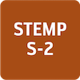
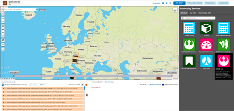
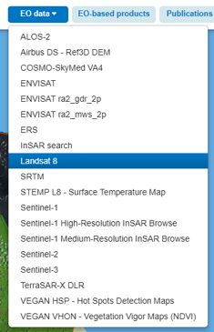
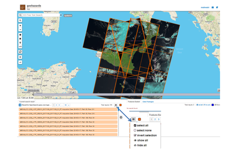
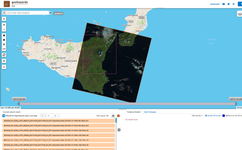
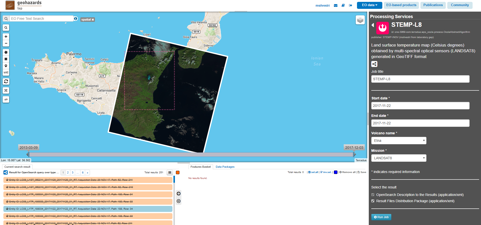
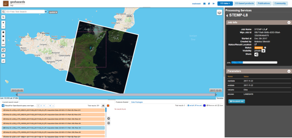
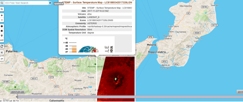

STEMP - Surface Temperature Map 
================================

**STEMP**

In the context of the VOLcanoes Thermal Application for GEP (VOLTAGE) pilot INGV has setup an end-to-end processing chain (named STEMP) for the generation of surface temperature maps over volcanic areas. It generates surface temperature map in file format fitting the Researcher and Users needs from new EO missions data such as Landsat-8, Sentinel-2 and Sentinel-3. 

**EO sources supported**:
        - Sentinel-2 MSI L1C
        - Sentinel-3 SLSTR L1
        - Landsat-8 L1B
        - ASTER L1T

**Output specifications**

        - surface temperature map (STEMP-S3 and STEMP-L8)
        - hot spot map (STEMP-S2)

-----

The Surface Temperature Map Process (STEMP) tool aims to produce surface temperature maps using  optical satellite data having thermal bands (Landsat 8, Sentinel 3). STEMP is also able to produce an hot spot detection map only during eruption using Sentinel 2 data.

STEMP produces a GeoTIFF file as output. It contains the surface temperature maps (or the hot spot pixel  for Sentinel 2). The output name of this product is the same of the input file with the "_TEMP.tif" final code. The processing, running in automatic,  can be executed also in manual mode.

Three different tools are installed on Geohazards TEP platform: 

	- STEMP-L8 for Landsat 8
	- STEMP-S2 for Sentinel 2
	- STEMP-S3 for Sentinel 3

Select the processing
---------------------

1. Login to the platform
2. Select the processing service (STEMP-L8 or STEMP-S2 or STEMP-S3)

 
Fill the parameters 
-------------------

1. Select from "EO data" the file to process: 

	- Landsat 8 for STEMP-L8 
	- Sentinel-2 for STEMP-S2
	- Sentinel-3 for STEMP-S3

 
2. Select volcano area to verify if EO input data are available by using the draw a rectangle , polygon or custom WKT filter.

.. figure:: assets/tuto_stemp_3.png
	:figclass: align-center
        :width: 750px
        :align: center 

All EO input data are visualized, select “hide all” to hide all the data 

3. Visualize single EO data by clicking on “show/hide layer”. The selected input data is displayed. An example is the L8 data of 22th Novembere 2017. Remind: search data without clouds. 

4. Fill the start date of the file
5. Fill the end date of the file (start and end date must be the same)
6. Select the volcano name

.. figure:: assets/tuto_stemp_6.png
	:figclass: align-center
        :width: 750px
        :align: center 

7. Follow the same procedure above mentioned for STEMP-S2 or STEMP-S3

Run the job
-----------

1. Click on the button "Run job" and see the running job

2. See the Running job:

3. At the end of the process click on the button "Show results" and the see the result on map: 

 
4. Result for STEMP-S2 is showed

.. figure:: assets/tuto_stemp_10.png
	:figclass: align-center
        :width: 750px
        :align: center 

5. Result for STEMP-S3 is showed

.. figure:: assets/tuto_stemp_11.png
	:figclass: align-center
        :width: 750px
        :align: center 

6. Metadata are showed when click on the result map.
 
.. figure:: assets/tuto_stemp_12.png
	:figclass: align-center
        :width: 750px
        :align: center 

Example to test
---------------

Use  the following input for testing service and verify results with the output :  
        
- Select the STEMP-L8 service and use the following information:

        - startDate: 2017-11-22
        - endDate:  2017-11-22
        - volcano:   Etna

Expected result: `LC08_L1TP_188034_20171122_20171122_01_RT_B10_TEMP-etna.tif 
§<https://geohazards-tep.eu/t2api/share?url=https%3A%2F%2Frecast.terradue.com%2Ft2api%2Fsearch%2Feboissier%2F_results%2Fworkflows%2Fgeohazards_tep_dcs_stemp_l8_dcs_stemp_l8_1_0_7%2Frun%2F29ca0494-ff85-11e7-a172-0242ac110006%2F0000022-180111082140820-oozie-oozi-W%3Fcount%3D20%26startPage%3D%26startIndex%3D%26q%3D%26lang%3D%26id%3D%26bbox%3D%26geom%3D%26start%3D%26stop%3D&id=volcanmonitoring-app>`_
 
- Select the STEMP-S2 service and use the following information:
        
        - startDate: 2017-03-26
        - endDate:  2017-03-26
        - volcano:   Etna

Expected result: `T33SVB_20170326T094031_HOT_SPOT-etna.tif 
<https://geohazards-tep.eu/t2api/share?url=https%3A%2F%2Frecast.terradue.com%2Ft2api%2Fsearch%2Feboissier%2F_results%2Fworkflows%2Fgeohazards_tep_dcs_stemp_s2_dcs_stemp_s2_1_0_2%2Frun%2Fc6d60c68-ff87-11e7-b373-0242ac110003%2F0000023-180111082140820-oozie-oozi-W%3Fcount%3D20%26startPage%3D%26startIndex%3D%26q%3D%26lang%3D%26id%3D%26bbox%3D%26geom%3D%26start%3D%26stop%3D&id=volcanmonitoring-app>`_

- Select the STEMP-S3 service and use the following information:
        - startDate:  2017-01-26
        - endDate:   2017-01-26
        - volcano:    Etna

Expected result: `S3A_SL_1_RBT____20170126T091215_UTM_etna_1km_TEMPclass.tif 
<https://geohazards-tep.eu/t2api/share?url=https%3A%2F%2Frecast.terradue.com%2Ft2api%2Fsearch%2Feboissier%2F_results%2Fworkflows%2Fgeohazards_tep_dcs_stemp_s3_dcs_stemp_s3_1_0_3%2Frun%2Fdbaf4616-0029-11e8-8a31-0242ac110003%2F0000028-180111082140820-oozie-oozi-W%3Fcount%3D20%26startPage%3D%26startIndex%3D%26q%3D%26lang%3D%26id%3D%26bbox%3D%26geom%3D%26start%3D%26stop%3D&id=volcanmonitoring-app>`_

