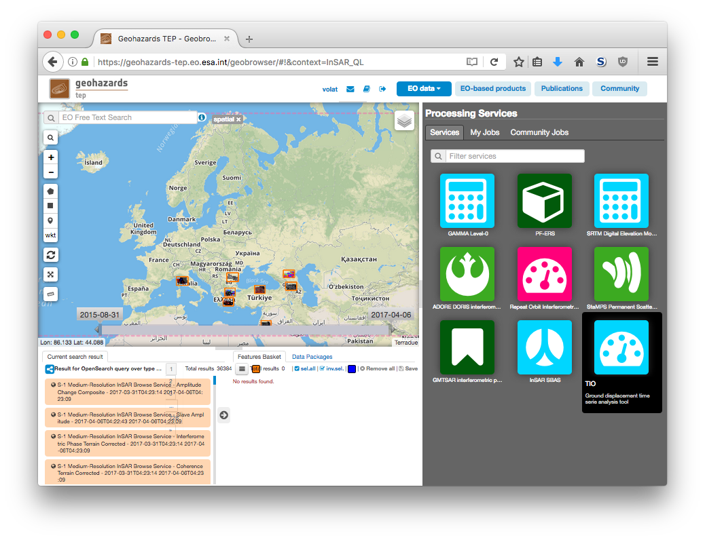
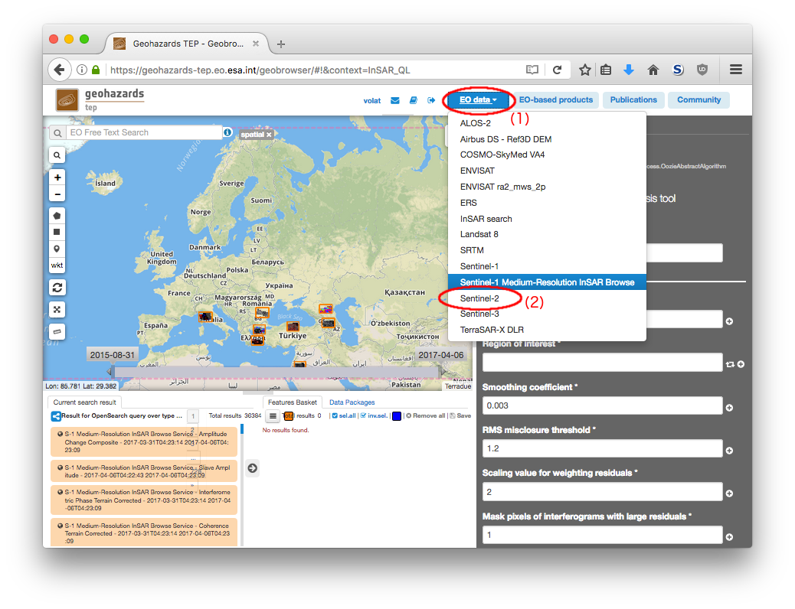
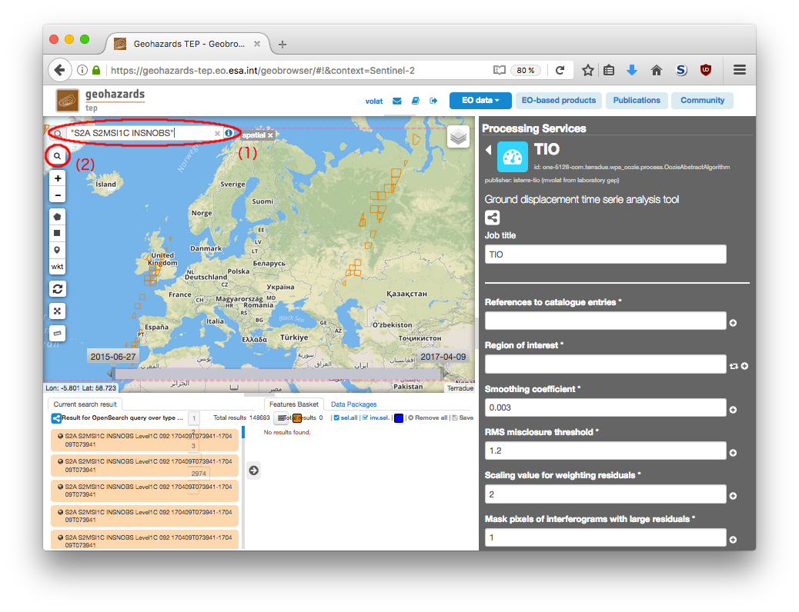
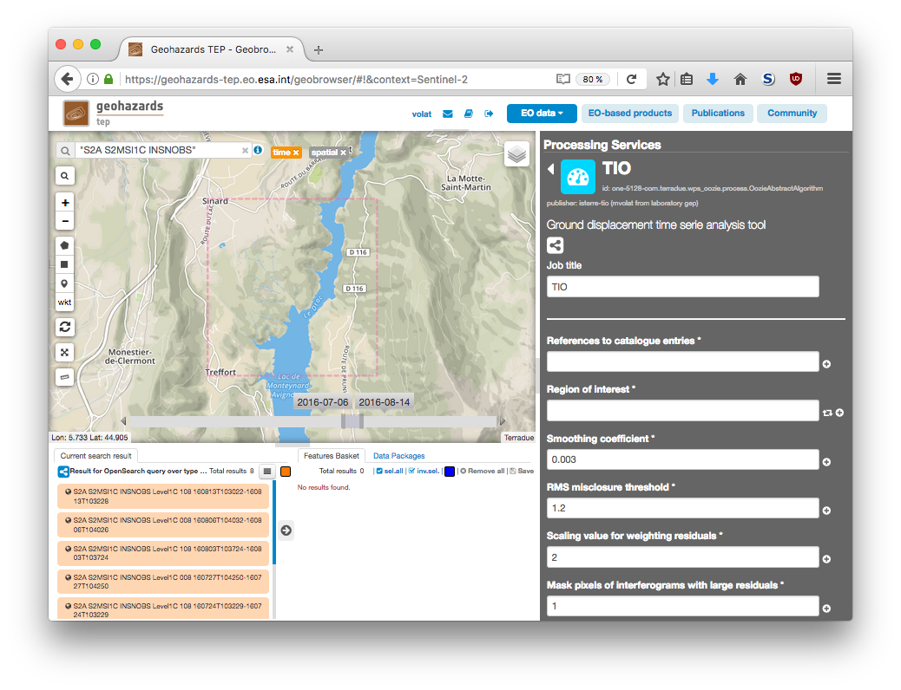
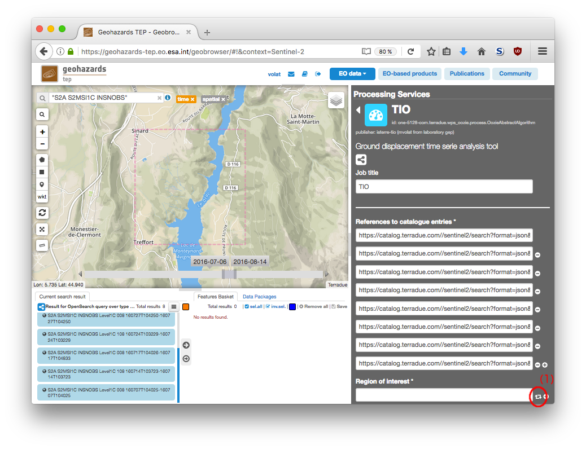
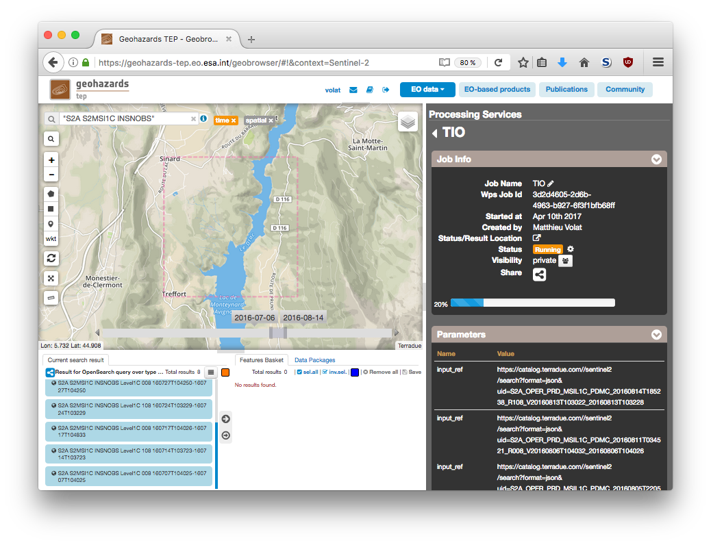
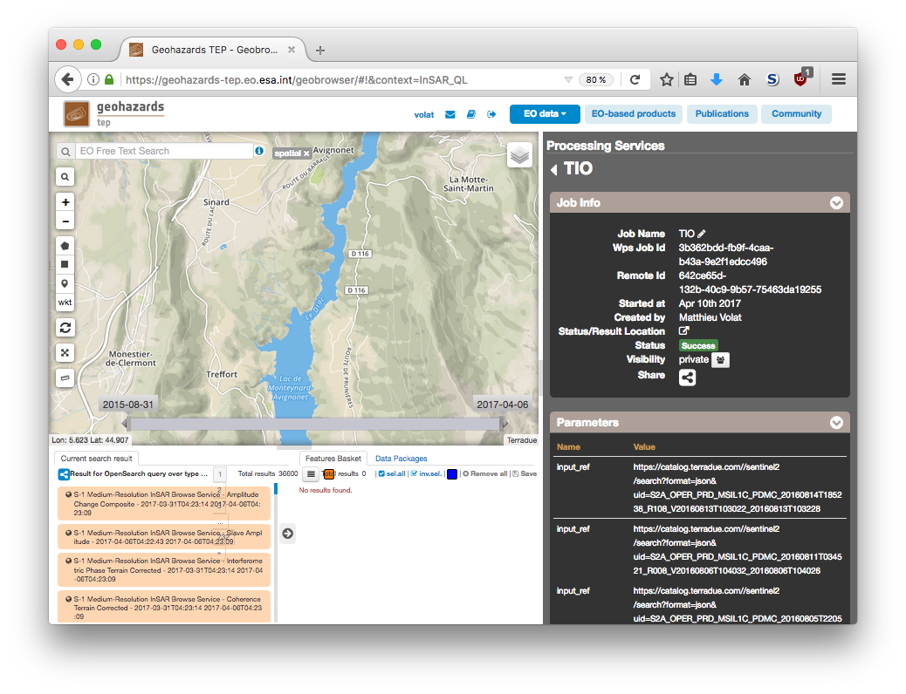
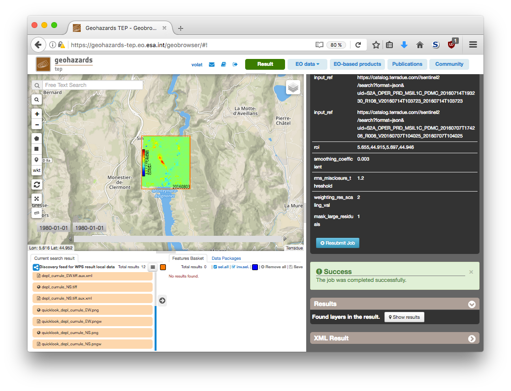

Optical time serie analysis with TIO
~~~~~~~~~~~~~~~~~~~~~~~~~~~~~~~~~~~~

The TIO service process a set of correlation maps between different
acquisition dates and produce a time serie analysis based on the
methods described in [BontempsRSE2017]_.

This tutorial will show how to use this service to produce such result
using the geoportal. In this example, we will process Sentinel-2 data 
over the Harmalière (France) landslide during summer 2016, as described
in [LacroixRSE2017]_.

.. [BontempsRSE2017] Noélie Bontemps and Pascal Lacroix and Marie-Pierre Doin (2017),
    "Inversion of deformation fields time-series from optical images, and 
    application to the long term kinematics of slow-moving landslides in Peru",
    Remote Sensing of Environment

.. [LacroixRSE2017] Pascal Lacroix and  Grégory Bièvre and Erwan Pathier and Ulrich Kniess and Denis Jongmans (2017),
    "Use of Sentinel-2 images for the detection of precursory motions before landslide ruptures",
    Remote Sensing of Environment

Select the processing
=====================

* Login to the platform (see :doc:`user <../community-guide/user>` section)

* Select the processing service “TIO”:

The "TIO" panel is displayed with parameters values pre-filled with 
reasonnable defaults, but no inputs.

Fill the parameters
===================

References to catalogue entries
-------------------------------

* Select the EO data button (1), click it to display a list of datasets and select **Sentinel-2** (2):

* Type **"S2A S2MSI1C INSNOBS"** (with the quotes) in the Search Terms field (1) and then click on the lens icon (2):

* Click on **Show Other Parameters** and set the following fields with the specified parameter:

- time:start -> 2016-07-01
- time:end -> 2016-08-14
- geo:box -> 5.655,44.915,5.697,44.946

.. note:: These parameters could be selected from other part of the geobrowser
    interface, such as the slider at the bottom or the map for the time frame,
    or using the area selector.

* Then click on the button **Search**:

* Drag and Drop all the eight results in the *References to catalogue entries* field:

.. figure:: assets/tuto_tio_5.png
	:figclass: align-center
        :width: 750px
        :align: center

.. note:: Some of these images will be too cloudy to produce any result, but
    the service will filter them automaticaly by estimating the mean value
    of the "water vapor mask". The threshold value can be tuned using the
    "Cloud level threshold" parameter (for advanced users).

* And finish by setting your region of interest using the button that set it from search (1):

.. note:: The region of interest parameter define what subset of the optical 
    products we will process, or how different product must be mosaiced. It
    also allows to lower the computation time and disk space requirements by
    processing a smaller area.

.. caution:: It is important that the region of interest is a subset of
    the imagery products. It is not advised to select an area of interest
    that overlap between orbits trajectory as results are not predictable
    between the time the satellite orbit the earth. 

Run the job
===========

* Click on the button Run Job at the bottom of the right panel and see the Running Job

* After a while, see the Successful Job:

* Click on the button *Show results on map*, then on the *quicklook_depl_cumule_NS.png* result on the *Results Table* in the bottom left side

* See the result on map:

